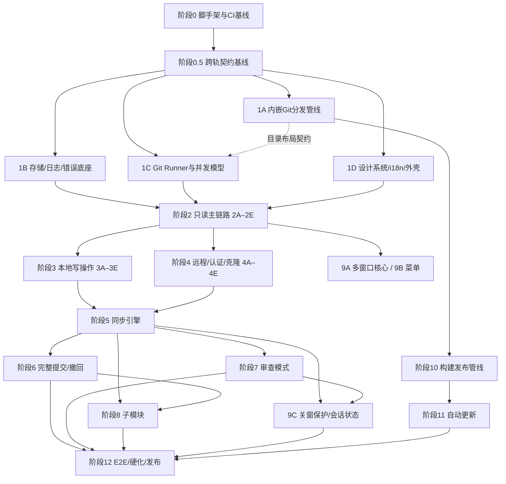

# Artistic Git — 分阶段任务清单（TASKS）

> 依据 [SEPC.md](SEPC.md) 拆解。目标：**每个阶段结束时应用都可构建、可运行、可测试**，并支持多人在不同 worktree 并行开发。

## 图例与约定

- **\[P\]** = 该轨道（Track）可在独立 worktree 中与同阶段其他 \[P\] 轨道并行开发。
- 轨道命名 `阶段编号 + 字母`（如 `1A`），建议分支/worktree：`git worktree add ../ag-1a -b phase-1a`。
- **契约先行**：并行轨道开工前，先完成阶段 0.5，在主干以小 PR 固化跨轨道契约（Tauri 命令签名与事件 payload 的 Rust/TS 类型、resources 目录布局、Diff/冲突组件 props），之后各轨道只依赖契约不互相依赖。
- 每阶段的**完成定义（DoD）**：
  1. 该阶段全部任务勾选完成，验收标准达成；
  2. 三平台 CI（lint + 单元 + Rust 集成测试）全绿；核心 Git 流程测试全部使用**真实临时仓库与内嵌 git**，从 `ARTISTIC_GIT_DIST_DIR` 或打包 resources 取显式路径，禁止 fake/mock 命令且绝不回退系统 git；
  3. 无静默错误处理；所有新增可预期/非预期/致命错误路径已归类并写日志；
  4. 新增 UI 文案全部走 i18n（中英），写入 Git 历史的自动文本恒为英文（`Revert:` / `Auto Stash:` / `backup/`）；
  5. 所有破坏性操作有二次确认；提交遵循 Conventional Commits（英文）。

## 阶段依赖总览

## 并行开发建议（worktree 分配示例，4 人）

| 时间窗 | 开发者 A（Rust 核心） | 开发者 B（基建/发布）         | 开发者 C（前端外壳）            | 开发者 D（前端引擎）       |
| ------ | --------------------- | ----------------------------- | ------------------------------- | -------------------------- |
| 窗口 1 | 1C Runner/并发        | 1A 内嵌 Git 管线              | 1D 设计系统/i18n                | 1B 存储/日志/错误          |
| 窗口 2 | 2A 打开/健康检查/查询 | 2E 实时状态引擎 → 10 发布管线 | 2B 起始/主界面骨架              | 2C 历史图表 + 2D Diff 引擎 |
| 窗口 3 | 3A 储藏 + 3B 分支     | 4A IPC 底座 → 4B/4C 认证      | 3E 设置/向导 + 9A/9B 多窗口菜单 | 3C 冲突界面 + 3D 本地提交  |
| 窗口 4 | 5A → 5B 同步          | 4D 克隆 + 4E Fetch → 11 更新  | 5C 批量/自动跟踪（UI+流程）     | 5D 改写防护 → 6A/6B        |
| 窗口 5 | 8A/8B 子模块          | 12 E2E 基建                   | 7 审查模式 + 9C 收尾            | 12 硬化/审计               |

> 阶段 3 与阶段 4 两组可**整体并行**（子系统无交集，汇合点是阶段 5）。阶段 10 自 1A 完成后可随时并行推进。
> 窗口 1 开始前先完成阶段 0.5；该阶段短小但阻塞 1A–1D，以避免 Rust/TS 类型、事件 payload 与 resources 布局在并行 worktree 中漂移。

---

## 阶段 0 — 工程脚手架与 CI 基线（串行，阻塞所有轨道）

**目标**：可启动的空应用 + 可运行的双端测试 + 三平台 CI。

- [x] pnpm + Vite + React + TypeScript（strict）初始化；技术栈全部取最新稳定版
- [x] Tauri 2 集成：productName `Artistic Git`、可执行名 `artistic-git`、identifier `com.smallmain.artistic-git`
- [x] Tailwind + shadcn/ui + lucide-react 接入；Vitest + Testing Library 就绪（示例测试）
- [x] Rust 侧拆 crate：`app`（命令入口）/ `core`（领域逻辑）/ `git-runner` / `helpers`（credential/askpass 二进制占位）；cargo test 就绪
- [x] 主窗口默认 1280×720、最小 960×600（低于最小尺寸出滚动不压缩布局）
- [x] Lint/格式化：eslint + prettier、clippy + rustfmt，pre-commit 可选
- [x] GitHub Actions：三平台矩阵跑 lint + 前端单测 + cargo test；**PR 只跑测试不发布**
- [x] 仓库文档骨架：README.md（英文）+ README_zh-CN.md；Conventional Commits 约定写入贡献说明

**验收**：`pnpm tauri dev` 打开空窗口；三平台 CI 全绿。

---

## 阶段 0.5 — 跨轨契约基线（串行，阻塞 1A–1D）

**目标**：把并行轨道共享的 Rust/TS 契约、resources 布局与测试 bootstrap 固化到主干。

- [x] Rust 契约类型包：`AppError` JSON、Tauri command request/response、事件 payload（`repo-changed` / `operation-progress` / `fetch-state` / `conflict-entered`）、Diff/冲突数据结构
- [x] TypeScript bindings 生成链路：Rust 类型为真相源，使用 `serde` + `specta`/`tauri-specta` 或等价方案生成 TS；CI 检查重新生成后 diff 为空
- [x] resources 目录布局契约：git 发行目录、git-lfs、Windows ssh、helper 二进制、dev resources 与打包 resources 的统一解析规则
- [x] Git 测试 bootstrap 契约：`ARTISTIC_GIT_DIST_DIR` 指向 dev git-dist；缺失或版本不符时测试失败，禁止 fallback 系统 git
- [x] IPC/认证契约：`operation-id` 贯穿高层操作；每条 git 命令派生 `invocation-id + one-time token`；helper 校验后 token 立即失效
- [x] Diff/冲突组件 props 契约：三处复用接口（本地更改/提交详情/冲突界面）与 LFS 锁状态预留位

**验收**：TS bindings 生成稳定且 CI 漂移检查通过；1A–1D 可仅依赖契约并行开工；无内嵌 Git 路径时相关测试明确失败。

---

## 阶段 1 — 基础设施（1A–1D 四轨并行）

### 1A 内嵌 Git / LFS / SSH 分发管线 **\[P\]**

依赖：阶段 0.5。产出与 1C 之间只有「resources 目录布局 + 版本自检」契约。

- [x] 单一构建配置文件（如 `git-dist.toml`）：git / git-lfs / Win32-OpenSSH 版本号 + 各平台产物或源码 SHA-256 + 完整编译配方（flags/容器镜像）集中钉死；取当时最新稳定版；git 版本优先选 fsmonitor 支持面最全者
- [x] Windows：下载官方 MinGit 预编译包 + 官方 Win32-OpenSSH 发行包，校验发布页二进制 SHA-256
  - 进展（2026-07-08）：用 GitHub API release metadata 重新核对 `PowerShell/Win32-OpenSSH`，最新非 draft release 为 `10.0.0.0p2-Preview`（2025-10-27），tag/name 仍含 Preview，不能作为稳定版勾选。本轮新增 `scripts/check-git-dist-openssh-release.mjs --expect-no-stable-release` 并接入 git-dist contract CI；该 gate 不只依赖 GitHub `prerelease` 布尔值，会把 Preview/Beta/RC/Alpha 文本视为非稳定。Windows real fetch 仍在下载前被 placeholder gate 阻断。
  - 进展（2026-07-08）：`workflow_dispatch` build 现在为 Windows 写出独立 `git-dist-blocker-windows-x86_64` artifact，包含 `git-dist-blocker.json/.md`、OpenSSH release gate 结果和 placeholder/non-stable blocker；`artistic-git-dist-windows-x86_64` 仍不上传，避免把 Win32-OpenSSH preview 伪装成可复用产物。
  - 复查（2026-07-08）：再次运行 `node scripts/check-git-dist-openssh-release.mjs --expect-no-stable-release`，确认最新官方 PowerShell/Win32-OpenSSH 仍为 `10.0.0.0p2-Preview` 且被 preview label 判为非稳定；上游 OpenSSH 10.4p1 已发布但不是 Win32 binary artifact，不能替代当前 Windows 打包源。
  - 复查（2026-07-09）：再次核对官方 `PowerShell/Win32-OpenSSH` releases，最新非 draft release 仍为 `10.0.0.0p2-Preview`（2025-10-27），官方 release note 仍写明 preview/non-production ready。本轮将 `scripts/check-git-dist-openssh-release.mjs` 与 `scripts/git-dist-report.mjs` 的稳定性判定扩展到 release body，并分页扫描 release metadata；真实运行输出 `scanned 54 non-draft releases, stable OpenSSH-Win64.zip releases=0`。`node --test scripts/git-dist.node-tests.mjs`、真实 `node scripts/check-git-dist-openssh-release.mjs --expect-no-stable-release` 与 `node scripts/git-dist-report.mjs --include-openssh-release --target=windows-x86_64` 已通过。Windows reusable git-dist artifact 仍不得上传，故本项继续不勾选。
  - 进展（2026-07-09）：新增 `fetch-git-dist --source-evidence-only --skip-blocked-sources`，Git Distribution workflow 的 Windows placeholder-blocked 分支现在会独立下载并 SHA-256 校验已稳定的官方 MinGit 与 Windows git-lfs archive，写出 `git-dist-source-evidence-windows-x86_64` artifact；`git-dist-report` 会把这份 partial source evidence 纳入 build evidence，同时继续标记 `reusable-git-dist.produced=false`。本地真实网络复测已校验 MinGit `e3ea2944cea4b3fabcd69c7c1669ef69b1b66c05ac7806d81224d0abad2dec31` 与 Windows git-lfs `8683cdc3d6c029b49393dcebbaa6265bd6efd9abdcf837be855b4cd42e5e80b6`，OpenSSH 仍为 `skipped-blocked`，所以本项继续不勾选。
  - 验证（2026-07-09）：当前 `main` 触发 Git Distribution build run `28969657255` 成功；Windows target 上传 `git-dist-build-evidence-windows-x86_64`、`git-dist-source-evidence-windows-x86_64` 与 `git-dist-blocker-windows-x86_64`，summary 判定为 `source-partial`（`git`/`git_lfs` checked，`win32_openssh` blocked），但 `reusableArtifactProduced=false`、`validationSummary.status=placeholder-blocked`，仍没有 `artistic-git-dist-windows-x86_64` reusable artifact。本项继续不勾选。
  - 进展（2026-07-09）：`git-dist.yml` 新增每日 scheduled contract run，自动执行 Win32-OpenSSH no-stable release gate；当官方 `PowerShell/Win32-OpenSSH` 出现稳定 `OpenSSH-Win64.zip` release 时，该 scheduled run 会失败并暴露解除 placeholder、更新 pin 与重跑 Windows reusable artifact 的下一步。该监控只缩短外部 blocker 发现时间，不替代真实 Windows reusable artifact，本项继续不勾选。
  - 进展（2026-07-09）：新增 `pnpm readiness:summary` 与 CI `readiness-summary` artifact，统一聚合 Win32-OpenSSH gate、Windows reusable artifact 缺失、Phase 12 E2E/性能 checkable 状态和 release rehearsal operator evidence blockers；这是机器可读的剩余 blocker 总览，不替代 Windows reusable artifact，本项继续不勾选。
  - 验证（2026-07-09）：当前 `main` commit `5fb13a1` 的 Git Distribution build run `28978952013` 成功；Linux/macOS target 均为 `validated-fresh-build` 且上传 reusable artifact，Windows target 仍为 `placeholder-blocked`、`reusableArtifactProduced=false`。Windows source evidence 再次校验 MinGit SHA-256 `e3ea2944cea4b3fabcd69c7c1669ef69b1b66c05ac7806d81224d0abad2dec31` 与 Windows git-lfs SHA-256 `8683cdc3d6c029b49393dcebbaa6265bd6efd9abdcf837be855b4cd42e5e80b6`，Win32-OpenSSH 仍因 `10.0.0.0p2-Preview` / stable `OpenSSH-Win64.zip` count 0 被 `skipped-blocked`；本项继续不勾选。
  - 复查（2026-07-09）：再次查看官方 [PowerShell/Win32-OpenSSH releases](https://github.com/PowerShell/Win32-OpenSSH/releases)，最新 release 仍为 `10.0.0.0p2-Preview`，页面文案仍标记 preview / non-production ready；Windows reusable git-dist 继续保持外部 blocker，本项继续不勾选。
  - 进展（2026-07-09）：按“优先 stable；无 stable 则选择 preview”的规则更新 git-dist 策略：`git-dist.toml` 将当前 `10.0.0.0p2-Preview` 从 placeholder 改为 `fallback_when_no_stable=true` 的显式 preview fallback，real-build policy 允许该源进入真实下载/校验；`scripts/check-git-dist-openssh-release.mjs --verify-preferred-release-policy` 会在出现 stable `OpenSSH-Win64.zip` 时失败并要求切回 stable。真实 release metadata gate 已通过：扫描 54 个 non-draft releases，stable `OpenSSH-Win64.zip` releases=0，latest preview fallback accepted；`pnpm git-dist:check:real`、`pnpm git-dist:test`、`pnpm readiness:summary:test`、`pnpm phase12:evidence:test` 已通过。`git-dist.yml` Windows matrix 已改为不再 placeholder-blocked；本项待 workflow_dispatch build 产出并校验 `artistic-git-dist-windows-x86_64` 后勾选。
  - 修复（2026-07-09）：Git Distribution build run `29001617550` 证明 Windows 已进入真实下载/组装路径并成功校验 MinGit、git-lfs、Win32-OpenSSH 三份 archive SHA-256，但 runtime smoke 在 `git submodule status` 处失败；原因是旧布局把 MinGit 的 `mingw64/` 子树剥离成 `git/bin/git.exe`，丢掉顶层 `usr/bin/sh.exe`，导致 shell-backed `git-submodule` 不能执行。本轮将 Windows manifest 路径改为 `git/mingw64/bin/git.exe`，保留完整 MinGit 根目录，并在 fixture 中覆盖 `usr/bin/sh.exe` 与 `mingw64/libexec/git-core/git-submodule`。
  - 完成（2026-07-09）：Git Distribution build run `29002169757` 已在 Windows runner 真实下载并 SHA-256 校验 MinGit `e3ea2944cea4b3fabcd69c7c1669ef69b1b66c05ac7806d81224d0abad2dec31`、Windows git-lfs `8683cdc3d6c029b49393dcebbaa6265bd6efd9abdcf837be855b4cd42e5e80b6`、Win32-OpenSSH preview fallback `23f50f3458c4c5d0b12217c6a5ddfde0137210a30fa870e98b29827f7b43aba5`，并通过 `check-git-dist --target=windows-x86_64` runtime smoke（含 `git submodule status`、local push/clone），上传 `artistic-git-dist-windows-x86_64`；下载 build evidence 复核 `validationSummary.status=validated-fresh-build`、`reusableArtifactProduced=true`。
- [x] macOS：CI 用 Xcode 工具链从官方源码以 `RUNTIME_PREFIX` 可重定位方式构建，arm64 + x86_64 分别构建后 lipo 合成 Universal；钉死源码 tarball SHA-256
  - 完成（2026-07-08）：`fetch-git-dist` 已接入 macOS source-tarball build plumbing：校验官方 tarball 后按 arm64/x86_64 分别构建安装，再用 `lipo` 合并 Mach-O 文件；fixture 覆盖 prepared source assembly 与 manifest checksum。`git-dist.yml` workflow_dispatch build run `28915237870` 的 `Prepare macos-universal` job 已真实 fetch/build/validate，并上传 reusable artifact `artistic-git-dist-macos-universal` 与 build evidence；下载 `git-dist-build-evidence-macos-universal` 校验为 `validated-fresh-build` 且 `reusable-git-dist.produced=true`。
  - 修复验证（2026-07-09）：source-built Git 组装现在合成 `git-receive-pack` / `git-upload-pack` / `git-upload-archive` transport builtin wrappers；`check-git-dist` runtime smoke 增加本地 bare remote push + clone，防止 file/ssh transport wrapper 缺失。Git Distribution run `28978952013` 在 macOS target 以 `validated-fresh-build` 通过新 smoke 并上传 `artistic-git-dist-macos-universal`。
- [x] Linux：Ubuntu 20.04 容器（glibc 2.31）构建；libcurl/openssl/zlib/pcre2/expat 全静态链入；`NO_GETTEXT/NO_TCLTK` 裁剪，保留 Perl-backed porcelain（如 `git submodule`）；glibc 动态链接（不用 musl）
  - 完成（2026-07-08）：`fetch-git-dist` 已接入 Linux source-tarball build plumbing：非 Ubuntu 20.04 Linux host 通过 Docker `ubuntu:20.04` 构建，Ubuntu 20.04 内可直接构建，并在安装后拒绝动态链接 libcurl/openssl/zlib/pcre2/expat。远端 build run `28914517678` 已完成 Linux 编译但被安装后动态第三方库审计拦截；本轮改为用 `pkg-config --static` 生成链接参数，并覆盖 Git Makefile 的 `EXTLIBS`/`CURL_LDFLAGS`/`EXPAT_LIBEXPAT`/OpenSSL link 变量；后续 run 暴露 Ubuntu 20.04 系统 libcurl 的 Kerberos、brotli、idn2、rtmp 等可选协议/认证传递依赖并非都提供可闭合的静态链，已将审计收窄到需求列出的 libcurl/openssl/zlib/pcre2/expat 必须静态，同时保持 glibc 与 libcurl 的系统可选传递依赖动态链接。`git-dist.yml` workflow_dispatch build run `28915237870` 的 `Prepare linux-x86_64` job 已真实 fetch/build/validate，并上传 reusable artifact `artistic-git-dist-linux-x86_64` 与 build evidence；下载 `git-dist-build-evidence-linux-x86_64` 校验为 `validated-fresh-build` 且 `reusable-git-dist.produced=true`。
  - 修复备注（2026-07-08）：手动 evidence run `28923893079` 证明 executable-bit 恢复后 macOS/Linux heavy perf 已能跑通，但 Rust tests 暴露 source-built Git 的 runtime prefix 指向 `/`，导致 `git-submodule` 与 templates 解析到 `//libexec`/`//share`。本轮把 macOS/Linux source build prefix 改为 `/git`，`fetch-git-dist` 的 configure/make/install prefix 改为同源配置驱动，并移除 Linux `NO_PERL=YesPlease`，防止 `git submodule` 等 porcelain 被裁掉。
  - 完成验证（2026-07-08）：Git Distribution workflow run `28929251233` 已使用上述 prefix/runtime 修复重建成功，macOS/Linux reusable artifact 通过 runtime smoke；本地下载 `artistic-git-dist-macos-universal` 后，`ARTISTIC_GIT_DIST_DIR=/private/tmp/ag-dist-macos-28929251233 cargo test --workspace` 全绿。Windows 仍因 Win32-OpenSSH 最新 release 非稳定而只产出 blocker artifact，不上传可复用 dist。
  - 修复验证（2026-07-09）：Linux source-built Git artifact 先前缺少 `git-receive-pack` wrapper，会导致真实本地 bare remote push 失败；本轮在 `fetch-git-dist` 中补齐 transport wrappers，并让 `node scripts/check-git-dist.mjs --target=linux-x86_64` 必跑本地 push/clone smoke。Git Distribution run `28978952013` 以 `validated-fresh-build` 通过并上传 `artistic-git-dist-linux-x86_64`。
- [x] git-lfs：全平台官方预编译包校验 SHA-256；macOS 合成 Universal
  - 进展（2026-07-08）：三平台 Git LFS 官方 archive URL/SHA 均已钉死并由 fetch 校验；macOS assembly 已合并 arm64/x86_64 staging 到 `git-lfs/git-lfs`。Windows OpenSSH placeholder 仍会在 Windows target 下载前阻断，故全平台 artifact 未完成。
  - 进展（2026-07-09）：source evidence 模式已让 Windows target 在 OpenSSH placeholder 阻塞期间也能独立校验 Windows git-lfs 官方 archive SHA-256；真实网络复测通过并写入 partial source evidence 语义。由于 Windows `artistic-git-dist-windows-x86_64` reusable artifact 仍不能产出，三平台完整 artifact 仍未完成，本项继续不勾选。
  - 验证（2026-07-09）：Git Distribution build run `28969657255` 与 Phase 12 summary run `28970008364` 均确认 Linux/macOS reusable artifact ready，Windows source archive evidence 中 `git_lfs` 已 checked，但 Windows reusable dist 仍被 `win32_openssh` blocker 阻断；因此“全平台官方预编译包校验 + 三平台 artifact”仍不能勾选。
  - 验证（2026-07-09）：Git Distribution build run `28978952013` 再次确认 Linux/macOS reusable artifact ready，Windows `git_lfs` source evidence checked，但 Windows reusable dist 仍因 Win32-OpenSSH stable blocker 缺失；`readiness-summary` 中 `git-lfs-distribution` blocker 仍指向 `windows-x86_64` reusable git-dist evidence missing，本项继续不勾选。
  - 进展（2026-07-09）：Win32-OpenSSH 已按 stable-first preview fallback 策略解除 source policy blocker，Windows build matrix 将进入真实 reusable artifact 路径；本项仍需等待新的 Git Distribution build evidence 证明 Windows `artistic-git-dist-windows-x86_64` 产出并通过 runtime validation 后才能勾选。
  - 完成（2026-07-09）：Git Distribution build run `29002169757` 产出并校验三平台 reusable artifact：Windows、macOS、Linux build evidence 均为 `validated-fresh-build` 且 `reusableArtifactProduced=true`；Windows 官方 git-lfs archive SHA-256 通过真实下载校验，macOS Universal artifact 继续由 Darwin arm64/x86_64 官方 archive 合成。
- [x] 产出统一 Tauri `resources` 目录布局（git 发行目录 + lfs + Windows ssh + 后续 helper 二进制的挂载点）
- [x] 本地开发脚本（如 `pnpm fetch:git-dist`）：开发机一键下载/构建产物放入 dev resources，并导出/提示 `ARTISTIC_GIT_DIST_DIR`；二进制产物不提交普通 Git 仓库
  - 进展（2026-07-08）：`fetch-git-dist` 已有 archive assembly、helper 复制/缺失报错、fixture manifest/sha256 测试；`--dev-resources` 会自动 release helper build、执行 macOS/Linux source build plumbing，并持续输出 `ARTISTIC_GIT_DIST_DIR` export。本轮补 Win32-OpenSSH release metadata gate，让本地/CI 在稳定 OpenSSH 出现时明确失败并提示解除 placeholder 的下一步。Windows OpenSSH placeholder gate 仍使 Windows 一键真实 dev resources 未完成；macOS/Linux 待真实 artifact 验证。
  - 进展（2026-07-08）：补 `/src-tauri/resources/git-dist/*` ignore 规则并保留 README mount point，防止本地 `--dev-resources` 生成的 git/git-lfs/helper artifact 被误提交；新增 `git-dist.node-tests` 覆盖 `fetch-git-dist --print-env --dev-resources --target=macos-universal`，固定输出 `ARTISTIC_GIT_DIST_DIR` 指向 Tauri `src-tauri/resources/git-dist` 挂载点。Windows dev resources 仍因 OpenSSH placeholder gate 保持未完成。
  - 进展（2026-07-09）：`src-tauri/resources/git-dist/README.md` 已同步当前 repo-local ignored mount 口径，明确可用 `pnpm fetch:git-dist -- --dev-resources --target=<target>` 生成本地资源并导出 `ARTISTIC_GIT_DIST_DIR`，且除 README 外该目录内容都应保持为未提交的生成物。最终勾选仍等待 Windows stable OpenSSH 解锁后的三平台 dev resources 实跑。
  - 复核（2026-07-09）：subAgent 只读复核确认脚本、mount point、ignore 规则与输出提示已具备；剩余缺口不是本地脚本能力，而是 Windows stable Win32-OpenSSH 未解锁，导致 `--target=windows-x86_64` 不能合法产出完整 dev resources。本项继续不勾选。
  - 进展（2026-07-09）：README / README_zh-CN 的 dev resources 示例已改为 `pnpm git-dist:check:runtime -- --target=macos-universal`，避免开发者只跑 schema-only check；`package.json` 新增 `git-dist:check:runtime`。`readiness-summary` 仍把本项 blocker 归因到 Windows reusable git-dist 未能合法产出，本项继续不勾选。
  - 进展（2026-07-09）：`fetch-git-dist --dev-resources` 现在拒绝与 `--output`、`--download-only`、`--no-extract` 组合，确保 repo-local ignored mount 只用于完整 runnable resource tree；`check-git-dist` 也会拒绝除 `manifest.json` / mount `README.md` 外未被 `manifest.sha256` 覆盖的 regular file，避免旧残留被误当成 dev resources 一部分。本项仍等待 Windows stable OpenSSH 后的三平台实跑，继续不勾选。
  - 进展（2026-07-09）：Win32-OpenSSH source policy 已改为 stable-first preview fallback，Windows dev resources 不再因 preview pin 被 real-build policy 预先拒绝；最终勾选仍需 Windows `--dev-resources --target=windows-x86_64` 或对应 reusable artifact 的真实构建/校验证据。
  - 完成（2026-07-09）：三平台 Git Distribution reusable artifact 已全部产出并通过 runtime validation，`readiness-summary` 将 `dev-resources-script` 判为 `ready` / `checkable=true`；本地 dev resources 路径继续落在 ignored `src-tauri/resources/git-dist` mount，并由 manifest / SHA-256 / runtime smoke gate 保证二进制产物不进入普通 Git 仓库。
- [x] CI cache/artifact 复用策略：git-dist 产物由 1A 生成并供后续测试/打包 job 复用；cache miss 时按 `git-dist.toml` 重新下载/构建并校验
  - 进展（2026-07-08）：workflow 已在 cache hit 时校验 restored `ARTISTIC_GIT_DIST_DIR`，cache miss 前构建 helper，并将 assembly/source-build fixture 测试纳入 contract；macOS/Linux build matrix 进入真实 fetch/build/upload 路径，Windows 只运行 expected-placeholder gate 并跳过 artifact，避免 preview Win32-OpenSSH 被误发布。本轮新增 contract 级 Win32-OpenSSH metadata gate，确保一旦最新 release 不再是 Preview/Beta/RC/Alpha 就阻断并要求更新真实 pin；另新增 `scripts/git-dist-report.mjs` 与 `git-dist-readiness-*` CI artifact，机器可读地区分 target `ready`/`blocked`、placeholder/non-stable blocker 和 OpenSSH release metadata，避免下游 release/E2E 靠日志推断。实际触发 `git-dist.yml` build run `28913945943` 后发现 `actions/setup-node@v5` 会在 pnpm 可执行文件安装前尝试 package-manager cache 并失败，已补 contract/prepare job 的 `pnpm/action-setup@v4` 顺序 gate，并让 `git-dist:report -- ...` 兼容 pnpm 传入的 `--` 分隔符；重跑 build run `28914118421` 已越过 pnpm setup/contract，Windows placeholder-blocked job 成功，macOS/Linux 真实 source build 暴露 Git 2.55 可选 Rust/Cargo 构建问题，已将 macOS/Linux make flags 固定为 `NO_RUST=YesPlease` 并补测试；build run `28914316817` 中 macOS Universal 真实 fetch/build/validate/upload artifact 成功，Linux 继续暴露 static libcurl 传递依赖缺失，已把 `libnghttp2-dev` / `libidn2-dev` / `librtmp-dev` / `libssh-dev` / `libpsl-dev` / `libkrb5-dev` / `libldap2-dev` / `libbrotli-dev` / `libzstd-dev` 钉入 Ubuntu 20.04 apt 配方。
  - 进展（2026-07-08）：本轮在 `git-dist-report` 增加 workflow build evidence schema，并接入 build matrix：每个 target 上传 `git-dist-build-evidence-<target>`，包含 workflow run manifest、artifact index、source/archive provenance、source cache hit、assembled cache hit、cache-hit/fresh-build validation summary；placeholder-blocked target 另上传 blocker artifact。macOS/Linux 的 reusable artifact 只有在真实 build step 校验后才标记 produced，Windows 仍 produced=false。
  - 完成（2026-07-08）：`git-dist.yml` workflow_dispatch build run `28915237870` 已通过 contract，并在 Windows placeholder-blocked、macOS Universal、Linux x86_64 三个 matrix job 中上传 readiness/build evidence；macOS/Linux 均完成 cache miss fresh build、`check-git-dist --no-exec` 校验、reusable artifact 上传，下载 evidence JSON 校验 `reusable-git-dist.produced=true`。Windows 仍按 Win32-OpenSSH preview blocker 上传 blocker evidence，不产出伪 artifact。
  - 修复备注（2026-07-08）：`git-dist.yml` 的 cache-hit/fresh-build validation 已取消 `--no-exec`，host target 必须运行 `check-git-dist` runtime smoke：在与应用 runner 等价的 artifact resource env 下，`git --exec-path` 必须落在 artifact 内，`git init` 默认分支为 `main` 且复制 hook templates，`git submodule status` 可执行；这会在 build/cache 入口直接挡住 resource env、submodule 与模板缺失问题。
- [x] 版本升级流程文档化：升级 = 修改配置文件走 PR + 全量测试 + 记入更新日志

**验收**：CI 三平台产出 artifact 且校验和匹配；本地脚本产物可执行 `git --version` / `git lfs version`；后续 job 可通过 `ARTISTIC_GIT_DIST_DIR` 复用产物；篡改校验和时构建失败。

### 1B 存储、日志与错误底座 **\[P\]**

依赖：阶段 0.5。

- [x] `AppError`：三级分类（可预期/非预期/致命）+ 操作上下文 + git 命令与完整输出；所有 Tauri 命令统一 `Result<T, AppError>`；错误在到达前端前已完整写入日志
- [x] panic hook：记录日志并转为崩溃事件上报（不直接 abort 进程）；禁止 panic 外泄命令边界
- [x] 日志：`tracing` + 按天滚动 appender 写 `appLogDir/`，保留 30 天；结构化含时间戳/级别/git 命令与完整输出；提供「打开日志目录」命令
- [x] 配置 actor（多窗口共享）：`appConfigDir/settings.json` + `appDataDir/projects.json`（规范化绝对路径为 key）；内存唯一模型 + mutex 串行写 + 临时文件 rename 原子落盘 + 高频更新防抖 + 读改写只动对应条目；变更后向所有窗口广播事件
- [x] settings 模型：语言/主题/Fetch 间隔/Git 用户信息/自动检查更新/Gravatar 开关/onboarded 标志/记住密码短语开关/全局默认窗口几何/上次克隆父目录
- [x] projects 模型：自动跟踪规则/侧栏比例与折叠状态/视图模式/窗口几何/最近打开时间/审查模式崩溃标记/大文件检查配置；最近项目列表由其派生
- [x] `keyring` crate 封装：HTTPS 凭据（默认按 host 共享，支持 `protocol + host + path` 覆盖）与 SSH 密码短语的存取删接口
- [x] 通用自动重试工具：网络类失败最多 3 次指数退避（1s→2s→4s）

**验收**：单测覆盖原子写/并发读改写不丢字段/防抖合并/广播；日志滚动与保留策略；AppError 序列化契约（TS 类型同步）稳定。

### 1C Git Runner 与操作并发模型 **\[P\]**

依赖：阶段 0.5；与 1A 仅目录布局契约（开发期通过 `ARTISTIC_GIT_DIST_DIR` 指向 dev git-dist）。

- [x] runner：`std::process::Command` 调用内嵌 git；显式内嵌路径，隔离并重建受控 `GIT_EXEC_PATH`/`GIT_TEMPLATE_DIR`/`GITPERLLIB`/`PATH`，**绝不回退系统 git**；`GIT_CONFIG_NOSYSTEM=1` + 受控 `HOME`；全局身份 fallback 由专用只读逻辑读取真实 `~/.gitconfig`
  - 修复备注（2026-07-08）：runner 现在会创建受控 HOME/.config，PATH 以 embedded `git/bin`、`git/libexec/git-core`、`git-lfs` 目录优先并仅追加平台 shell 工具目录，注入 `init.defaultBranch=main`，并设置 embedded Git resource env；同时修复 standalone `git-lfs` 不支持 `-C` 的调用方式，改为 cwd 或 `git -C ... lfs`。
- [x] 运行期自检：启动执行 `git --version` / `git lfs version`，不符或不可执行 → 致命错误崩溃弹窗
- [x] 命令级注入约定（`-c`，不落盘）：`credential.helper`、`core.sshCommand`、`core.longpaths=true`（仅 Windows）、rename detection、`--progress`
- [x] 仓库写锁：单写锁 + 忙时拒绝（非队列）；写操作互斥串行；只读操作不受影响；后台任务 single-flight 接口（有写锁则跳过）
- [x] 进度框架：解析 git `--progress` stderr 输出百分比事件；拿不到进度的操作走不确定进度（spinner）
- [x] 长操作取消：kill 子进程 + 各操作注册「恢复到操作前状态」钩子的约定
- [x] 事件通道骨架：`repo-changed` / `operation-progress` / `fetch-state` / `conflict-entered` 等，按 window label 路由到指定窗口
- [x] 写锁入口预留「身份懒校验」挂载点（3E 实装）

**验收**：Rust 集成测试（真实临时仓库 + 内嵌 git）：写锁互斥与忙时拒绝、取消后状态恢复、进度解析、环境隔离（系统/全局 config 注入不生效）、缺失 `ARTISTIC_GIT_DIST_DIR` 不回退系统 git、自检失败路径。

### 1D 设计系统、i18n 与应用外壳 **\[P\]**

依赖：阶段 0.5。

- [x] 设计令牌落地 CSS 变量 + Tailwind 主题扩展：黑白极简主色（浅色近黑/深色白）、语义色（成功/警告/危险/同步橙）、审查青色渐变、系统字体栈、字阶 12–24 行高 1.5、等宽数字变体、圆角 8/6/6/12、4px 间距网格、柔和阴影仅浮层、动效 150/200–250ms ease-out/spring + 尊重「减少动态效果」降级淡入淡出、lucide 统一 16/20
- [x] 深浅主题：两套完整令牌，跟随系统 + 手动切换，shadcn theming 承载
- [x] i18next：中英资源结构、跟随系统 + 手动即时切换（无需重启）；本地化日期/相对时间/数字/文件大小工具函数
- [x] 通用组件库：截断 + tooltip 文本（路径统一 `/` 分隔符工具）、仅图标按钮（强制 `aria-label` + tooltip）、确认弹窗基座、**错误详情弹窗**（语言化摘要 + 可折叠技术详情：git 命令/退出码/stderr 原文不翻译 + 复制错误信息 + 打开日志目录）、**崩溃详情弹窗**（同上 + 重启工具按钮 + 覆盖层阻止操作）
- [x] 前端状态骨架：TanStack Query（服务端态，按「仓库+查询类型」key）+ Zustand（UI 态）；每窗口独立 React 根/store/query client；Tauri 命令与事件的类型安全绑定层（与 1B/1C 契约对齐）
- [x] 全键盘可达基线：Tab 顺序、焦点环、Esc 关闭 Modal/面板/下拉

**验收**：Vitest 组件测试（主题切换/语言即时切换/截断 tooltip/两弹窗交互）；演示页人工核对两主题 × 两语言。

---

## 阶段 2 — 只读主链路（2A–2E 并行，阶段末集成联调)

**里程碑**：打开真实仓库，浏览分支/历史/本地更改/Diff，全只读可用。

### 2A 打开仓库、健康检查与状态查询（后端） **\[P\]**

依赖：1B、1C。

- [x] 打开校验：非 Git 目录报错「不是有效的 Git 项目」（不提供 init）；子目录经 `git rev-parse --show-toplevel` 静默解析到仓库根；bare 仓库与 linked worktree 拒绝（「不是受支持的 Git 项目类型」）；存在多个 remote 时仅管理 `origin` 并给非阻塞提示，无 `origin` 即进入无远程模式
- [x] 打开流程：以工具身份写仓库级 `user.name/user.email`（**仅不同才写，只动 `.git/config`**，工具无身份则跳过）；存在 LFS 规则时自动 `git lfs install --local`（允许按需写仓库级 `filter.lfs.*`）；只清理工具创建的临时 worktree 残留；记录 projects.json 最近打开时间
- [x] 健康检查：游离 HEAD（提示 + 新建分支/切换引导）；外部残留 rebase/merge/cherry-pick 中间态（提示 + 放弃恢复 abort 按钮）；空仓库 unborn HEAD 语义（显示 unborn 分支名 + 历史空态 + 分支切换/删除/新建禁用）；`.git/index.lock` 残留**永不自动清除**，引导式提示（mtime 年龄 + 警示文案 + 用户显式确认后删除）；无法自动修复的归入致命错误
- [x] 分支列表查询：本地/远程合并显示、去 `origin/` 前缀、三种存在状态、当前分支置顶其余按最近提交时间降序、每分支 ahead/behind、仅远程分支无 Badge；`backup/*` 默认过滤（5D 提供查看入口）
- [x] 本地更改查询：`status --porcelain -z`、严格遵循 .gitignore、未跟踪未忽略显示为「新增」、rename detection（`--find-renames`，含二进制相似度）识别为「重命名」记录
- [x] 储藏列表查询（含 Auto Stash 识别与来历标注字段）；仓库概要查询（当前分支/远程有无 → 无远程模式标志/中间态标志）
- [x] `git log` 分页查询（批 200、topo、`--parents`）与搜索命令（`--grep` / `--author` / `-S` pickaxe，可中断）

**验收**：Rust 集成测试覆盖上述全部（真实仓库夹具：unborn/detached/中间态/index.lock/bare/worktree/子目录/LFS 仓库/多 remote 仓库）。

### 2B 起始界面与主界面骨架（前端） **\[P\]**

依赖：1D；集成时对接 2A。

- [x] 起始界面：左侧「克隆项目（占位，4D 实装）」「打开项目（目录选择器）」两个带图标文字按钮；右侧最近项目列表（图标 + 目录名 + 灰色路径两行，hover 出删除图标按钮，底部「清空历史记录」文字链接，目录已删除/移动时点击提示 + 「从列表中移除」）；右下角图标按钮组：向导（占位，3E 实装）、设置（占位）
- [x] 首次进入判定：settings.json `onboarded` 标志路由到向导（向导本体 3E）
- [x] 主界面布局：左侧栏（项目信息/分支/储藏/审查模式按钮占位/更多操作=设置图标）+ 主面板选项卡（默认「历史」，「本地更改」带更改数 Badge，0 时隐藏数字）
- [x] 左侧栏行为：项目信息区固定高（图标 + 目录名与路径两行 + 右对齐同步图标按钮占位）；分支/储藏区自动撑满 + 拖拽 handle 调比例（持久化恢复）+ 可折叠 + 模糊搜索框 + 「未搜索到相关内容」空态；侧栏整体宽度可拖拽（区间限制 + 记忆）
- [x] 分支列表项：当前分支点标记、本地/云分支图标、名称截断、右对齐待同步 Badge（tooltip「↑n 待推送 ↓m 待拉取」）；hover 图标按钮组（同步/切换/删除，本阶段禁用态）；右键菜单（同步/切换/作为基准创建新分支/删除，占位）；点击分支 → 主面板切历史选项卡并聚焦该分支最新提交
- [x] 储藏列表项：图标 + 名称 + 右对齐时间；hover 按钮组（应用/删除/详情，占位）
- [x] 无远程模式警告条「未配置远程仓库」（引导去项目设置）
- [x] 忙碌态 UI：顶部细进度条 + 当前操作名；写操作入口禁用（灰显 + tooltip「有操作正在进行」）——消费 1C 事件
- [x] 错误/崩溃弹窗接入全局事件；React 错误边界（每窗口独立）

**验收**：组件测试（列表交互/折叠/搜索/比例持久化）；与 2A 集成后人工清单：打开真实仓库完整浏览。

### 2C 提交历史图表 **\[P\]**

依赖：2A（数据契约先行即可开工）。

- [x] Rust 泳道布局：按 200/页增量计算，跨页携带打开泳道状态保证连续；输出每行线段/节点/颜色
- [x] 前端：TanStack Virtual 行虚拟化 + 轻量 SVG 绘制预计算线段；不使用现成 gitgraph 库
- [x] 提交行：头像圆点、提交信息单行截断、分支/标签 Badge（标签仅只读展示、图标与颜色区别于分支）、作者名、相对时间（悬停完整时间）
- [x] 头像：默认纯本地首字母色块；设置开启 Gravatar 才联网（失败回退色块）——默认关闭
- [x] 工具栏左：分支筛选器（默认「自动」；下拉含「全部」「自动」特殊项 + 分割线 + 全部分支项，每项复选框；选「全部/自动」时清空其它勾选）
- [x] 工具栏右：搜索框（提交信息/作者 `--grep/--author` + 内容 `-S` pickaxe，结果合并去重；防抖 + 可取消 + loading）
- [x] 提交详情滑出面板（下方滑出 + 半透明遮罩点击关闭）：完整提交信息/作者 + 头像/完整时间/短 hash 点击复制；变更文件列表（左）+ 选中文件 Diff（右，复用 2D）；操作按钮「撤回此提交」（占位禁用，6B 实装）、「复制提交号」
- [x] git log infinite query 接入 + 滚动加载

**验收**：万级提交仓库滚动流畅；泳道跨页连续性 Rust 单测；搜索合并去重与取消测试；Gravatar 默认不发起网络请求（测试断言）。

### 2D Diff 渲染引擎与本地更改选项卡 **\[P\]**

依赖：1D（文件分类契约与 2A 约定）。

- [x] Rust 权威判定：文本/二进制（git binary 标记与 null 字节探测，不依赖扩展名）/LFS 指针/图片类型/重命名/超大文本（>1MB 或 >5000 行变更）；前端只渲染不判定
- [x] 文本 Diff：CodeMirror 6 `@codemirror/merge`，分栏/行内切换（工具栏小按钮），语法高亮映射深浅主题令牌；窄窗口自动降级行内
- [x] 图片 Diff（png/jpg/webp/gif/svg/bmp，含 LFS）：并排旧|新、棋盘格背景、可缩放、尺寸与文件大小变化标注；新增只显新图/删除只显旧图
- [x] 其他二进制：文件卡片（图标 + 文件名 + 变更类型 + 大小变化）；超大文本显示「文件过大」卡片
- [x] LFS 指针：显示实际内容；旧版本不在本地时按需 `git lfs fetch` + 加载态
- [x] 本地更改文件列表：复选框 + 三态全选 + 搜索（文件名 + 文件内容）；平铺（默认，文件名 + 灰色相对路径省略 + 变更类型彩色图标）/目录树（层级折叠 + 父文件夹三态勾选）切换并记忆；重命名显示「旧路径 → 新路径」，纯移动 Diff 区提示「文件已移动，内容无变化」
- [x] 右键菜单（作用于所有选中项）：还原更改/储藏更改（占位，3A/3D 实装）/勾选/取消勾选；列表下方右对齐提交按钮（无勾选禁用；本阶段占位）
- [x] 勾选状态数据层：平铺/目录树共享同一份；预留「内部操作前后保持」接口
- [x] Diff 组件三处复用接口统一（本地更改/提交详情/冲突界面）；LFS 锁定状态接入位预留（列表项/提交前检查/.gitattributes 处理）

**验收**：各文件类型夹具仓库快照测试；组件测试（视图切换/三态勾选/搜索）；超大文件不卡死（性能断言）。

### 2E 实时状态引擎 **\[P\]**

依赖：1C、2A。

- [x] fsmonitor 平台条件启用：`-c core.fsmonitor=true -c core.untrackedCache=true`（macOS/Windows 必开；Linux 若钉定版本不支持则退化 untrackedCache + 自有 watcher）
- [x] 自有 watcher 分层启用：`.git` 关键路径（HEAD/refs/index/packed-refs/MERGE_HEAD 等）必须精监听；工作区 watcher 作为可静默降级的刷新触发器
- [x] 防抖 300–500ms 合并工作区事件；同一时刻最多一个 `git status`（写锁或已有在跑则跳过），状态以 git status/fsmonitor 为准而非 watcher 自行判定
- [x] 自产事件抑制：持写锁期间忽略 watcher 事件，操作结束统一刷新一次
- [x] 超限静默降级：触达 OS watch 上限时退化为 fsmonitor + 粗粒度轮询，不打扰用户
- [x] `repo-changed` 事件 → 前端按「仓库+查询类型」定向 `invalidateQueries`

**验收**：集成测试：外部改文件/外部 git 命令后状态自动刷新；写锁期间抑制 + 结束刷新；防抖合并行为；（Linux）降级路径。

---

## 阶段 3 — 本地写操作（3A–3E 并行；**与阶段 4 整体可并行**）

**里程碑**：无远程仓库下离线全功能可用（储藏/分支/提交/还原/设置/向导）。

### 3A 储藏子系统 **\[P\]**

依赖：阶段 2 集成完成。

- [x] 创建储藏弹窗：名称默认「储藏于 <日期时间>」；单选：全部本地更改（默认）/仅勾选文件；含未跟踪（`git stash push -u`）；完成后对应部分变干净
- [x] 手动应用：`git stash apply` 保留储藏不自动删；apply 前建立可恢复点；冲突进入冲突界面（文案「储藏的内容/当前分支的内容」）；取消恢复到 apply 前状态且原储藏保留
- [x] 删除（二次确认 `git stash drop`）；详情：与提交详情同构滑出面板（名称/时间/文件列表 + Diff）
- [x] 部分储藏：右键菜单「储藏更改」= `git stash push -u -- <选中路径>` + 名称弹窗
- [x] Auto Stash 程序契约：名称恒为英文 `Auto Stash: <理由>`（如 `switch branch`）；流程成功后删除、失败保留；详情标注「由 <某操作> 自动创建」；不自动清理
- [x] 通用「恢复储藏流程」（供切换分支/同步/审查模式复用）：成功无感 → 冲突进冲突界面 → 文件勾选状态恢复后保持

**验收**：真实仓库集成测试：创建（全部/部分/含未跟踪）/应用冲突进入与取消恢复 apply 前状态/失败保留/勾选保持。

### 3B 分支本地操作 **\[P\]**

依赖：阶段 2 集成完成。

- [x] 创建分支弹窗：名称 + 基于分支（默认当前；可选「仅远程」分支 → 自动建本地跟踪分支，通用规则）；复选「是否远程分支」（默认勾选；远程部分 5A 接入，本阶段无远程时隐藏/禁用）；复选「是否立即切换」（默认勾选）；名称实时校验（git 规则非法字符/格式 + 重名 → 红字 + 确认禁用）
- [x] 切换分支：干净直接切；有本地更改弹确认框：1) 自动储藏并恢复（默认，「更改跟人走」：储藏→切换→目标分支恢复同一流程）2) 丢弃本地更改（走统一还原流程，工作区当前版本先按相对路径进入回收站兜底）；恢复冲突 → 冲突界面；成功删 Auto Stash 失败保留；勾选状态切换前后保持
- [x] 切换到「仅远程」分支：自动 `git checkout -b X origin/X`，图标随之更新
- [x] 删除分支：当前分支删除按钮禁用 + tooltip「无法删除当前所在的分支」；未合并提交保护（红字「包含 N 个未合并的提交，删除后将丢失」）；「是否删除远程分支」复选默认不勾选（远程执行 5A 接入）；仅远程分支的确认框强制勾选且禁用 + 明确文案
- [x] unborn HEAD：切换/删除/新建入口禁用

**验收**：集成测试：创建（校验矩阵）/切换（干净/带更改储藏跟人走/冲突/取消/丢弃回收站）/删除保护矩阵/仅远程分支自动跟踪。

### 3C 冲突解决界面 **\[P\]**

依赖：2D。

- [x] 全屏覆盖层：顶部「正在解决冲突：<操作名>」；除完成/取消外无法离开；项目窗口其他入口全部禁用
- [x] 左侧文件列表（每项复选框 + 已解决/未解决标记）；顶部工具栏：全选/反选 + 批量「使用他人的更改」「使用自己的更改」（作用于勾选文件，标签按场景变化）
- [x] 文本详情：左右双栏对比 + 整文件选边按钮 + 手动编辑模式——CodeMirror 预填 git 合并结果：非冲突区自动合并；冲突区**两边都保留可见**，高亮装饰块 + 行内「采用他人这段/采用自己这段」按钮；不显示原始 `<<<<<<<` 标记；绝不默认丢弃或静默拼接；逐段选择与自由编辑并存
- [x] 保存门控：存在未决冲突区时完成/保存禁用；保存断言无残留未决区域与 git 标记
- [x] 二进制详情：双侧文件信息（大小/修改时间）；常见图片格式（含 LFS 先取回）缩略图对比；仅选边不可编辑
- [x] 完成：全部已解决才可用 → `git add` 标记 resolved 并继续原流程（rebase/revert/stash 恢复）；取消：二次确认 → 放弃整个操作恢复到操作前状态
- [x] 选边实现 `git checkout --ours/--theirs -- <文件>`；rebase 场景 ours/theirs 语义反转由内部映射，界面只呈现「他人的/自己的」
- [x] `conflict-entered` 事件对接；worktree 场景文件路径支持（5B 使用）

**验收**：组件测试（门控/批量/逐段采用）+ 与 3A/3B 集成的真实冲突端到端（stash 恢复冲突场景），取消后断言恢复原状。

### 3D 本地提交、还原与撤回（离线口径） **\[P\]**

依赖：2D。

- [x] 提交确认框：多行提交信息（placeholder，为空禁用）+ 将提交文件数 + 复选「立即推送」（默认勾选；无远程隐藏；无上游=首次发布 `push -u`——联网执行 6A 接入）；`Cmd/Ctrl+Enter` 确认
- [x] 提交实现：`git add -A -- <勾选路径>` 后 `git commit`；未勾选文件不受影响；新增/修改/删除统一处理
- [x] 大文件体检（提交执行前）：扫描将提交文件，超阈值（默认 50MB 可调）且未被 LFS 规则覆盖 → 「检测到大文件」对话框列出文件与大小，三选：加入 LFS 并继续（默认推荐：`git lfs track` + 更新 .gitattributes 明示 + 转指针提交）/仍普通提交（知情确认）/取消；仓库未初始化 LFS 时仅提示一次不强推
- [x] 提交签名：不改签名配置；`commit.gpgsign=true` 无密钥失败 → 弹窗解释，选「为本仓库关闭签名并继续」（写仓库级 `commit.gpgsign=false`/`tag.gpgsign=false`）或取消
- [x] 还原更改：二次确认红色警示「此操作无法撤销」；所有丢弃类流程统一，先把工作区当前版本按仓库相对路径收集到临时目录并移入**系统回收站**，再恢复 Git 目标状态；不创建隐藏储藏备份
- [x] 撤回提交（离线部分）：提交详情面板「撤回此提交」按钮；统一 `git revert` 永不改写历史；任意当前分支提交可撤回；merge commit 禁用 + tooltip「合并提交无法撤回」；非当前分支提交禁用 + tooltip 提示切换；提交信息固定英文 `Revert: <原提交信息>`；冲突 → 冲突界面，取消 `git revert --abort` 恢复原状（前置同步与推送 6B 接入）

**验收**：集成测试：勾选范围提交精确性/大文件三路径（真实 LFS track）/gpgsign 失败路径/修改与未跟踪文件回收站兜底/revert 冲突取消恢复。

### 3E 设置界面、向导与身份懒校验 **\[P\]**

依赖：1B、1D。

- [x] 设置 Modal 框架：左侧栏分区导航 + 右侧面板（基本设置/项目设置/关于）
- [x] 基本设置（本阶段项）：Git 用户信息（用户名/邮箱）；SSH Key 展示 + 复制 + 生成按钮；语言（跟随系统/中文/English）；主题（跟随系统/浅色/深色）；Gravatar 开关（默认关）——HTTPS 凭据列表、Fetch 间隔、自动检查更新分别随 4B/4E/11 接入
- [x] 项目设置（本阶段项）：大文件检查开关 + 阈值（MB，默认 50）；.gitignore 编辑器（查看/修改，保存后成为一条本地更改待提交，界面明示）——远程地址、自动跟踪随 4E/5C 接入
- [x] 关于分区骨架：当前版本号（检查更新/更新日志 11 接入）
- [x] 向导两步式 + 右下角跳过（跳过用系统既有配置，之后可在设置补填）：
  - 第一步作者信息：通过专用只读逻辑预填真实系统 `~/.gitconfig` 现有身份值；邮箱格式校验
  - 第二步 SSH Key：检测 `~/.ssh/` 常见私钥（id_ed25519/id_rsa/id_ecdsa）；完全没有才显示生成按钮 + 作用说明；生成弹窗固定 ed25519 / `~/.ssh/id_ed25519` / 注释=第一步邮箱，唯一输入=密码短语（默认留空 + 「留空则日常无需重复输入（推荐个人电脑）」小字）；生成后/已有 Key 显示复制公钥按钮 + 添加到 Git 平台说明
- [x] 向导可重入（起始界面入口，不受 onboarded 影响）；完成/跳过置 `onboarded: true`
- [x] 身份数据源与广播：设置修改身份 → 落盘 + 广播所有窗口 + 对每个已打开仓库执行「不同才写」仓库级 config（绝不改全局 `~/.gitconfig`）
- [x] 身份懒校验（挂 1C 写锁入口）：流程含 commit/stash 步骤时校验仓库级→全局 fallback 有效身份；全局 fallback 由工具专用只读逻辑读取真实 `~/.gitconfig`，不让 Git Runner 读取用户全局 config；缺失弹「完善身份信息」（用户名+邮箱，写入仓库级后继续原操作，取消中止）；只读与纯引用操作不校验
- [x] 设置变更即时生效：语言/主题广播所有窗口

**验收**：组件测试 + 集成测试：身份写入时机矩阵（打开/修改/懒校验触发场景全覆盖）/真实 `ssh-keygen` 生成与检测/gitignore 保存成为本地更改。

---

## 阶段 4 — 远程、认证与克隆（**与阶段 3 整体并行**；4A 先行，4B/4C 依赖 4A）

**里程碑**：可克隆真实远程仓库，HTTPS/SSH 认证全链路，定时 Fetch 与离线状态。

### 4A 本地 IPC 底座与 helper 二进制（本阶段先行）

依赖：1C。

- [x] IPC 服务：`interprocess` crate，Unix domain socket（权限 0600）/ Windows 命名管道（ACL 限本用户）；**不开网络端口**
- [x] 高层操作上下文：`operation-id` 贯穿恢复流程、忙碌态 UI 与认证交互策略
- [x] 每条 git 命令注入环境：socket 路径 + 一次性会话 token + invocation-id（不落盘）；helper 连接先校验 token，成功后 token 立即失效
- [x] 交互性决策收敛主进程：`operation-id/invocation-id → {是否交互, 仓库, host, path}` 表决定弹框/静默返回缓存/直接失败；后台 Fetch invocation 恒为非交互
- [x] credential helper 单文件二进制：实现 git `get/store/erase` 原生协议；askpass 单文件二进制；均随 resources 分发（接入 1A 构建配置与校验）
- [x] 死锁规避架构：服务 helper 回调的 IPC 任务与持写锁操作任务为并发两线（持锁任务等 git、git 等 helper、helper 等弹框）；认证弹窗在忙碌态**照常弹出**（操作的延续，不受忙时禁用约束）；认证框取消 = 取消该操作走恢复流程

**验收**：集成测试：operation-id 串联多命令流程、token 校验/一次性失效/socket 权限；真实 git 命令回调 helper 全链路（配合本地 `git http-backend`）；忙碌态弹窗与取消恢复。

进展备注（2026-07-08）：4A 验收闭环已补齐。认证 IPC runtime 现在有后台服务生命周期与关闭唤醒；Unix socket 0600、Windows named pipe owner-only SDDL ACL（`cargo check -p artistic-git-app --target x86_64-pc-windows-msvc`）均覆盖；高层 `operation-id` 在 clone/sync/accept remote history 中复用为同一 auth operation，每条 git invocation 派生独立 token/env；helper IPC 加连接/读写超时，交互/非交互决策仍收敛在主进程。真实 `artistic-git-credential-helper` + 本地 `git http-backend` clone E2E 已覆盖 Git 原生回调链路；忙碌态 helper 回调不持仓库写锁、HTTPS/SSH prompt cancel 错误恢复和 clone cancel token 注册均有 Rust 测试。

### 4B HTTPS 凭据流 **\[P\]**

依赖：4A、1B（keyring）。

- [x] 凭据默认按 host 维度存系统钥匙串（macOS Keychain / Windows Credential Manager / Linux Secret Service），支持 `protocol + host + path` 覆盖；绝不明文落盘；同平台同上下文仓库共享
- [x] 每条 git 命令注入 `-c credential.helper=<本工具>`；401 重试与凭据填充由 git 原生流程驱动
- [x] 首次无凭据：弹凭据输入框（host 只读/用户名/Token 密码框 + 「可在 Git 平台 Access Tokens 页面生成」小字），输入后自动继续原操作；401 → 同一框提示「Token 无效或已过期」；取消 = 操作失败走常规恢复
- [x] 设置-基本设置接入：已保存凭据列表（host + 用户名），支持修改和删除；高级项展示/管理 path 级覆盖

**验收**：CI 起本地 `git http-backend` + Basic Auth：无凭据→弹框→成功→入钥匙串；第二次静默；同 host 不同 path 覆盖生效；改错密码→401→重弹；取消→失败恢复。

进展备注：HTTPS 凭据 keyring/host+path 覆盖、helper 注入、凭据弹窗续跑/401 重试、设置页凭据列表与修改删除已接入并覆盖后端/组件测试；真实 `git http-backend` + Basic Auth 端到端验收仍待补齐。

### 4C SSH 认证流 **\[P\]**

依赖：4A。

- [x] ssh 二进制选择：Windows 用捆绑 Win32-OpenSSH（1A 产物）；macOS 13+ / Linux 用系统 ssh
- [x] 统一注入 `-c core.sshCommand="<ssh 路径> -o StrictHostKeyChecking=accept-new -o UserKnownHostsFile=~/.ssh/known_hosts"`（不落盘）；首连自动信任、指纹变更报错
- [x] 密码短语：`SSH_ASKPASS` helper + `SSH_ASKPASS_REQUIRE=force`，经 IPC 回调弹输入框，不依赖 TTY 永不卡死；首次输入后内存缓存，后续静默；不自主管理 ssh-agent（agent 已有密钥则 askpass 不触发）
- [x] 后台绝不弹框：`non-interactive` 标记的后台操作需要密码短语且无缓存 → 直接归入可预期认证失败走离线图标
- [x] 「记住密码短语」开关（默认关）：勾选存系统钥匙串（与 HTTPS 同套存储）

**验收**：本地 sshd 容器（Linux CI）：accept-new 首连/指纹变更报错/passphrase 弹一次后缓存静默/后台无缓存不弹框走离线/agent 路径。

进展备注：SSH 二进制选择、`core.sshCommand`/`SSH_ASKPASS` 注入、主进程 askpass IPC、前端密码短语弹窗、内存缓存、可选 keyring 记住密码短语、后台 non-interactive 失败路径均已接入并覆盖后端/组件测试；真实 sshd/container 端到端验收仍待补齐。

### 4D 克隆流程 **\[P\]**

依赖：4A（认证）、2B（起始界面）。

- [x] 克隆弹窗：仓库地址（SSH/HTTPS 均接受，不转换）+ 目标父目录（目录选择器，记住上次）+ 目录名（URL 自动推断可改）
- [x] 克隆执行：`git clone --recurse-submodules --progress`，进度条弹窗解析百分比，LFS 下载阶段单独显示进度
- [x] 取消：二次确认后终止并自动清理半成品目录
- [x] 成功后自动打开进入主界面 + 加入最近项目列表；打开流程复用 2A（身份写入/lfs install --local）

**验收**：真实克隆测试（本地 bare + LFS + 子模块夹具）：进度事件/取消清理无残留/成功打开。

### 4E 定时 Fetch、离线状态与远程设置 **\[P\]**

依赖：1C、2A。

- [x] 定时 `git fetch origin --prune --recurse-submodules=on-demand`；间隔设置项（秒，默认 60，校验 10–3600 越界红字禁用保存）
- [x] 额外触发：打开项目时/窗口重获焦点时/执行同步、提交、撤回等操作前；全局 single-flight：有写锁跳过本轮
- [x] 失败表现：网络类失败不弹窗 → 项目信息区离线小图标 + tooltip（最后成功 Fetch 时间），恢复自动消失；非网络类意外错误走错误弹窗
- [x] `fetch-state` 事件 → 分支 Badge（ahead+behind）与同步按钮橙色态数据链路（按钮行为 5A 实装）
- [x] 项目设置-远程仓库地址：显示 + 复制 + 修改（写 `remote.origin.url`）+ 清空（二次确认 → 删除 origin 进入无远程模式）
- [x] 无远程模式整合：隐藏所有同步入口/待同步 Badge/「立即推送」复选框；提交撤回跳过前置同步；全功能离线可用；顶部警告条引导

**验收**：集成测试：prune 同步删除远程分支/断网降级与恢复/聚焦与操作前触发/写锁跳过/清空 origin 进入无远程模式全套 UI 断言。

---

## 阶段 5 — 同步引擎（依赖 3A、3C、4；**5A 先行，5B/5C/5D 随后并行**）

**里程碑**：全部同步语义就绪，双 clone 对抗测试全绿。

### 5A 当前分支同步核心（先行，阻塞本阶段其余轨道）

- [x] 双向语义：操作前 Fetch → 远程有新提交则 **ff-only** 合并到本地（绝不自动产生 merge commit）→ push 本地未推送提交
- [x] 有本地更改先 Auto Stash（英文理由），流程成功恢复并删除、失败保留；恢复冲突 → 冲突界面
- [x] 分叉处理：自动 rebase 本地未推送提交到远程最新之上（仅动未推送提交）；冲突 → 冲突界面（他人的更改=远程内容/自己的更改=本地提交）；取消 `git rebase --abort` 完整恢复；UI 全程只显示「正在同步」，不出现 rebase 概念
- [x] 推送竞态自愈：non-fast-forward 被拒 → 自动重走「fetch → ff/rebase → push」≤3 次；仍失败提示「远程更新过于频繁，请稍后重试」并恢复到操作前状态；全程无感
- [x] **绝不 force push**：任何流程不含 `--force`；网络类失败 3 次指数退避重试
- [x] 发布边界实现：本地阶段（储藏/检出/提交/指针）可完整回滚；发布阶段失败停在前向安全终态（本地提交保留为未推送、下次同步补推、明确报告）；任何终态下工作区与 HEAD 干净可用（作为通用断言进测试工具箱）
- [x] 无上游分支：跳过拉取；分支级同步 = 发布分支（`push -u origin <分支>`）；无内容同步（ahead=0 behind=0）瞬间完成 → 按钮短暂「已是最新」对勾淡出不弹框
- [x] 入口接线：分支级同步按钮（hover）/项目信息区同步按钮（先单当前分支口径，批量 5C 升级）；创建分支「是否远程分支」= 创建后 `push -u`；删除分支远程部分 = `git push origin --delete`（受保护分支被拒 → 常规错误弹窗 + 本地删除结果保留）

**验收**：双 clone（模拟同事）集成测试：ff 拉取/分叉 rebase/rebase 冲突取消复原/推送竞态注入 ≤3 自愈与超限恢复/无上游发布/每一步注入失败断言恢复到操作前状态 + 干净不变量。

### 5B 非当前分支同步（快/慢路径） **\[P\]**

- [x] 快路径：无分叉时 `git fetch origin B:B`（仅 fast-forward）完成拉取再推送；不切分支不碰工作区、无需储藏
- [x] 慢路径：需 rebase 或自动跟踪合并时，临时目录 `git worktree add` 检出该分支执行完整流程，完成后删除
- [x] worktree 冲突同样进冲突界面（文件路径指向 worktree）；取消 → abort + 删除 worktree
- [x] 清理保证：成功/失败/取消均删除工具专用 worktree；启动只清理工具创建的临时 worktree 残留（2A 已挂），不自动清理用户 linked worktree

**验收**：集成测试：快路径 ff/慢路径分叉 rebase/worktree 冲突解决与取消/进程 kill 模拟崩溃后 prune 清理。

### 5C 批量同步与自动跟踪 **\[P\]**

- [x] 项目级同步按钮 = 串行批量同步所有「有对应远程分支的本地分支」，按列表排序（当前最先，其余最近提交降序）；当前分支完整流程、非当前分支快/慢路径；**不自动发布仅本地分支**
- [x] 批量交互：某分支需冲突解决/改写决策时就地暂停，完成或取消后继续；结束弹汇总（逐分支成功/失败/需关注）；单分支不可重试失败不中断；全部无需同步 → 「所有分支均已是最新」
- [x] 同步按钮橙色条件 = 任一「有对应远程分支的本地分支」ahead>0 或 behind>0
- [x] 自动跟踪设置 UI（项目设置）：规则列表 (A→B) 增删改；Modal 选 A、B 分支；A 唯一；实时校验 A≠B + 图检测禁止成环（红字）；A、B 可选「仅远程」分支（自动建本地跟踪分支）；存 projects.json
- [x] 失效处理：B 被删 → 规则标记失效（黄字「目标分支已删除」）、A 同步退化为普通同步不报错；A 被删 → 规则自动移除
- [x] 自动跟踪同步流程：有更改自动储藏 → 拉取 A、B → **ff-only** 合并 B 入 A（非 ff → 提示「无法自动将 \<B\> 合并到 \<A\>，存在分歧提交」→ 进入恢复储藏流程，不自动 rebase）→ push A → 恢复储藏

**验收**：集成测试：追踪流程全路径（含非 ff 提示）/成环校验/失效规则两种/批量暂停继续与汇总/橙色条件。

### 5D 远程历史改写防护与安全备份 **\[P\]**

- [x] 判定：本地**已推送过的提交**不在远程历史中 → 不自动 rebase
- [x] 专门提示框：说明远程历史发生变化；选项 1)「以远程为准」（默认推荐）= 本地独有提交先自动建 `backup/<分支名>-<时间戳>` 再硬重置到远程；2) 取消
- [x] `backup/*` 生命周期：分支列表默认隐藏；备份名 `backup/<分支名>-<时间戳>` 保留原分支 `/` 层级；「查看安全备份」入口列出全部（原分支 + 时间，解析失败显示完整 ref）；用户确认后手动删除；纯本地永不推送、永不自动删除
- [x] 唯一改写远程场景审计：确认全代码库无 force push 路径（静态检查 runner 参数）

**验收**：模拟同事 force push 测试：防护触发/备份分支内容完整/重置后状态/备份查看与手动删除；分支列表隐藏断言。

---

## 阶段 6 — 完整提交与撤回（依赖 5A；6A/6B 并行）

### 6A 提交完整流程 **\[P\]**

- [x] 确认后前置同步：储藏**全部**本地更改（含未勾选）→ 同步直到成功否则中断 → 恢复储藏 → 按勾选范围提交；恢复冲突 → 中断提交流程进冲突界面；勾选状态全程保持
- [x] 可重试失败（未同步类）自动再次同步后重试提交
- [x] 「立即推送」执行：常规 push；无上游 = `push -u` 首次发布；无远程隐藏复选并跳过前置同步（离线可提交）
- [x] 联网要求矩阵落地：有上游需联网、无上游/无远程离线可用

**验收**：双 clone 测试：提交前同事已推送 → 自动同步 rebase → 提交推送一气呵成；恢复冲突中断后完成/取消两路径；勾选保持；离线矩阵。

### 6B 撤回完整流程 **\[P\]**

- [x] 前置同步（同 6A 语义，直到成功否则中断）+ 撤回前自动储藏本地更改
- [x] 执行 revert → 确认框「立即推送」复选（默认勾选；无远程隐藏；无上游 `push -u`）；可重试失败自动再同步
- [x] 已推送/未推送提交行为一致性验证

**验收**：双 clone 测试：撤回任意历史提交 + 推送；revert 冲突进入界面取消后 `revert --abort` 恢复原状 + 储藏恢复；离线矩阵。

---

## 阶段 7 — 审查模式（依赖 3A、4E、5A 拉取侧；**与阶段 6 并行**） **\[P\]**

- [x] 进入：`Auto Stash: review mode` 储藏本地修改 → **仅拉取（pull-only，绝不推送）**；不做联网前置检查；拉取网络失败按可预期错误降级（离线图标 + tooltip，不弹窗不回滚进入）；无远程模式跳过拉取（语义 = 检查漏提交，入口不隐藏）
- [x] 覆盖层：阻止所有操作；中间「退出审查模式」按钮 + 当前分支名 + 最新提交信息
- [x] 期间：定时 Fetch 继续；远程新提交不自动拉取 → 覆盖层提示「有新内容需同步」+ 同步按钮（工作区干净 ff 拉取）→ 更新显示的提交信息
- [x] 退出：自动恢复储藏；冲突 → 冲突界面；成功删除 Auto Stash
- [x] 崩溃保护：进入时项目级数据记标记；重开检测到未正常退出且对应 Auto Stash 存在 → 弹窗「上次审查模式未正常退出，是否恢复当时储藏的本地更改？」
- [x] 审查模式期间禁止关窗直接放行（与 9C 关窗保护对接）

**验收**：集成测试：完整进入/退出/恢复冲突；离线进入；期间远程新提交提示与拉取；kill 进程模拟崩溃 → 重开恢复弹窗。

---

## 阶段 8 — 子模块支持（依赖 5、6；8A 先行）

### 8A Tier 0 消费型

- [x] 打开含 `.gitmodules` 仓库自动 `git submodule update --init --recursive`（持写锁 + 显进度 + 含子模块内 LFS）
- [x] 克隆已 `--recurse-submodules`（4D）；定时 Fetch 已 `--recurse-submodules=on-demand`（4E）——补充子模块对象/LFS 可用性断言
- [x] 同步：超级项目 ff 拉取后自动 `git submodule update --init --recursive` 检出到新锁定提交，全程无感
- [x] 超级项目指针变化显示为友好行「子模块 X 更新到新版本」（不显示裸 gitlink diff）

**验收**：真实子模块夹具（含 LFS 子模块）：克隆/打开/同步全透明；指针行展示。

### 8B Tier 1 编辑型

- [x] 本地更改聚合视图：超级项目 + 各子模块工作区更改进同一列表；子模块文件小徽章标注归属（「子模块: X」）
- [x] 提交自底向上：先完成全部本地工作（受影响子模块检出跟踪分支并带过更改 → 子模块提交 → 超级项目指针提交）并校验，**最后按依赖顺序 push（子模块 → 超级项目）**；用户只见一次「提交」
- [x] 发布边界：本地阶段可整体回滚；子模块已推、超级项目 push 失败 → 指针提交留本地为「未推送」下次同步补推（前向安全，不回滚）
- [x] 安全护栏：子模块默认游离 HEAD → 提交前自动检出 `.gitmodules` branch 或默认分支并带过更改；无法安全进行则明确阻止并说明
- [x] 冲突界面文件路径带子模块前缀，复用同一套 Diff/冲突组件

**验收**：集成测试：子模块内编辑 → 一次提交贯通（含检出带改）；超级项目 push 失败注入 → 前向安全断言；阻止场景；子模块冲突路径前缀。

---

## 阶段 9 — 多窗口、菜单与会话状态（9A/9B 自阶段 2 后即可并行；9C 依赖 5、7）

### 9A 多窗口核心 **\[P\]**（依赖：阶段 2）

- [x] 单进程多 WebviewWindow：每窗口独立承载一个项目（独立 React 根/store/query client 已备）；后端按 window label 路由事件复核
- [x] 应用单实例：second-instance 转发给已运行进程
- [x] 同项目去重：再次打开已打开项目 → 聚焦已有窗口，发起窗口保留不关闭（消除 index.lock 并发风险）
- [x] 打开新窗口唯一入口：File → New Window / `Cmd/Ctrl+N`，新窗口显示起始界面；界面内不提供入口
- [x] 关闭最后窗口退出应用（Windows/Linux）；macOS Dock 保活遵循平台惯例
- [x] 窗口几何按项目存 projects.json 恢复；起始/新建窗口用全局默认几何

**验收**：集成/手动清单：双窗口双项目互不干扰；同项目去重聚焦；单实例转发；几何按项目恢复。

### 9B 应用菜单与快捷键 **\[P\]**（依赖：9A）

- [x] macOS App 菜单（Artistic Git）：关于/检查更新/设置 `Cmd+,`/退出 `Cmd+Q`；Windows/Linux 同套挂窗口内菜单栏（Ctrl）
- [x] File：新建窗口 `Cmd/Ctrl+N`/打开项目 `Cmd/Ctrl+O`/克隆项目/关闭窗口 `Cmd/Ctrl+W`
- [x] Edit：撤销/重做/剪切/复制/粘贴/全选标准项（确保 WebView 下输入框系统级编辑与快捷键正常）
- [x] View：历史/本地更改选项卡切换；切换主题；开发者工具（仅开发构建）
- [x] Help：打开日志目录/查看更新日志/项目主页
- [x] 最小快捷键集补齐：`Cmd/Ctrl+F` 聚焦当前视图搜索框/`Cmd/Ctrl+Enter` 提交确认/`Esc` 关闭 Modal 面板下拉

**验收**：三平台手动清单 + 组件测试（快捷键分发）；输入框剪贴板操作三平台可用。

### 9C 关窗保护、崩溃隔离与会话状态（依赖：5、7）

- [x] 关窗保护：点 X / `Cmd/Ctrl+W` 时若有写操作进行中或未完成冲突/审查模式 → 确认框「有操作正在进行，关闭将取消该操作并恢复到操作前状态」；确认执行标准取消/恢复后关闭；`Cmd/Ctrl+Q` 逐窗口执行同样检查
  - 完成证据（2026-07-08，phase9c close/crash validation）：`pnpm phase9:close-guard:audit` 扩展为覆盖点 X（`WindowEvent::CloseRequested`）、菜单/快捷键 `Cmd/Ctrl+W`、应用退出 `Cmd/Ctrl+Q`（`RunEvent::ExitRequested` fan-out 到所有 guarded window）三条入口，并固定 RepositoryShell 将 active 写操作、wait-only 写操作、冲突 overlay、审查模式和审查恢复提示全部映射到同一 `WindowCloseGuard`。Vitest 补充 `Ctrl+W` + `Cmd+W` 快捷键、写操作可取消/等待、冲突 close/quit 恢复、审查模式 close/quit 退出、pending quit dismissed/failure 取消等断言；WDIO real-git spec 继续由 `pnpm e2e:check` 静态 gate 固定冲突期间窗口快捷键保护。
- [x] 崩溃隔离三层验证：WebView 崩溃 → 主进程检测自动重载该窗口 + 崩溃弹窗；React 错误边界仅影响自身窗口；Rust 命令 Result 化全量复查 + panic hook → 崩溃弹窗端到端接通
  - 进展备注（2026-07-08，phase9c close/crash validation）：新增 `pnpm phase9:crash-isolation:audit`，自动复查 renderer crash 注入命令、macOS/iOS `on_web_content_process_terminate` native hook、`handle_renderer_crash` 仅重载目标窗口并写 pending crash、`window_context` 取出 pending crash 后由前端弹崩溃弹窗；React 层新增 per-root error boundary 隔离测试；Rust 层审计所有 Tauri command 返回 `AppResult`，并固定 `install_panic_hook_with_reporter` → `crash-reported` → `CrashDetailsDialog` 通路。剩余 gap：当前 Tauri 2.11 公开 native WebView process termination hook 只在 macOS/iOS 路径可接入，Windows/Linux 的 native WebView 崩溃自动检测仍缺平台 hook 或真实 tauri-driver 实跑证据，因此三层完整崩溃隔离暂不勾选。
  - 进展备注（2026-07-08，phase9c crash-isolation hardening）：`src-tauri` 增加 native renderer crash hook 平台 gate 单测，明确 macOS/iOS 为 `supported`、Windows/Linux 为 `unsupported` 且需要 tauri-driver crash injection 证据；`pnpm phase9:crash-isolation:audit` 升级为 schema v2 JSON/Markdown 报告，输出平台支持矩阵、tauri-driver gate、known gaps 和 `taskCheckable:false`；CI 三平台 test job 运行该审计并上传 `phase9-crash-isolation-${{ runner.os }}` artifact。当前仍未取得 Windows/Linux native hook 或 tauri-driver crash-injection 实跑 artifact，故本项继续不勾选。
  - 进展备注（2026-07-08，phase9c crash-injection runtime wiring）：新增 `e2e/tauri/crash-isolation.e2e.ts`，在真实 tauri-driver 会话里通过 `window.__TAURI_INTERNALS__.invoke("inject_renderer_crash")` 触发 renderer crash 注入，断言目标窗口 reload 后出现 `CrashDetailsDialog` 且 StartScreen 仍可交互；Linux/Windows E2E job 会写入并上传 `phase9-crash-isolation-e2e-${{ runner.os }}` runtime artifact。`pnpm phase9:crash-isolation:audit` 已固定该 spec、runtime JSON 和 CI artifact wiring，但当前工作区仍未产出成功的 Linux/Windows runtime artifact，故本项继续不勾选。
  - 进展备注（2026-07-08，phase9c crash-isolation evidence split）：`pnpm phase9:crash-isolation:audit` 报告新增 `coverageSegments`，把 native hook coverage、renderer reload evidence、React boundary evidence、Rust panic hook evidence 分开列出；其中 native hook 明确为 macOS/iOS static supported、Windows/Linux unsupported，renderer reload 明确为 tauri-driver spec wired 但 runtime artifact pending，报告继续输出 `taskCheckable:false`。
  - 验证备注（2026-07-08）：手动 Phase 12 evidence run `28933298164` 中 Linux crash-injection runtime step 未进入 spec 体，失败在 `POST http://127.0.0.1:4444/session` 的 WebDriver session creation timeout；本轮已将 Linux E2E 包进 `dbus-run-session` + Xvfb X11 screen，补独立 crash 端口、残留进程清理、Tauri/WDIO 日志 artifact 和 WebDriver 工具诊断，仍需重跑取得成功 runtime artifact 后才能勾选。
  - 验证备注（2026-07-08）：手动 Phase 12 evidence run `28935348642` 中 Windows crash-injection runtime artifact 生成成功，但 Linux crash-injection 仍未进入 spec 体，失败在 `POST http://127.0.0.1:4454/session` 240s timeout；日志显示 `xdg-desktop-portal-gtk` 多次 `cannot open display:`，定位为 DBus session 先于 Xvfb 创建导致 portal 后端继承不到 `DISPLAY`。本轮已把 Linux E2E/crash 命令改为 `xvfb-run ... dbus-run-session -- pnpm e2e:tauri:ci`，补 `dbus-x11`，并透传 `DBUS_SESSION_BUS_ADDRESS`/`XAUTHORITY`；仍需重跑取得 Linux runtime artifact 后才能勾选。
  - 验证备注（2026-07-08）：手动 Phase 12 evidence run `28937233473` 证明 Windows crash-injection runtime artifact 与 Windows E2E skipped/blocker evidence 已按真实 git-dist availability 正确产出；Linux crash-injection 仍卡在 `POST http://127.0.0.1:4454/session` 240s timeout，但 `xdg-desktop-portal-gtk` 已能取得 display 并成功 activated，剩余日志集中在 `Failed connect to PipeWire`。本轮补 `pipewire`/`pipewire-media-session` 启动、`GTK_USE_PORTAL=0`、X11 session/software rendering/DMABUF env、隔离 XDG data/cache/config 与 WDIO outputDir/log artifact；仍需重跑取得 Linux runtime artifact 后才能勾选。
  - 验证备注（2026-07-08）：手动 Phase 12 evidence run `28939469925` 在 Test job 阶段提前失败，E2E/crash runtime job 因 `needs: test` 被跳过；Linux 与 Windows Test 已通过，macOS heavy perf 在 history fixture 第 1160 次 porcelain commit 写 commit object 时遇到 `unable to create temporary file: Invalid argument`。本轮将 perf history 造数改为 `commit-tree` 线性单 tree 提交链，减少 loose blob/tree 写入噪声；仍需重跑后才能验证 Linux PipeWire E2E 修复并取得 runtime artifact。
  - 验证备注（2026-07-08）：手动 Phase 12 evidence run `28941180900` 中 Linux full-chain 与 crash runtime 均未进入 spec 体，应用在 Tauri setup 阶段 panic：`embedded git version mismatch: expected 2.55.0, got git version 2.55.0`；Windows crash runtime artifact 仍为 `taskCheckable:false`。本轮修复 runtime self-check 的 Git/Git LFS 版本规范化，比对 manifest 纯版本号与工具 banner 中提取出的版本号；仍需重跑取得 Linux runtime artifact。
  - 验证备注（2026-07-08）：提交 `14292ef` 后 push CI run `28943236521` 全绿，Linux/Windows smoke E2E 与 Phase 12 summary 均成功；手动 heavy evidence run `28943243034` 已越过 embedded Git version panic 并进入 Linux tauri-driver spec，但 crash-injection runtime 在 60s 内未观察到 CrashDetailsDialog，artifact `phase9-crash-isolation-e2e-Linux.json` 仍为 `taskCheckable:false`。本轮补共享 start-screen 状态采样与可配置 WDIO Mocha timeout，下一轮失败会带 title/body/buttons 诊断。
  - 验证备注（2026-07-08）：复盘手动 heavy evidence run `28943243034` 的 start-screen timeout 后，定位 CI 新 XDG/app config profile 缺 `settings.json` 会按默认 `onboarding.onboarded=false` 路由到 OnboardingWizard，导致 crash/full-chain spec 等待的 StartScreen 永不出现；本轮新增 Tauri E2E profile bootstrap，在 WDIO `onPrepare` 前写入测试专用 `settings.json`（`onboarded=true`、`updates.autoCheck=false`），同时保留 CI XDG 目录用于 artifact 上传，并用 Vitest 覆盖本地隔离与 CI 目录复用。仍需新 heavy evidence run 产出成功 crash runtime artifact 后才能勾选。
  - 验证备注（2026-07-08）：提交 `3d84057` 后 push CI run `28945574625` 三平台 Test、Linux/Windows E2E job 与 Phase 12 summary 均完成 success，但下载 `phase9-crash-isolation-e2e-Linux/Windows` 后确认 runtime JSON 仍为 `result=failed`、`taskCheckable=false`，观测字段显示 `crashDetailsVisible=false`、`startScreenStillInteractive=false`。本轮不勾选；已把 pending renderer crash 从初始化 `CustomEvent` 通路改为 App 顶层 state，给 CrashDetailsDialog 增加稳定 `data-testid`，并让 crash E2E 失败 artifact 带 DOM/dialog/IPC 诊断，需重跑 runtime artifact 验证。
  - 验证备注（2026-07-08）：提交 `9f933b1` 后 push CI run `28947498874` 全绿，但下载 Linux/Windows crash runtime JSON 仍为 `result=failed`、`taskCheckable=false`；新增诊断显示 reload 后/等待后仍停在 StartScreen，`dialogCount=0`、`hasCrashDialogTestId=false`、`injectionError=null`。本轮继续强化 crash spec：注入时等待 Tauri IPC promise 最多 1 秒，并记录 `pending/fulfilled/rejected/timeout` 与 navigation type，下一轮可区分 IPC 未完成、权限拒绝、reload 打断和 pending crash 未显示四类问题。
  - 验证备注（2026-07-08）：提交 `52c3476` 后 push CI run `28948805385` 与 Release dry-run `28948805709` 均成功，但下载 `phase9-crash-isolation-e2e-Linux/Windows` 仍为 `result=failed`、`taskCheckable=false`；诊断显示 `navigationType=reload`，StartScreen 可见但无 crash dialog，说明 crash reload 已发生而 pending crash 未被前端稳定消费。本轮将 pending renderer crash 改为 `window_context` idempotent peek + 前端写入 App state 后 `acknowledge_renderer_crash` 清除，并避免 `WindowEvent::Destroyed` 在 reload 期间删除 pending crash；仍需新 runtime artifact 通过后才能勾选。
  - 验证备注（2026-07-08）：提交 `5bc3a75` 后 push CI run `28951180997` 的 Linux crash runtime artifact 已显示 `navigationType=reload`、`hasCrashDialogTestId=true`、`dialogCount=1`，证明 pending crash 已能跨 reload 进入 CrashDetailsDialog；但旧 spec 要求默认折叠的技术详情文本立即出现在 dialog text 中，并在 modal 打开时要求底层 StartScreen 控件可交互，导致 artifact 仍为 `result=failed`。本轮修正 runtime 语义：先断言 CrashDetailsDialog 覆盖已恢复的 StartScreen，再展开技术详情验证 `Renderer process for window`，最后关闭 dialog 后验证 StartScreen 控件恢复；仍需新 Linux/Windows runtime artifact 通过后再勾选。
  - 完成验证（2026-07-08）：提交 `7c2e9cf` 的 push CI run `28952886245` 三平台 Test 与 Linux/Windows E2E 全绿，Release dry-run run `28952885970` 全绿；下载 `phase9-crash-isolation-e2e-Linux` 与 `phase9-crash-isolation-e2e-Windows` 均为 `result=passed`、`taskCheckable=true`，并同时记录 `navigationType=reload`、`hasCrashDialogTestId=true`、`crashDetailsVisible=true`、`startScreenStillInteractive=true`。React per-root boundary 与 Rust panic hook/`AppResult` audit 仍由 `pnpm phase9:crash-isolation:audit` 固定，故本项勾选。
- [x] 会话状态恢复矩阵：恢复（侧栏比例/折叠状态/本地更改视图模式/窗口几何）；重置（激活选项卡→历史/分支筛选器→自动/搜索框/文件勾选/选中项与滚动/打开的面板 Modal）

**验收**：E2E/手动：操作中关窗 → 取消恢复后关闭；三层崩溃注入各自隔离；会话矩阵逐项断言。

---

## 阶段 10 — 构建发布管线（依赖 1A；**自阶段 1 后可随时并行推进**） **\[P\]**

- [x] Tauri 打包配置：macOS 13+ Universal `.dmg` + `.app.tar.gz` + 更新签名；Windows x64 NSIS `.exe`（**perUser/currentUser** 安装，自更新免 UAC 可静默）；Linux `.AppImage`（主推，自带 webkit，glibc 2.31+）+ `.deb`（Ubuntu 22.04+ / webkit2gtk-4.1）
- [x] Release 工作流：推送 main 自动构建发布，但仅在来源为 main 且仓库变量 `ENABLE_MAIN_RELEASE=true` 时发布，不使用人工审批；未开启时只测试 + dry-run 打包；`workflow_dispatch` 手动触发（默认自动计算版本，可手动指定级别覆盖）；PR 只测试不发布
- [x] 版本计算：初始 `0.1.0`；解析自上一 tag 提交（Conventional Commits）：仅 fix→patch；feat/refactor→minor；BREAKING CHANGE/`!`→major；无法解析→patch；自动打 tag
- [x] 更新日志 = 自上一 tag 以来所有提交信息，写入 Release notes
- [x] 上传全平台二进制到 GitHub Releases + 生成 `latest.json`；Tauri 更新签名（私钥存 GitHub Secrets）；仓库与 Releases 公开
- [x] 内嵌 git 分发产物（1A）接入打包 resources；三平台产物内自检通过
- [x] README 补全：最低支持版本（macOS 13+ / Windows 10 1809+ / Linux 见上）；无 OS 签名的绕过说明（macOS 右键打开 + 移动到 /Applications；Windows SmartScreen）；main 自动发布闸门说明

**验收**：测试 tag 端到端演练：三平台产物生成、安装可运行、内嵌 git 自检通过、latest.json 与签名正确；版本计算规则单测。

---

## 阶段 11 — 自动更新（依赖 10） **\[P\]**

- [x] Tauri updater 接 GitHub Releases（latest.json）；每小时自动检查（设置「自动检查更新」开关默认开，关闭保留手动）+ 设置-关于「检查更新」按钮
- [x] 自动检查发现新版本：不弹窗静默后台下载；完成后弹更新提示框（新版本号 + Release notes 更新日志 + 「立即重启更新」/「稍后」→ 下次启动自动安装）；自动检查失败静默忽略下小时重试
- [x] 手动检查：立即显示「发现新版本」弹窗 + 下载进度，其余同上；检查失败提示「检查失败」
- [x] 安全约束：有 git 操作执行中或未完成冲突/审查模式 → 「立即重启更新」禁用 + 原因提示；绝不操作中途重启
- [x] 多窗口：提示只弹最近获得焦点的窗口，该窗口关闭则转移到下一个；重启安装关闭所有窗口，任一窗口有进行中操作则阻止
- [x] Linux 非对称：AppImage 应用内自更新；`.deb` 检查更新降级为提示 + 打开 Release 页面
- [x] macOS App Translocation：README 与首启引导「移动到 /Applications 并右键打开一次」

进展备注：已补自动更新 ready 提示按最近聚焦窗口路由、目标窗口关闭后转移到下一最近聚焦窗口；已补重启安装关闭所有窗口与跨窗口进行中操作阻止，并覆盖 Rust/前端测试。

**验收**：本地静态服务器伪造 latest.json 端到端：静默下载/弹窗内容/签名校验失败拒绝安装/重启门控（注入进行中操作）/多窗口弹窗路由与转移/deb 降级路径。

---

## 阶段 12 — E2E、硬化与发布收尾（依赖全部）

- [x] E2E 基建：`tauri-driver` + WebdriverIO，Linux + Windows CI（macOS 无 WebDriver 由 Rust 集成测试兜底）
- [x] E2E 全链路：克隆 → 修改 → 提交 → 同事推送 → 同步 → 冲突 → 解决 → 撤回（真实临时远程仓库）
  - 进展备注：已补 Rust 后端 full-chain integration test，使用真实临时 bare remote + app clone/open/commit/sync/conflict resolution/revert API 串联覆盖完整 Git 操作链；WDIO/Tauri UI 自动化目前仍是 smoke，尚未关闭 UI 点击全链路。
  - 进展备注（2026-07-08）：新增 `e2e/tauri/full-chain-real-git.e2e.ts`，在 `ARTISTIC_GIT_E2E_REAL_GIT=1` 且提供真实 `ARTISTIC_GIT_DIST_DIR` 时创建真实临时 bare remote，并通过 Tauri WebView 点击克隆入口/填写克隆表单；克隆后的提交/同步/冲突保存完成/撤回通过同一真实 Tauri 后端 invoke 链路执行。由于提交、冲突解决、撤回仍未做到完整 UI 控件点击，不勾选。
  - 进展备注（2026-07-08）：WDIO full-chain 已进一步改为 UI 控件链路：克隆、切本地更改、勾选文件、提交弹窗、立即推送开关、项目同步按钮、冲突文件选择/采用己方/完成、历史提交行/撤回确认均通过稳定 `data-testid`/属性 selector 驱动；backend invoke 仅保留 readiness 探测。当前工作区未提供真实 git-dist + tauri-driver 实跑环境，尚未用 Linux/Windows E2E 证明全链路绿，不勾选。
  - 进展备注（2026-07-08）：WDIO full-chain 去掉最后的 `repository_summary` backend readiness probe，克隆完成后只通过 `repository-shell` / `history-scroll-viewport` 等真实 UI selector 观察仓库已打开，并以 `data-commit-id` 定位撤回目标；`pnpm e2e:check` 新增静态 gate，禁止该 spec 重新引入 Tauri invoke。Linux/Windows CI 新增 `pnpm e2e:real-git:report` artifact：检测到真实 `ARTISTIC_GIT_DIST_DIR` 时自动启用 `ARTISTIC_GIT_E2E_REAL_GIT=1` 执行 full-chain，缺失时明确产出 skipped JSON，配置损坏或显式 real run 缺失时 fail，且禁止系统 git fallback。当前仍无真实 Linux/Windows full-chain 通过证据，不勾选。
  - 进展备注（2026-07-08）：新增 `pnpm phase12:e2e:audit` 与 `scripts/phase12-e2e-full-chain-audit.mjs`，把 WDIO UI full-chain、Rust 后端真实临时 bare remote integration test、Linux/Windows CI gate、禁止 backend invoke、禁止系统 Git fallback 串成机器可读 evidence；`pnpm e2e:check` 现在会以 `--check` 模式防止克隆/修改/提交/同事推送/同步/冲突/解决/撤回任一步覆盖退化，`pnpm e2e:real-git:report` 会额外产出 `e2e-real-git-report-phase12-full-chain-audit-*` JSON。该 audit 仅证明静态链路与 CI gate，仍缺 Linux/Windows 真实 WDIO 通过 artifact，暂不勾选。
  - 进展备注（2026-07-08）：CI `workflow_dispatch` 增加 `phase12_git_dist_run_id`，Linux/Windows E2E job 会按 target 自动下载同一 Git Distribution build run 的 `artistic-git-dist-*` artifact 并作为 `ARTISTIC_GIT_DIST_DIR`；下载缺失或 Windows target 仍被 placeholder blocker 阻断时只产出 skipped/failed report，不伪造 real-git pass。`e2e-real-git-report` 升级为 schemaVersion=2，记录 artifact run/source，并 sha256 校验 manifest 中 git/git-lfs executable 且 realpath 必须留在 dist 内；仍缺真实 Linux/Windows tauri-driver full-chain 通过 artifact，不勾选。
  - 进展备注（2026-07-08）：阶段 12 evidence 闭环新增 `pnpm phase12:e2e:finalize` 与 `pnpm phase12:evidence:summary`：E2E job 在 WDIO 后总是生成 `phase12-e2e-full-chain-evidence-*`，记录 `availabilityReport.status`、`wdio.selectedOutcome`、`gitDistSource.{source,runId,target}` 与 `taskReadiness.platformEvidenceCheckable`；汇总 artifact `phase12-evidence-summary` 默认要求 E2E Linux/Windows 都 checkable。Windows git-dist artifact 缺失时只能保持 skipped/blocker，不能作为 E2E 勾选证据。
  - 验证备注（2026-07-08）：手动 CI run `28922740913` 使用 Git Distribution run `28915237870` 尝试拉起真实 artifact 证据流；Windows Test 通过，Linux/macOS 在 Test 阶段启用 artifact 后失败，E2E 因 `needs: test` 未执行。本轮补 `scripts/activate-phase12-git-dist.mjs`，在 GitHub artifact 下载后按 manifest 入口和 `git/bin` / `git/libexec/git-core` / `helpers` 等 Git 可执行资源恢复 Unix 可执行位，并加强 perf blocker 错误字段；需重跑手动 evidence 后才能判断 E2E 全链路，不勾选。
  - 验证备注（2026-07-08）：手动 CI run `28923893079` 已证明 executable-bit blocker 消失，Linux/macOS Test 能激活 `28915237870` 的 artifact；但 Rust tests 随后暴露 artifact 自身 runtime prefix/templates/submodule 问题，E2E 仍因 `needs: test` 被跳过。本轮已在本地修复 source build prefix、runner resource env、默认分支和 `git-lfs -C`，`cargo test` 全量通过；仍需先重建 macOS/Linux git-dist artifact，再重跑 evidence CI 才能勾选 E2E。
  - 验证备注（2026-07-08）：Git Distribution run `28929251233` 已重建 macOS/Linux artifact；本轮在该 macOS artifact 下修复真实 Git 2.55 暴露的 checkout auto-stash cancel、sync 失败 auto-stash 恢复、submodule gitlink 提交、auto-tracking stale ref/prune 与测试夹具 fast-forward 问题，并验证 `ARTISTIC_GIT_DIST_DIR=/private/tmp/ag-dist-macos-28929251233 cargo test --workspace`、普通 `cargo test --workspace`、`cargo clippy --workspace --all-targets -- -D warnings`、`pnpm typecheck`、`pnpm test` 全绿。仍缺 Linux/Windows tauri-driver full-chain 通过 artifact，故 E2E 全链路不勾选。
  - 验证备注（2026-07-08）：手动 Phase 12 evidence run `28933298164` 使用 Git Distribution run `28929251233` 后，Linux/macOS/Windows Test job 均通过，说明 Linux artifact-backed `cargo test --workspace` 与 failure hardening 已越过前次子模块 identity blocker；Linux Tauri full-chain E2E 仍在 WebDriver session creation 阶段 120s timeout，Windows real E2E 仍因缺 `artistic-git-dist-windows-x86_64` 只能 smoke/skipped。本轮已硬化 Linux DBus/X11、session timeout/retry、日志上传和 driver 诊断，仍需重跑取得 Linux/Windows real WDIO 通过 artifact。
  - 验证备注（2026-07-08）：手动 Phase 12 evidence run `28935348642` 的 Linux availability 已为 artifact-backed ready（`artistic-git-dist-linux-x86_64` from run `28929251233`），但 WDIO full-chain 仍在 `POST http://127.0.0.1:4444/session` 240s timeout，且 portal 日志显示空 `DISPLAY`；Windows availability 为 `artifact-missing`，但 workflow 仍执行 smoke WDIO 并失败，导致 summary 记录 `WDIO selected outcome is failure`。本轮将 Phase 12 full-chain WDIO 限定为 `steps.real-git-e2e.outputs.ready == 'true'` 时才执行，缺 Windows real git-dist 时只产出 skipped/blocker evidence；Linux 则反转 Xvfb/DBus 包装顺序并透传 display/session env，仍需重跑证据链。
  - 验证备注（2026-07-08）：手动 Phase 12 evidence run `28937233473` 中 push CI 与 Release dry-run 均通过；manual evidence 的 Test job 三平台通过，Linux/macOS heavy perf 继续 artifact-backed pass，Windows E2E job 已因缺 `artistic-git-dist-windows-x86_64` 正确跳过 full-chain 并成功产出 blocker/skipped evidence。Linux E2E availability 仍为 ready，但 full-chain 与 crash spec 都在 WebDriver session creation timeout；portal display 问题已消失，剩余 PipeWire/headless WebKitGTK 初始化问题。本轮把 Linux E2E/crash 包进 dbus session 内 PipeWire + media-session、补 portal/X11/software rendering env，并将 WDIO logs 与 XDG state/cache/data 写入 artifact 目录；仍需重跑证据链。
  - 验证备注（2026-07-08）：手动 Phase 12 evidence run `28940505015` 使用 `phase12_perf_require_real_git_dist=true` 时，macOS/Linux heavy perf 已通过新的 `commit-tree-linear-single-tree` history fixture，但 Windows 因 Git Distribution run `28929251233` 没有上传 `artistic-git-dist-windows-x86_64` reusable artifact 而在 Test job 按要求失败，E2E 未执行。
  - 验证备注（2026-07-08）：手动 Phase 12 evidence run `28941180900` 改为允许缺失 Windows real git-dist 后，Test job 三平台通过且 Linux availability 为 artifact-backed ready；Linux full-chain 在 app setup 阶段因 runtime self-check 将 manifest `2.55.0` 与 `git version 2.55.0` 原文比较而 panic，Windows full-chain 按真实 git-dist artifact 缺失正确 skipped/blocker。当前已修复版本规范化，仍需重跑取得 Linux/Windows 可判定 artifact。
  - 验证备注（2026-07-08）：提交 `14292ef` 的 push CI run `28943236521` 三平台 Test、Linux/Windows E2E 与 Phase 12 summary 全绿；手动 heavy evidence run `28943243034` 三平台 Test 全绿且 Linux availability 为 artifact-backed ready，但 real-git full-chain spec 建立 WebDriver session 后未在 60s 内找到 StartScreen，`phase12-e2e-full-chain-evidence-Linux.json` 仍为 `status=blocker`、`WDIO selected outcome=failure`。Windows 继续因缺 `artistic-git-dist-windows-x86_64` reusable artifact 正确 skipped/blocker；本轮补 start-screen 诊断采样和 real/crash 默认 5 分钟 Mocha timeout 后需再跑 evidence。
  - 验证备注（2026-07-08）：进一步确认 `28943243034` 的 StartScreen blocker 是测试 profile first-run onboarding，而非 embedded Git readiness：Linux `e2e-real-git-report` 已为 artifact-backed `ready` 且版本自检通过。新增 `e2e/tauri/profile.ts` 统一 WDIO 测试 profile，写入 `settings.json` 跳过 onboarding 并关闭自动更新噪音；`pnpm e2e:check`、`pnpm typecheck`、`pnpm lint`、`pnpm test`（19 files / 172 tests）本地通过。仍需提交后重跑 manual heavy evidence，确认 Linux full-chain runtime 是否转为可判定；Windows 继续受缺真实 Win32-OpenSSH stable dist 阻塞。
  - 验证备注（2026-07-08）：提交 `3d84057` 的 push CI run `28945574625` 已恢复三平台 Test 和 Linux/Windows E2E job success；Release dry-run run `28945574866` 三平台 package dry-run success。手动 heavy evidence run `28945603185` 中 Windows/Ubuntu Test success，macOS heavy perf 实际输出 `PASS phase12 perf verification (heavy): 10000 commits, 50000 files, 134217728 byte binary.`，但随后临时目录 cleanup `rmSync` 在 macOS 抛 `ENOTEMPTY`，导致 Test job failure、E2E job 因 `needs: test` skipped。本轮先修 cleanup 容错，再重跑 manual heavy evidence。
  - 验证备注（2026-07-08）：提交 `52c3476` 后手动 heavy evidence run `28948889469` 的 Linux E2E availability 为 artifact-backed ready，但 WDIO full-chain 在克隆并打开 `/tmp/ag-wdio-full-chain-*/local` 后，外部写入 `local.txt` 的第一步提交未在 UI 本地更改列表中刷新出来，失败为 `local change did not appear in UI: local.txt`；Windows 仍因缺 `artistic-git-dist-windows-x86_64` skipped/blocker。本轮修复 RepositoryShell：进入/重复点击 Local Changes tab 会主动 refetch `listLocalChanges`，覆盖真实用户和 WDIO 外部文件变化后刷新路径；仍需新 Linux runtime artifact 通过，Windows 仍受 git-dist artifact 缺失阻塞。
  - 验证备注（2026-07-08）：提交 `7c2e9cf` 后手动 heavy evidence run `28952911609` 的 Linux E2E availability 为 artifact-backed ready，但 Linux full-chain WDIO 5 分钟 timeout；应用日志显示 UI 克隆出的 `local` 仓库缺 `user.name/user.email`，`commitChanges` 返回 `Git author identity is required`。本轮修复 full-chain spec：克隆并打开 UI local 仓库后写入测试身份，给每个关键步骤输出 `e2e-real-git-report-full-chain-progress-*` JSON，并把 real-git Mocha timeout 提到 8 分钟；Windows 仍因缺 `artistic-git-dist-windows-x86_64` 只能 skipped/blocker。仍需新 Linux runtime artifact 通过，Windows 继续受 git-dist artifact 缺失阻塞。
  - 验证备注（2026-07-08）：提交 `d656dd4` 后手动 heavy evidence run `28959121912` 使用 Git Distribution run `28929251233` 取得 Linux full-chain runtime pass：`phase12-e2e-full-chain-evidence-Linux.json` 为 `status=pass`、`platformEvidenceCheckable=true`，progress 覆盖 clone → commit/push → peer push → sync → conflict → resolve → sync resolved conflict → UI revert 并确认 “Created and pushed” → peer fast-forward 后 `local.txt` 删除。`phase12-evidence-summary` 中 Linux target 已 checkable；Windows 仍因缺 `artistic-git-dist-windows-x86_64` 为 `artifact-missing` skipped/blocker，所以 `tasks.e2eFullChain.checkable=false`，E2E 总项继续不勾选。
  - 进展备注（2026-07-09）：`phase12-evidence-summary` 升级为 schema v2，CI summary job 现在会在配置了 Git Distribution run id 时直接下载 `git-dist-build-evidence-*`、`git-dist-source-evidence-*` 与 `git-dist-blocker-*`，并在总报告中按 target 展示 reusable artifact、source archive evidence 和 blocker。Windows 可显示 `source-partial`（MinGit/git-lfs 已 SHA 校验、Win32-OpenSSH blocked），但 E2E 总项仍要求 Linux + Windows real-git runtime 均 checkable，因此继续不勾选。
  - 验证备注（2026-07-09）：基于当前 `main` 的 Git Distribution build run `28969657255` 重新触发 Phase 12 heavy evidence run `28970008364`，整轮 CI success；Linux E2E full-chain `status=pass` 且 `checkable=true`，run/artifact 指向 `artistic-git-dist-linux-x86_64`。Windows E2E 按预期 `status=skipped`、`gitDistSource.source=artifact-missing`，summary 同时展示 Windows git-dist `source-partial`（`git`/`git_lfs` checked，`win32_openssh` blocked）。`tasks.e2eFullChain.checkable=false`、`status=blocked`，总项继续不勾选。
  - 进展备注（2026-07-09）：`phase12-evidence-summary` 现在记录当前 HEAD（CI 传入 `GITHUB_SHA`）并拒绝旧提交或缺失提交来源的 E2E runtime evidence / git-dist build evidence；`readiness-summary` 也会阻止 stale Phase 12 summary 让 E2E 项误判为可勾选。该 gate 只保证证据属于当前提交，Windows real-git runtime 仍因缺 reusable git-dist artifact 继续阻塞，本项不勾选。
- [x] 失败注入全矩阵复查：每个融合操作（同步/自动跟踪/提交/撤回/审查/切换/子模块提交）每一步注入失败，断言恢复到操作前状态 + 「工作区与 HEAD 干净可用」全局不变量
  - 进展备注（2026-07-08）：新增 `crates/app/src/phase12_failure_hardening.rs`，提供阶段 12 真实 git-dist hardening harness：同步本地阶段坏子模块失败、提交 GPG 签名失败、revert 冲突 abort 均断言分支/HEAD/index/status 恢复到操作前快照并可继续执行 git 命令。既有 sync/commit/revert/branch/submodule 测试已有多处失败恢复覆盖，但尚未形成覆盖同步/自动跟踪/提交/撤回/审查/切换/子模块提交每一步的完整矩阵，不勾选。
  - 进展备注（2026-07-08）：failure hardening harness 扩展到 7 条真实 git-dist 用例：同步当前分支本地阶段失败、非当前分支发布失败、自动跟踪 ff-only 分歧后恢复本地修改、提交 GPG 失败、撤回冲突 abort、切换分支 auto-stash 冲突后取消恢复、子模块提交发布前护栏失败；均断言 snapshot 恢复和仓库可继续执行 git 命令。仍不是“每个融合操作每一步”的完整矩阵，不勾选。
  - 进展备注（2026-07-08）：新增 `pnpm phase12:failure-matrix`，CI 上传 `phase12-failure-matrix-*` artifact，机器可读 JSON/Markdown 将同步、自动跟踪、提交、撤回、审查、切换、子模块提交拆成 29 个 failure step，8 个已有真实 harness 用例标记 covered，21 个缺口标记 gap，整体 status=`blocker` 但默认不让 CI 失败。harness 另补审查模式退出时 auto-stash 恢复冲突 + cancel 的真实用例，断言 pre-exit snapshot 恢复、review recovery 仍可提示、仓库可继续执行 git 命令。仍不是完整矩阵，不勾选。
  - 进展备注（2026-07-08）：failure matrix v2 基于最新 `origin/main`（`cfae911`）继续补真实 git-dist hardening 覆盖：同步当前分支 fetch 失败、同步当前分支 rebase 冲突后 cancel、非当前分支临时 worktree rebase 冲突后 cancel、撤回前同步失败、子模块 nested commit GPG 失败；均断言操作前 snapshot 恢复、工作区/HEAD 可用，非当前分支路径额外断言 tool worktree 清理。`pnpm phase12:failure-matrix` 现为 13/29 covered、16 gaps，仍为 blocker，不勾选。
  - 进展备注（2026-07-08）：failure matrix v3 继续补 5 条稳定本地失败注入：提交前同步失败恢复选中/未选中修改、提交后 push hook 失败保留前向安全本地提交、撤回后 push hook 失败保留前向安全 revert commit、审查模式 pull 离线降级并保留 recovery stash、子模块提交成功但 superproject pointer commit GPG 失败时父子仓库链式回滚。`pnpm phase12:failure-matrix` 现为 18/29 covered、11 gaps，仍为 blocker，不勾选。
  - 进展备注（2026-07-08）：failure matrix v4 继续补 5 条稳定本地 harness：自动跟踪 source stale remote fetch 失败、target stale remote fetch 失败均恢复操作前 snapshot；自动跟踪 fast-forward 后 pre-push hook 失败保留本地 source 分支 ahead 且恢复 dirty worktree；大文件选择 LFS 时用 test-only fake git-lfs 注入 track 失败并保持提交前 snapshot；子模块 push 成功但 superproject pre-push hook 失败时保留 forward-safe 本地 pointer commit 且远端 superproject pointer 未变。`pnpm phase12:failure-matrix` 现为 23/29 covered、6 gaps（push race retry exhausted、临时 worktree cleanup failure、review start stash-create failure、review sync ff failure、checkout stash-create failure、discard trash backup failure），仍为 blocker，不勾选。
  - 进展备注（2026-07-08）：failure matrix v5 关闭剩余 6 个 gap：同步当前分支 push race retry exhausted 保留 forward-safe 本地提交；非当前分支临时 worktree cleanup failure 通过 fake git 拦截 `worktree remove` 并保持主 worktree snapshot；review start / checkout auto-stash 创建失败通过 fake git 拦截 `stash push`；review sync 使用真实分叉历史触发 ff-only failure 且 recovery stash 仍可用；checkout discard 使用文件型 trash root 稳定触发备份创建失败。`pnpm phase12:failure-matrix` 现为 pass、29/29 covered、0 gaps，矩阵项可勾选。
  - 验证备注（2026-07-08）：真实 Git 2.55 artifact 复测补齐矩阵实现缺口：checkout auto-stash 冲突取消现在携带操作前分支/HEAD/auto-stash recovery 并恢复原分支；sync 失败路径会恢复已创建 auto-stash；submodule gitlink 提交跳过 root pre-sync 并保持 push-immediate 后发布边界；auto-tracking 在 sync-all 前 fetch/prune，已删除远端分支报告 Invalid 而不重新发布 stale ref。`ARTISTIC_GIT_DIST_DIR=/private/tmp/ag-dist-macos-28929251233 cargo test -p artistic-git-app` 与 workspace 全量均通过。
  - 验证备注（2026-07-08）：手动 Phase 12 evidence run `28932426932` 使用 Git Distribution run `28929251233` 激活 Linux artifact 后，Linux `cargo test --workspace` 暴露两个子模块 failure-hardening fixture 在实际 submodule clone 中缺少 identity，失败先落到 `Author identity unknown` 而不是预期 GPG/commit failure。本轮修复 `add_local_submodule` 对返回的本地 submodule clone 写入测试 identity，并用 `cargo test -p artistic-git-app phase12_submodule` 验证相关 4 条 hardening 用例通过；仍需重跑 evidence CI 取得新 artifact 结论。
  - 验证备注（2026-07-08）：手动 Phase 12 evidence run `28933298164` 重新激活 run `28929251233` 的 Linux/macOS artifacts 后，Linux/macOS Test job 均通过，覆盖 artifact-backed workspace tests 与 failure hardening；Windows Test job 也通过但仍缺真实 Windows git-dist artifact。该矩阵项已在本地 `pnpm phase12:failure-matrix` 29/29 covered 且 evidence CI 不再暴露 Rust hardening 失败。
  - 验证备注（2026-07-09）：基于当前 `main` commit `5fb13a1` 的 Git Distribution build run `28978952013` 与 Phase 12 heavy evidence run `28979260811` 整轮 CI success；Linux full-chain WDIO evidence `status=pass` / `result=pass`，使用 artifact-backed `artistic-git-dist-linux-x86_64`，覆盖真实临时 bare remote 的 clone、commit、peer push、sync、conflict、resolve、revert UI 链路。本轮同时修复 source-built Git artifact 缺失 `git-receive-pack` wrapper 的问题，`check-git-dist` 新增本地 push/clone smoke，防止该缺口回归。Windows E2E 仍因缺 `artistic-git-dist-windows-x86_64` 为 `skipped` / `artifact-missing`，`phase12-evidence-summary.tasks.e2eFullChain.checkable=false`、`readiness-summary.overallStatus=blocked`；总项继续不勾选。
  - 硬化备注（2026-07-09）：`full-chain-real-git` 的同步 fixture Git 命令新增 `ARTISTIC_GIT_E2E_GIT_TIMEOUT_MS`（默认 120s）和 `result.error`/signal 诊断，progress JSON 同步写入 Actions live log；Linux real E2E step 增加 35 分钟硬超时，避免下轮 Git/WebDriver 卡住时只能等待默认 job 上限。该改动只增强故障诊断，不替代 Windows artifact-backed E2E evidence。
  - 验证备注（2026-07-09）：当前 `main` commit `4569a06` 复用 Git Distribution run `28978952013` 触发 Phase 12 heavy evidence run `28981195931`，整轮 CI success；Linux full-chain evidence 仍为 `status=pass` / `result=pass`，progress artifact 记录 48 个事件，最后一步 `verify revert reached peer` 为 pass。Windows E2E 仍因缺 `artistic-git-dist-windows-x86_64` 为 `skipped` / `artifact-missing`，`readiness-summary` 保持 `overallStatus=blocked` 且 blocker 指向 Windows reusable git-dist，本项继续不勾选。
  - 进展备注（2026-07-09）：`phase12-evidence-summary` 现在要求 E2E runtime evidence 中 `gitExecutable` 与 `gitLfsExecutable` 的实际 SHA-256 必须等于 manifest 中记录的 SHA-256；伪造 artifact-backed pass 但 executable hash 与 manifest 不一致时 summary 会保持 blocked。该 gate 只增强 Linux/Windows real-git evidence 可信度，Windows 仍缺 reusable git-dist artifact，本项继续不勾选。
  - 进展备注（2026-07-09）：`phase12-evidence-summary` 继续收紧 E2E artifact-backed 判定：runtime report 自称来自 Git Distribution artifact 时，必须能匹配同 target 的 reusable git-dist build evidence，且 `runId` / `artifactName` 一致；缺 build evidence 或 run mismatch 会保持 blocked。该 gate 防止孤立 runtime JSON 被误判为可勾选证据，Windows 仍缺 reusable artifact，本项继续不勾选。
  - 进展备注（2026-07-09）：E2E finalizer 同步前移 executable hash gate：单平台 WDIO 即使 `success`，只要 `gitExecutable` / `gitLfsExecutable` 缺少 manifest SHA-256 或实际 SHA-256 不一致，`phase12-e2e-full-chain-runtime` 会直接标为 `blocker`，不再只等 summary 汇总阶段打回。Windows artifact-backed E2E 仍缺，故本项继续不勾选。
  - 进展备注（2026-07-09）：`phase12-evidence-summary` 多候选选择改为同分时按 `generatedAt`、run id、mtime 与路径稳定排序，避免脏 artifacts 目录中旧 E2E runtime report 抢先被选中；该改动只提升 evidence 汇总确定性，不替代 Windows artifact-backed E2E，本项继续不勾选。
  - 完成（2026-07-09）：Phase 12 heavy evidence summary 已将 `tasks.e2eFullChain.checkable` 判为 `true`；Linux/Windows WDIO full-chain 均使用 artifact-backed real git-dist，覆盖真实临时 bare remote 的 clone / commit / peer push / sync / conflict / resolve / revert 链路，并要求 runtime report 与同 target reusable GitDist build evidence 的 run/artifact/SHA-256 匹配。
- [x] 性能验证：万级提交历史滚动/几万文件大树 status 时延（fsmonitor 生效断言）/巨型二进制 + LFS 仓库操作
  - 进展备注（2026-07-08）：新增 `pnpm phase12:perf`（`scripts/phase12-perf-verify.mjs`），使用真实 `ARTISTIC_GIT_DIST_DIR` 验证历史分页 200/页、`core.fsmonitor=true` + `core.untrackedCache=true` 下大文件树 status 时延、巨型二进制经 git-lfs 以 pointer 入库且工作区保留真实内容；默认轻量，`ARTISTIC_GIT_PERF_HEAVY=1` 跑 10000 commits / 50000 files / 128MB binary，可用 env 覆盖规模。重型性能尚未在目标 CI/平台完成，暂不勾选。
  - 进展备注（2026-07-08）：`phase12:perf` 支持 `ARTISTIC_GIT_PHASE12_PERF_REPORT`，CI 默认写 `artifacts/phase12-perf-report.json`，包含 pass/skipped/blocker、light/heavy profile、history/status/LFS 指标；缺少真实 git-dist 时也产出机器可读 skipped report。本轮仅验证 skipped artifact 输出，重型与目标平台实测未完成，不勾选。
  - 进展备注（2026-07-08）：`phase12:perf` JSON 升级为 schemaVersion=1，status/result 明确使用 `pass` / `skipped` / `blocker`，并写入 skips/blockers 数组；CI test matrix 新增 `phase12-perf-*` artifact 上传。本轮本地仍因缺少真实 `ARTISTIC_GIT_DIST_DIR` 只验证 skipped report，真实 heavy perf 与目标平台实测未完成，不勾选。
  - 进展备注（2026-07-08）：`phase12:perf` evidence v2 升级为 schemaVersion=2：JSON/Markdown artifact 记录 Node/OS/CPU/内存、CI run 元数据、profile 阈值、manifest 摘要、git/git-lfs 版本、sha256 校验、executable realpath 必须仍在 `ARTISTIC_GIT_DIST_DIR` 内，拒绝系统 Git fallback 或缺 sha256 的假 dist；status 检查额外记录 untracked-cache 探测和 fsmonitor daemon evidence。新增 `--require-real-git-dist` / `--heavy` 与 `pnpm phase12:perf:heavy`，CI `workflow_dispatch` 可选择 heavy profile 并把缺真实 dist 升级为 blocker gate；默认 PR/push 仍在缺 dist 时上传 skipped artifact，不伪装 pass。重型与目标平台真实 evidence 尚未完成，暂不勾选。
  - 验证备注（2026-07-08）：本轮本地 `pnpm -s phase12:perf` 在未设置真实 `ARTISTIC_GIT_DIST_DIR` 时保持 skipped；已有 `/private/tmp/ag-phase12-test-git-dist` 因 `gitExecutable` realpath 指向 `/usr/bin/git` 被 v2 gate 判为 blocker，未当作真实 light profile pass。仍缺真实 git-dist light/heavy 与目标平台 evidence，不勾选。
  - 进展备注（2026-07-08）：使用 Git Distribution run `28915237870` 下载的真实 macOS universal artifact 作为 `ARTISTIC_GIT_DIST_DIR`，修正 perf harness：历史测试每次写唯一文件以避免 fsmonitor/index 缓存误报，历史分页预算只统计页面查询耗时并单独记录 `fixtureCreateMs`，大树 status 使用 `--untracked-files=all` 确认逐文件枚举。`pnpm -s phase12:perf:heavy -- --require-real-git-dist` 本机通过：10000 commits 分页查询 12ms（fixture 475807ms）、50000 untracked files status 106ms 且 fsmonitor daemon watching、128MB LFS pointer 入库 1675ms；light profile 亦通过。仍缺 Linux/Windows 目标平台 heavy artifact，不勾选。
  - 进展备注（2026-07-08）：CI test job 现在同样可通过 `phase12_git_dist_run_id`/`ARTISTIC_GIT_PHASE12_GIT_DIST_RUN_ID` 自动下载 Git Distribution artifact 后运行 `phase12:perf`；`phase12_perf_require_real_git_dist=true` 仍会在 artifact 缺失时失败，默认 PR/push 仅上传 skipped/blocker evidence，避免把未下载到的 git-dist 记为性能通过。目标平台 heavy run artifact 尚未取得，不勾选。
  - 进展备注（2026-07-08）：`phase12-evidence-summary` 会下载 `phase12-perf-*` artifact 并按 Linux/macOS/Windows 三个 git-dist target 判读性能 evidence；单平台必须 `status/result=pass`、`profileName=heavy`、规模不低于 10000 commits / 50000 files / 128MB、三项 perf checks 全 pass、artifact-backed git/git-lfs sha256 evidence 完整，才会标记 `platformEvidenceCheckable=true`。Linux/macOS 可形成单平台 pass 证据；Windows artifact 缺失时 summary 仍为 skipped/blocker，性能总项不勾选。
  - 验证备注（2026-07-08）：手动 heavy evidence run `28922740913` 已证明 Windows 默认路径通过，但 Linux/macOS artifact 激活后 `git --version` 无法启动，报告显示 `git --version failed` 且 stdout/stderr 缺细节；这符合 `actions/download-artifact` 解包后丢失 Unix executable bit 的阻塞形态。本轮把 artifact 激活抽成可测试脚本并恢复 manifest 入口及 Git 内部 helper 权限，同时让 perf report 输出 `spawnSync` 的 error code/message/path；仍需新一轮 heavy run 产出 Linux/macOS/Windows 可判定 artifact，不勾选。
  - 验证备注（2026-07-08）：手动 heavy evidence run `28923893079` 在 Linux/macOS 均产出 `phase12-perf-*` pass，heavy profile 三项检查（10000 commits、50000 files、128MB LFS）均通过，说明 executable-bit 激活修复有效；但该 run 的 Windows target 仍缺真实 git-dist artifact，且 E2E 因 Linux/macOS Rust tests 失败未执行，所以性能总项仍不能勾选。下一步需用本轮 prefix/runtime 修复后的新 git-dist build run 重跑三平台 summary。
  - 验证备注（2026-07-08）：本轮仅用 run `28929251233` 的 macOS artifact 完成 Rust/workspace 真实 git-dist 回归；未重新产出 Linux/macOS heavy perf summary，也仍无 Windows real git-dist artifact，因此性能总项继续不勾选。
  - 验证备注（2026-07-08）：手动 Phase 12 evidence run `28933298164` 已在 Linux/macOS Test job 中使用 run `28929251233` artifact 跑通 heavy perf，Linux/macOS 均满足 10000 commits / 50000 files / 128MB LFS evidence；Windows 仍只有 blocker/skipped，因为 Windows git-dist artifact 被 Win32-OpenSSH stable blocker 阻断，所以三平台性能总项继续不勾选。
  - 验证备注（2026-07-08）：手动 Phase 12 evidence run `28935348642` 再次产出 heavy perf summary：Linux 与 macOS 均为 artifact-backed `pass`（10000 commits / 50000 files / 128MB LFS 三项通过），Windows 仍因缺 `artistic-git-dist-windows-x86_64` 为 `skipped`，summary 中 `tasks.performance.checkable=false`；性能总项继续不勾选。
  - 验证备注（2026-07-08）：手动 Phase 12 evidence run `28937233473` 延续上述结论：Linux 与 macOS heavy perf artifact-backed `pass`，Windows 因 Windows git-dist artifact 被 Win32-OpenSSH stable blocker 阻断仍为 skipped/blocker，三平台性能总项继续不勾选。
  - 验证备注（2026-07-08）：手动 Phase 12 evidence run `28939469925` 暴露 macOS 26 runner 上逐文件逐提交 history fixture 的平台不稳定性：artifact-backed Git 2.55 在第 1160 次 `git commit -m history ...` 写 commit object 时返回 `unable to create temporary file: Invalid argument`，导致 macOS perf blocker、E2E job skipped。本轮保留万级提交分页验证目标，但用 `git write-tree` + `git commit-tree` + `git update-ref` 生成单 tree 线性历史，并在 perf report 写入 `fixtureStrategy=commit-tree-linear-single-tree`；仍需新 heavy evidence 确认三平台结论。
  - 验证备注（2026-07-08）：手动 Phase 12 evidence runs `28940505015` 与 `28941180900` 均确认新的 history fixture 在 macOS/Linux artifact-backed heavy perf 下通过：10000 commits / 50000 files / 128MB LFS 三项可判定；Windows 仍因 Git Distribution run `28929251233` 的 Win32-OpenSSH placeholder blocker 没有 reusable dist，只能 failed（require=true）或 skipped/blocker（require=false），三平台性能总项继续不勾选。
  - 验证备注（2026-07-08）：手动 Phase 12 evidence run `28943243034` 再次确认 Linux/macOS heavy perf 均为 artifact-backed `pass`；Windows 仍为 `artifact-missing` skipped/blocker，`phase12-evidence-summary` 中 `tasks.performance.checkable=false`，性能总项继续不勾选。
  - 验证备注（2026-07-08）：手动 Phase 12 evidence run `28945603185` 再次证明 Linux/Windows Test job 通过，macOS heavy perf 三项检查实际 pass，但 run failure 来自 pass 后清理 `/var/folders/.../ag-phase12-perf-*` 时 `rmSync` 偶发 `ENOTEMPTY`。本轮将 perf fixture cleanup 改为 `maxRetries=10`、`retryDelay=100`，最终失败仅输出 warning，不再覆盖已写出的 pass/blocker evidence；仍需新 run 生成 summary 后再判断性能总项。
  - 验证备注（2026-07-08）：手动 heavy evidence run `28948889469` 已确认 Linux/macOS heavy perf artifact-backed `pass`，三项规模仍满足 10000 commits / 50000 files / 128MB LFS；Windows 继续因缺 `artistic-git-dist-windows-x86_64` 为 `artifact-missing` skipped/blocker，`phase12-evidence-summary` 中 `tasks.performance.checkable=false`，性能总项继续不勾选。
  - 验证备注（2026-07-08）：手动 heavy evidence run `28952911609` 再次确认 Linux/macOS heavy perf artifact-backed `pass`：Linux 10000 commits 分页 370ms、50000 files status 75ms、128MB LFS 798ms；macOS 10000 commits 分页 576ms、50000 files status 100ms、128MB LFS 1057ms。Windows 仍因缺 `artistic-git-dist-windows-x86_64` 为 `artifact-missing` skipped/blocker，`phase12-evidence-summary` 中 `tasks.performance.checkable=false`，性能总项继续不勾选。
  - 验证备注（2026-07-08）：手动 heavy evidence run `28959121912` 完整成功，继续确认 Linux/macOS heavy perf artifact-backed `pass`，且 summary 中 `tasks.performance.targets.linux-x86_64.checkable=true`、`tasks.performance.targets.macos-universal.checkable=true`。Windows 仍因 Git Distribution run `28929251233` 未提供 `artistic-git-dist-windows-x86_64` artifact 而 `artifact-missing` skipped/blocker，`tasks.performance.checkable=false`，性能总项继续不勾选。
  - 进展备注（2026-07-09）：Phase 12 summary 现在会把 Git Distribution build/source/blocker evidence 纳入性能汇总旁证：Linux/macOS reusable artifact 必须有非 `--no-exec` runtime smoke 证据，Windows 缺 reusable artifact 时会显示 source archive partial evidence 与 Win32-OpenSSH blocker。该改动只增强可审计性，不改变三平台性能总项需要 Windows real git-dist heavy evidence 的 gate，本项继续不勾选。
  - 验证备注（2026-07-09）：Phase 12 heavy evidence run `28970008364` 使用 Git Distribution run `28969657255` 后，Linux/macOS heavy perf 仍为 artifact-backed `pass` 且 `checkable=true`；Windows perf report 为 `skipped` / `artifact-missing`，summary 中 `tasks.performance.checkable=false`、`status=blocked`，blocker 仍是缺 `artistic-git-dist-windows-x86_64` executable evidence。本项继续不勾选。
  - 验证备注（2026-07-09）：Phase 12 heavy evidence run `28979260811` 使用 Git Distribution run `28978952013` 后，Linux/macOS heavy perf 继续 artifact-backed `pass` 且 `checkable=true`。Linux：10000 commits 分页 351ms（fixture 50819ms）、50000 files status 74ms、128MB LFS 808ms；macOS：10000 commits 分页 950ms（fixture 192460ms）、50000 files status 148ms、128MB LFS 1451ms。Windows perf report 仍为 `skipped`，原因是 `ARTISTIC_GIT_DIST_DIR` 未设置 / `artistic-git-dist-windows-x86_64` artifact missing；`tasks.performance.checkable=false`，本项继续不勾选。
  - 验证备注（2026-07-09）：当前 `main` commit `4569a06` 的 Phase 12 heavy evidence run `28981195931` 再次确认 Linux/macOS heavy perf artifact-backed `pass`。Linux：10000 commits 分页 213ms、50000 files status 60ms、128MB LFS 701ms；macOS：10000 commits 分页 698ms、50000 files status 212ms、128MB LFS 1130ms。Windows 仍为 `skipped` / `missing-git-dist`，三平台性能总项继续不勾选。
  - 进展备注（2026-07-09）：性能 evidence 汇总同样新增 executable hash 一致性 gate：heavy perf report 即使声明 artifact-backed pass，只要 `gitExecutable` 或 `gitLfsExecutable` 的实际 SHA-256 与 manifest SHA-256 不一致，`tasks.performance.targets.<target>.checkable` 会保持 false。该 gate 防止伪 artifact 混入，不替代 Windows heavy perf artifact，本项继续不勾选。
  - 进展备注（2026-07-09）：性能 evidence 汇总现在也要求 artifact-backed heavy perf report 匹配同 target reusable git-dist build evidence 的 `runId` / `artifactName`；只有 runtime perf report 与 build evidence 同源且 build evidence 可复用时，单平台才可能 checkable。该 gate 只防止证据串联被绕过，不替代 Windows heavy perf artifact，本项继续不勾选。
  - 进展备注（2026-07-09）：`release:check` 已纳入 `phase12:perf:test`，Release dry-run 主闸门会覆盖性能 evidence schema、缺真实 git-dist 的 skipped/blocker 语义、manifest SHA-256 缺失拒绝、spawn 诊断和 cleanup 容错。该检查增强发布前契约覆盖，不替代 Windows heavy perf artifact，本项继续不勾选。
  - 进展备注（2026-07-09）：`phase12-evidence-summary` 对 perf evidence 同样使用同分选最新排序，优先选择较新的 heavy perf report 与 git-dist build evidence，避免旧 artifacts 影响当前汇总结论；Windows heavy perf artifact 仍缺，本项继续不勾选。
  - 进展备注（2026-07-09）：性能 evidence 现在同样必须携带并匹配当前 HEAD（`ci.sha` 或 `environment.repository.head`），否则单平台 `checkable=false`；readiness 聚合只消费当前提交的 Phase 12 summary。该 gate 防止旧 heavy perf artifact 误勾当前任务，Windows heavy perf artifact 仍缺，本项继续不勾选。
  - 完成（2026-07-09）：Phase 12 heavy evidence summary 已将 `tasks.performance.checkable` 判为 `true`；Linux/macOS/Windows heavy perf 均为 artifact-backed `pass`，三项规模 gate（10000 commits、50000 files、128MB LFS）以及 manifest executable SHA-256 / GitDist build evidence 同源匹配 gate 均通过。
- [x] 「整仓库显示已修改」自愈提示条：检测本地更改数量异常巨大 → 列表顶部建议一键规范化（`git add --renormalize` 预览，不自动提交，默认不打扰）
- [x] 无障碍审计：全键盘可达/焦点环/AA 对比度/仅图标按钮 aria-label + tooltip/减少动态效果降级
- [x] i18n 审计：全部 UI 双语无遗漏；git 写入文本恒英文（`Revert:`/`Auto Stash:`/`backup/`）；stderr 原文不翻译；日期/相对时间/数字/大小本地化
- [x] 隐私审计：无遥测无第三方上报；默认零第三方连接（Gravatar 默认关）；仅更新源（GitHub Releases）与用户远程仓库；无任何指向开发者服务器的连接
- [x] LFS 锁定预留位复查（列表项/提交前检查/.gitattributes 处理接入点存在且不影响 v1 行为）；「非目标：任意分支合并」确认无入口泄漏
- [x] 文档收尾：README.md / README_zh-CN.md 完整（功能/最低版本 macOS 13+ / 签名绕过 / git-dist 升级流程 / main 自动发布闸门）
- [x] `0.1.0` 正式发布演练：走完整 Release 流程 + 三平台安装冒烟 + 自动更新升级到 `0.1.1` 演练
  - 进展备注（2026-07-08）：新增 `pnpm release:rehearsal:checklist` 作为精确演练入口，列出 secrets、release workflow、三平台安装、0.1.0→0.1.1 更新验证与记录项；本地不能伪造签名 secrets、GitHub protected environment 与三平台安装/更新结果，未执行正式发布演练，不勾选。
  - 进展备注（2026-07-08）：release dry-run job 增加 `release-rehearsal-*` artifact，`pnpm release:rehearsal:checklist` 支持 `ARTISTIC_GIT_RELEASE_REHEARSAL_REPORT_DIR` 输出 Markdown + JSON dry-run verifier/checklist；secrets、protected environment、三平台安装和 0.1.0→0.1.1 更新演练仍未实际完成，不勾选。
  - 进展备注（2026-07-08）：release rehearsal JSON 升级为 schemaVersion=1，status/result 明确区分 `skipped`（CI dry-run checklist）、`blocker`（operator-confirmed 但缺 secrets 或三平台安装/更新 evidence）、`pass`（operator-confirmed evidence marker 均提供），并列出 missingSecrets/missingEvidence；release dry-run artifact 上传改为 always。本轮仍缺签名 secrets、三平台安装冒烟、0.1.0→0.1.1 真实升级证据，不勾选。
  - 进展备注（2026-07-08）：release rehearsal evidence v2 将 JSON 升级为 schemaVersion=2，明确 `ARTISTIC_GIT_RELEASE_REHEARSAL_OPERATOR_CONFIRMED=1` 与 `ARTISTIC_GIT_RELEASE_PROTECTED_ENVIRONMENT_APPROVED=1` 才能进入 operator-confirmed 模式；新增 0.1.0/0.1.1 GitHub run、artifact/release URL 形状校验，并要求三平台 `0.1.0` 安装冒烟 marker 与 `0.1.0`→`0.1.1` 更新演练 JSON record schema（含每平台 before/discovered/after 版本、下载、重启门控、更新后冒烟、evidence URL、operator、recordedAt）。CI dry-run artifact 现在包含 workflow run/version/reason 上下文、blockers、record schema 与示例；本轮仍未取得真实签名 secrets、protected environment 审批、三平台安装冒烟和真实更新证据，不勾选。
  - 验证备注（2026-07-09）：最新 `main` 提交 `6ddc97a` 的 Release dry-run run `28961520693` 已三平台成功，包含 release plan、三平台 `pnpm release:check`、release rehearsal dry-run artifact 与 `pnpm tauri build --ci --no-bundle`。这证明脚本/资源/dry-run 包装链路可用；本轮也按 SEPC 修正 README/README_zh-CN，将 `0.1.x` 发布口径明确为 Tauri updater 签名，Apple notarization 与 Windows OS 级代码签名属于后续发布硬化，不作为当前正式演练 gate。但正式发布演练仍需要 `ENABLE_MAIN_RELEASE=true`、release environment 审批、Tauri 签名 secrets、可下载的三平台真实 release asset、三平台安装冒烟和 `0.1.0`→`0.1.1` 更新记录；当前缺 Windows reusable git-dist artifact 与真实 operator evidence，所以发布演练继续不勾选。
  - 进展备注（2026-07-09）：正式 release package job 已在消费 `artistic-git-dist-<target>` 前下载并校验同一 Git Distribution run 的 `git-dist-build-evidence-<target>`，要求 target/runId 匹配、`reusableArtifactProduced=true` 且 build evidence 记录非 `--no-exec` 的 `check-git-dist` runtime smoke；打包前 staged resources 也改为执行 runtime smoke。打包后 `check-tauri-bundle-resources --require-bundled-resource` 现在会解析 packaged `git-dist/manifest.json` 并校验每个 manifest-declared executable 的 SHA-256，避免只打进 manifest 的伪通过。CI PR 路径新增 Linux `pnpm release:check`，`git-dist.yml` path filter 也覆盖 `scripts/git-dist-report.mjs`；operator rehearsal 的 GitHub evidence URL 现在必须属于 `smallmain/artistic-git`。这些是 release gate 硬化，不替代正式 operator 发布/安装/更新证据，本项继续不勾选。
  - 进展备注（2026-07-09）：新增 `verify-git-dist-build-evidence` 黑盒 Node 测试并接入 `pnpm release:check`，覆盖 target/runId 匹配、reusable artifact produced、validation summary produced、以及缺少非 `--no-exec` runtime smoke 时失败；Phase 12 summary 同步下载并展示 git-dist build/source/blocker evidence。发布 gate 继续增强，但正式演练仍缺 Windows reusable git-dist、operator approval/secrets、三平台安装冒烟与 `0.1.0`→`0.1.1` 更新记录，所以本项继续不勾选。
  - 复核（2026-07-09）：subAgent 只读复核与最新远端 run 结论一致：Release dry-run 与 release gates 可用，但正式演练仍需要 `ENABLE_MAIN_RELEASE=true`/protected environment approval、Tauri signing secrets、三平台真实 release asset、安装冒烟和 `0.1.0`→`0.1.1` 更新记录；当前又缺 Windows reusable git-dist artifact。因此该项是外部 operator evidence + Windows dist blocker，不是本地代码缺口，继续不勾选。
  - 进展备注（2026-07-09）：`readiness-summary` 薄聚合器已把 release rehearsal 的 dry-run/operator blockers 与 Phase 12、git-dist blockers 归一到 `overallStatus` / `remainingBlockers[]`，并接入 `release:check` 测试与 CI 上传；该报告只让正式演练缺口更易审计，不伪造 protected environment、签名 secrets、安装冒烟或 updater 证据，本项继续不勾选。
  - 验证备注（2026-07-09）：当前 `main` commit `5fb13a1` 的 Release dry-run run `28978942292` 三平台成功，常规 push CI run `28978942302` 也成功；Phase 12 run `28979260811` 上传的 `readiness-summary` 仍为 `overallStatus=blocked`，其中 `release-rehearsal` blocker 明确为 checklist/operator evidence missing。正式演练仍缺 `ENABLE_MAIN_RELEASE=true` protected environment 审批、Tauri signing secrets、三平台安装冒烟和 `0.1.0`→`0.1.1` updater 记录，本项继续不勾选。
  - 验证备注（2026-07-09）：当前 `main` commit `4569a06` 的常规 push CI run `28981187124` 与 Release dry-run run `28981187048` 均成功；Phase 12 run `28981195931` 的 `readiness-summary` 仍为 `overallStatus=blocked`、9 个 remaining blockers，其中 release rehearsal 仍是 operator evidence missing。正式演练继续等待 protected environment/secrets/三平台安装冒烟/updater 记录，本项继续不勾选。
  - 进展备注（2026-07-09）：CI `workflow_dispatch` 新增 `release_rehearsal_run_id`，可在 Phase 12 summary 之后、readiness summary 之前下载 Release workflow 的 `release-rehearsal-*` artifact 到同一 evidence input 目录；`readiness-summary` 因而能把 dry-run checklist 识别为 release rehearsal operator evidence，而不是缺失 artifact。该路径仍只消费 dry-run/operator evidence，不替代正式 protected environment、签名 secrets、三平台安装冒烟或 updater 记录，本项继续不勾选。
  - 验证备注（2026-07-09）：当前 `main` commit `fe3f69e` 的 push CI run `28983688662` 与 Release dry-run run `28983688624` 均成功；随后手动轻量 CI run `28985215334` 传入 `release_rehearsal_run_id=28983688624` 后，`readiness-summary.source.releaseRehearsalPath` 指向 `release-rehearsal-Windows/release-rehearsal-checklist.json`，`release-rehearsal` 主 blocker 分类从缺 artifact 的 `missing-evidence` 变为 dry-run/operator 的 `operator-evidence`。该验证只证明 readiness 能消费 dry-run rehearsal artifact；正式演练继续等待 protected environment/secrets/三平台安装冒烟/updater 记录，本项继续不勾选。
  - 进展备注（2026-07-09）：`readiness-summary` 升级为 schema v2，保留 `releaseRehearsalPath` 兼容字段，同时输出 `releaseRehearsalCandidates[]`、`selectedReleaseRehearsal` 与候选数量；多平台 Release dry-run 上传多个 `release-rehearsal-*` artifact 时，summary 会记录每个候选的 artifact name、workflow URL、attempt、SHA、planned tag 与选择结果，避免只从路径推断 evidence 来源。该增强仍只审计 dry-run/operator evidence，不满足正式发布演练 gate，本项继续不勾选。
  - 修复备注（2026-07-09）：`423b641` 的 Release dry-run run `28986964873` 在 Windows `pnpm release:check` 暴露 `activate-phase12-git-dist` 只因 Windows 不需要 chmod 就跳过 manifest 路径越界校验；现改为三平台都校验 manifest-declared executable 是否仍在 git-dist 内，Windows 仅跳过 chmod。这修复 release gate 的跨平台测试覆盖，不产生正式 operator/secrets/安装/updater evidence，本项继续不勾选。
  - 验证备注（2026-07-09）：当前 `main` commit `6f80eb8` 的 Release dry-run run `28987187115` 已三平台成功，Windows `pnpm release:check` 与 dry-run Tauri package build 均通过；同一提交的 CI run `28987187121` 也成功，覆盖三平台 Test、Linux/Windows E2E 与 Phase 12 evidence summary。该结果确认 release gate 跨平台修复生效；正式发布演练仍缺 protected environment/operator approval、Tauri signing secrets、三平台真实 release asset 安装冒烟与 updater 记录，本项继续不勾选。
  - 进展备注（2026-07-09）：`release:check` 主闸门新增 `e2e:real-git:report:test` 与 `phase12:perf:test`，Release dry-run 会覆盖 E2E availability report schema、artifact provenance、缺 dist blocker/skipped 语义和 Phase 12 perf report schema；这只扩大 release gate 的本地契约覆盖，不替代正式 protected environment、签名 secrets、三平台安装冒烟或 updater 记录，本项继续不勾选。
  - 进展备注（2026-07-09）：打包后 `check-tauri-bundle-resources --require-bundled-resource` 现在也会拒绝 packaged `git-dist` 中未被 `manifest.sha256` 覆盖的 regular file（仅允许 `manifest.json` 与 mount `README.md`），防止旧残留随 release asset 打包但不进入校验证据链；正式演练仍缺 operator/secrets/安装/updater evidence，本项继续不勾选。
  - 进展备注（2026-07-09）：release rehearsal dry-run evidence 现在在缺少 `ARTISTIC_GIT_RELEASE_WORKFLOW_SHA` 时回退记录 `GITHUB_SHA`；`readiness-summary` 会优先选择当前提交证据，并把 stale/missing-provenance 的 release rehearsal pass evidence 判为 blocker。该 gate 只防止旧演练证据误勾当前提交，正式 protected environment/secrets/三平台安装/updater 证据仍缺，本项继续不勾选。
  - 阻塞复核（2026-07-09）：GitDist、E2E full-chain 与 performance 闭环后，`readiness-summary` 只剩 `release-rehearsal` 一个 blocker。当前仓库未配置 release variables/secrets，`release` protected environment 不存在，也没有 `0.1.0` / `0.1.1` release assets、三平台安装冒烟记录或 `0.1.0`→`0.1.1` updater rehearsal 证据；该项必须等真实 protected Release workflow、Tauri signing secrets、三平台安装 smoke 和 updater 演练记录后才能勾选。
  - 流程变更（2026-07-10）：按维护者决定废弃 GitHub `release` Environment 人工审批及 `ARTISTIC_GIT_RELEASE_PROTECTED_ENVIRONMENT_APPROVED` evidence marker；发布改为仅由 main ref、`ENABLE_MAIN_RELEASE`、git-dist 与签名密钥 gate 约束。历史记录中的 protected-environment approval 要求不再适用；三平台真实安装与 updater 演练证据要求不变。
  - 正式发布（2026-07-10）：`v0.1.0`（run `29073171720`）与 `v0.1.1`（run `29074488349`）已公开发布；三平台 package/runtime/hash gate、Tauri updater 签名资产与 `latest.json` 均通过。修复 updater metadata 后发布的 `v0.1.1` tag 指向 `1710e0a`。仓库 `release` Environment 已删除，`ENABLE_MAIN_RELEASE` 在发布窗口外保持 `false`。
  - macOS 实机演练（2026-07-10）：按维护者明确缩小后的实机范围，在 macOS 上完成 `0.1.0` 安装启动、发现并下载 `0.1.1`、应用内冲突期间重启安装门控、解除 blocker、安装重启及 UI/`Info.plist` `0.1.1` 版本确认；随后安装 `0.1.2` 并确认“已是最新版本”。macOS-only JSON/Markdown 与四张 SHA-256 固定截图位于 `/tmp/ag-release-rehearsal-macos`。Windows/Linux 未做实机安装或 updater 断言，因此不向原三平台 schema 伪造记录，本项继续不勾选。
  - updater 修复（2026-07-10）：实机定位 `an update check is already in progress` 的原因是自动检查持有 guard 直至约 705 MB payload 下载结束，而自动下载进度被 UI 隐藏。`7ec922f` 改为手动检查原子附着正在进行的检查并镜像进度/终态，覆盖多窗口 observer、事件顺序与 canonical Ready prompt；同时增加 30 秒 metadata、15 秒 connect、2 分钟 read-idle 与 6 小时总下载 timeout。修复已发布为 `v0.1.2`（run `29079030950`），10 个资产、`latest.json`、Mac payload Minisign、SHA-256、Universal/最低 macOS 13 metadata 均独立验证通过。
  - 演练发现（2026-07-10）：冲突进入事件会广播到所有窗口，但完成/取消只清理操作窗口，导致其他窗口的 updater install gate 保留 stale conflict blocker；已新增全局 `conflict-cleared` 事件并覆盖 realtime bridge/close recovery 回归测试。另确认 `0.1.x` macOS app 未做 Apple code signing/notarization、Gatekeeper `spctl` 拒绝，以及 hardlink 展开使 Mac updater payload 约 704.8 MB；前者仍按既定口径属于后续发布硬化，后者需后续收缩 git-dist 体积。

**验收**：三平台 CI（单元 + 集成）与 Linux/Windows E2E 全绿；发布演练成功。

---

## SEPC 章节 → 阶段覆盖对照

| SEPC 章节                                          | 落点阶段                   |
| -------------------------------------------------- | -------------------------- |
| 介绍（技术栈/更新/CI/测试/错误/响应式）            | 0 / 11 / 10 / 12 / 1B / 1D |
| 设计总则（多窗口/双语/主题/确认框/崩溃隔离）       | 1D / 9A–9C / 各阶段 DoD    |
| 内嵌 Git / LFS / 版本锁定 / 自检 / 隔离            | 1A / 1C                    |
| 远程地址模型 / 无远程模式 / 无上游                 | 2A / 4E / 5A / 6           |
| 认证（SSH/HTTPS/IPC/钥匙串）                       | 4A–4C / 1B                 |
| 实时 Fetch / fsmonitor / watcher                   | 4E / 2E                    |
| 分支（合并显示/切换/创建/删除/通用规则）           | 2A / 2C / 3B / 5A          |
| 本地更改 / 规范化与二进制判定                      | 2A / 2D / 12               |
| 仓库健康检查                                       | 2A                         |
| 子模块（Tier 0/1）                                 | 8A / 8B                    |
| 同步（语义/入口/批量/竞态/分叉/改写防护/自动跟踪） | 5A–5D                      |
| 储藏 / 恢复储藏                                    | 3A                         |
| 提交 / 撤回                                        | 3D / 6A / 6B               |
| 审查模式                                           | 7                          |
| 发布边界与备份矩阵                                 | 5A / 5D / 8B / 12          |
| 操作并发模型                                       | 1C / 4A / 2B               |
| 隐私与网络行为                                     | 2C / 11 / 12               |
| 会话状态恢复                                       | 2B / 9A / 9C               |
| 应用菜单与快捷键                                   | 9B                         |
| 视觉设计系统 / 无障碍与响应式                      | 1D / 2D / 12               |
| 国际化与文案                                       | 1D / 3A / 3D / 12          |
| 数据存储                                           | 1B / 3E                    |
| 内部安全产物生命周期                               | 2A / 3A / 5D               |
| 错误处理三级分类                                   | 1B / 1D / 9C               |
| 技术架构与实现约定                                 | 1C / 1D / 2C / 2D          |
| 测试策略                                           | 各阶段验收 / 4B / 4C / 12  |
| 构建与发布                                         | 10 / 11                    |
| 起始界面 / 向导 / 主界面 / 冲突解决 / 设置         | 2B / 3E / 2B–2D / 3C / 3E  |
