# Artistic Git — 分阶段任务清单（TASKS）

> 依据 [SEPC.md](SEPC.md) 拆解。目标：**每个阶段结束时应用都可构建、可运行、可测试**，并支持多人在不同 worktree 并行开发。

## 图例与约定

- **\[P\]** = 该轨道（Track）可在独立 worktree 中与同阶段其他 \[P\] 轨道并行开发。
- 轨道命名 `阶段编号 + 字母`（如 `1A`），建议分支/worktree：`git worktree add ../ag-1a -b phase-1a`。
- **契约先行**：并行轨道开工前，先完成阶段 0.5，在主干以小 PR 固化跨轨道契约（Tauri 命令签名与事件 payload 的 Rust/TS 类型、resources 目录布局、Diff/冲突组件 props），之后各轨道只依赖契约不互相依赖。
- 每阶段的**完成定义（DoD）**：
  1. 该阶段全部任务勾选完成，验收标准达成；
  2. 三平台 CI（lint + 单元 + Rust 集成测试）全绿；核心 Git 流程测试全部使用**真实临时仓库与内嵌 git**，从 `ARTISTIC_GIT_DIST_DIR` 或打包 resources 取显式路径，禁止 fake/mock 命令且绝不回退系统 git；
  3. 无静默错误处理；所有新增可预期/非预期/致命错误路径已归类并写日志；
  4. 新增 UI 文案全部走 i18n（中英），写入 Git 历史的自动文本恒为英文（`Revert:` / `Auto Stash:` / `backup/`）；
  5. 所有破坏性操作有二次确认；提交遵循 Conventional Commits（英文）。

## 阶段依赖总览

```mermaid
graph TD
    S0[阶段0 脚手架与CI基线] --> S05[阶段0.5 跨轨契约基线]
    S05 --> S1A[1A 内嵌Git分发管线]
    S05 --> S1B[1B 存储/日志/错误底座]
    S05 --> S1C[1C Git Runner与并发模型]
    S05 --> S1D[1D 设计系统/i18n/外壳]
    S1A -.目录布局契约.-> S1C
    S1B --> S2[阶段2 只读主链路 2A–2E]
    S1C --> S2
    S1D --> S2
    S2 --> S3[阶段3 本地写操作 3A–3E]
    S2 --> S4[阶段4 远程/认证/克隆 4A–4E]
    S2 --> S9A[9A 多窗口核心 / 9B 菜单]
    S1A --> S10[阶段10 构建发布管线]
    S3 --> S5[阶段5 同步引擎]
    S4 --> S5
    S5 --> S6[阶段6 完整提交/撤回]
    S5 --> S7[阶段7 审查模式]
    S5 --> S8[阶段8 子模块]
    S6 --> S8
    S5 --> S9C[9C 关窗保护/会话状态]
    S7 --> S9C
    S10 --> S11[阶段11 自动更新]
    S6 --> S12[阶段12 E2E/硬化/发布]
    S7 --> S12
    S8 --> S12
    S9C --> S12
    S11 --> S12
```

## 并行开发建议（worktree 分配示例，4 人）

| 时间窗 | 开发者 A（Rust 核心） | 开发者 B（基建/发布）         | 开发者 C（前端外壳）            | 开发者 D（前端引擎）       |
| ------ | --------------------- | ----------------------------- | ------------------------------- | -------------------------- |
| 窗口 1 | 1C Runner/并发        | 1A 内嵌 Git 管线              | 1D 设计系统/i18n                | 1B 存储/日志/错误          |
| 窗口 2 | 2A 打开/健康检查/查询 | 2E 实时状态引擎 → 10 发布管线 | 2B 起始/主界面骨架              | 2C 历史图表 + 2D Diff 引擎 |
| 窗口 3 | 3A 储藏 + 3B 分支     | 4A IPC 底座 → 4B/4C 认证      | 3E 设置/向导 + 9A/9B 多窗口菜单 | 3C 冲突界面 + 3D 本地提交  |
| 窗口 4 | 5A → 5B 同步          | 4D 克隆 + 4E Fetch → 11 更新  | 5C 批量/自动跟踪（UI+流程）     | 5D 改写防护 → 6A/6B        |
| 窗口 5 | 8A/8B 子模块          | 12 E2E 基建                   | 7 审查模式 + 9C 收尾            | 12 硬化/审计               |

> 阶段 3 与阶段 4 两组可**整体并行**（子系统无交集，汇合点是阶段 5）。阶段 10 自 1A 完成后可随时并行推进。
> 窗口 1 开始前先完成阶段 0.5；该阶段短小但阻塞 1A–1D，以避免 Rust/TS 类型、事件 payload 与 resources 布局在并行 worktree 中漂移。

---

## 阶段 0 — 工程脚手架与 CI 基线（串行，阻塞所有轨道）

**目标**：可启动的空应用 + 可运行的双端测试 + 三平台 CI。

- [x] pnpm + Vite + React + TypeScript（strict）初始化；技术栈全部取最新稳定版
- [x] Tauri 2 集成：productName `Artistic Git`、可执行名 `artistic-git`、identifier `com.smallmain.artistic-git`
- [x] Tailwind + shadcn/ui + lucide-react 接入；Vitest + Testing Library 就绪（示例测试）
- [x] Rust 侧拆 crate：`app`（命令入口）/ `core`（领域逻辑）/ `git-runner` / `helpers`（credential/askpass 二进制占位）；cargo test 就绪
- [x] 主窗口默认 1280×720、最小 960×600（低于最小尺寸出滚动不压缩布局）
- [x] Lint/格式化：eslint + prettier、clippy + rustfmt，pre-commit 可选
- [x] GitHub Actions：三平台矩阵跑 lint + 前端单测 + cargo test；**PR 只跑测试不发布**
- [x] 仓库文档骨架：README.md（英文）+ README_zh-CN.md；Conventional Commits 约定写入贡献说明

**验收**：`pnpm tauri dev` 打开空窗口；三平台 CI 全绿。

---

## 阶段 0.5 — 跨轨契约基线（串行，阻塞 1A–1D）

**目标**：把并行轨道共享的 Rust/TS 契约、resources 布局与测试 bootstrap 固化到主干。

- [x] Rust 契约类型包：`AppError` JSON、Tauri command request/response、事件 payload（`repo-changed` / `operation-progress` / `fetch-state` / `conflict-entered`）、Diff/冲突数据结构
- [x] TypeScript bindings 生成链路：Rust 类型为真相源，使用 `serde` + `specta`/`tauri-specta` 或等价方案生成 TS；CI 检查重新生成后 diff 为空
- [x] resources 目录布局契约：git 发行目录、git-lfs、Windows ssh、helper 二进制、dev resources 与打包 resources 的统一解析规则
- [x] Git 测试 bootstrap 契约：`ARTISTIC_GIT_DIST_DIR` 指向 dev git-dist；缺失或版本不符时测试失败，禁止 fallback 系统 git
- [x] IPC/认证契约：`operation-id` 贯穿高层操作；每条 git 命令派生 `invocation-id + one-time token`；helper 校验后 token 立即失效
- [x] Diff/冲突组件 props 契约：三处复用接口（本地更改/提交详情/冲突界面）与 LFS 锁状态预留位

**验收**：TS bindings 生成稳定且 CI 漂移检查通过；1A–1D 可仅依赖契约并行开工；无内嵌 Git 路径时相关测试明确失败。

---

## 阶段 1 — 基础设施（1A–1D 四轨并行）

### 1A 内嵌 Git / LFS / SSH 分发管线 **\[P\]**

依赖：阶段 0.5。产出与 1C 之间只有「resources 目录布局 + 版本自检」契约。

- [x] 单一构建配置文件（如 `git-dist.toml`）：git / git-lfs / Win32-OpenSSH 版本号 + 各平台产物或源码 SHA-256 + 完整编译配方（flags/容器镜像）集中钉死；取当时最新稳定版；git 版本优先选 fsmonitor 支持面最全者
- [ ] Windows：下载官方 MinGit 预编译包 + 官方 Win32-OpenSSH 发行包，校验发布页二进制 SHA-256
- [ ] macOS：CI 用 Xcode 工具链从官方源码以 `RUNTIME_PREFIX` 可重定位方式构建，arm64 + x86_64 分别构建后 lipo 合成 Universal；钉死源码 tarball SHA-256
- [ ] Linux：Ubuntu 20.04 容器（glibc 2.31）构建；libcurl/openssl/zlib/pcre2/expat 全静态链入；`NO_GETTEXT/NO_PERL/NO_TCLTK` 裁剪；glibc 动态链接（不用 musl）
- [ ] git-lfs：全平台官方预编译包校验 SHA-256；macOS 合成 Universal
- [x] 产出统一 Tauri `resources` 目录布局（git 发行目录 + lfs + Windows ssh + 后续 helper 二进制的挂载点）
- [ ] 本地开发脚本（如 `pnpm fetch:git-dist`）：开发机一键下载/构建产物放入 dev resources，并导出/提示 `ARTISTIC_GIT_DIST_DIR`；二进制产物不提交普通 Git 仓库
- [ ] CI cache/artifact 复用策略：git-dist 产物由 1A 生成并供后续测试/打包 job 复用；cache miss 时按 `git-dist.toml` 重新下载/构建并校验
- [x] 版本升级流程文档化：升级 = 修改配置文件走 PR + 全量测试 + 记入更新日志

**验收**：CI 三平台产出 artifact 且校验和匹配；本地脚本产物可执行 `git --version` / `git lfs version`；后续 job 可通过 `ARTISTIC_GIT_DIST_DIR` 复用产物；篡改校验和时构建失败。

### 1B 存储、日志与错误底座 **\[P\]**

依赖：阶段 0.5。

- [x] `AppError`：三级分类（可预期/非预期/致命）+ 操作上下文 + git 命令与完整输出；所有 Tauri 命令统一 `Result<T, AppError>`；错误在到达前端前已完整写入日志
- [x] panic hook：记录日志并转为崩溃事件上报（不直接 abort 进程）；禁止 panic 外泄命令边界
- [x] 日志：`tracing` + 按天滚动 appender 写 `appLogDir/`，保留 30 天；结构化含时间戳/级别/git 命令与完整输出；提供「打开日志目录」命令
- [x] 配置 actor（多窗口共享）：`appConfigDir/settings.json` + `appDataDir/projects.json`（规范化绝对路径为 key）；内存唯一模型 + mutex 串行写 + 临时文件 rename 原子落盘 + 高频更新防抖 + 读改写只动对应条目；变更后向所有窗口广播事件
- [x] settings 模型：语言/主题/Fetch 间隔/Git 用户信息/自动检查更新/Gravatar 开关/onboarded 标志/记住密码短语开关/全局默认窗口几何/上次克隆父目录
- [x] projects 模型：自动跟踪规则/侧栏比例与折叠状态/视图模式/窗口几何/最近打开时间/审查模式崩溃标记/大文件检查配置；最近项目列表由其派生
- [x] `keyring` crate 封装：HTTPS 凭据（默认按 host 共享，支持 `protocol + host + path` 覆盖）与 SSH 密码短语的存取删接口
- [x] 通用自动重试工具：网络类失败最多 3 次指数退避（1s→2s→4s）

**验收**：单测覆盖原子写/并发读改写不丢字段/防抖合并/广播；日志滚动与保留策略；AppError 序列化契约（TS 类型同步）稳定。

### 1C Git Runner 与操作并发模型 **\[P\]**

依赖：阶段 0.5；与 1A 仅目录布局契约（开发期通过 `ARTISTIC_GIT_DIST_DIR` 指向 dev git-dist）。

- [x] runner：`std::process::Command` 调用内嵌 git；显式内嵌路径，隔离 `GIT_EXEC_PATH`/`PATH`，**绝不回退系统 git**；`GIT_CONFIG_NOSYSTEM=1` + 受控 `HOME`；全局身份 fallback 由专用只读逻辑读取真实 `~/.gitconfig`
- [x] 运行期自检：启动执行 `git --version` / `git lfs version`，不符或不可执行 → 致命错误崩溃弹窗
- [x] 命令级注入约定（`-c`，不落盘）：`credential.helper`、`core.sshCommand`、`core.longpaths=true`（仅 Windows）、rename detection、`--progress`
- [x] 仓库写锁：单写锁 + 忙时拒绝（非队列）；写操作互斥串行；只读操作不受影响；后台任务 single-flight 接口（有写锁则跳过）
- [x] 进度框架：解析 git `--progress` stderr 输出百分比事件；拿不到进度的操作走不确定进度（spinner）
- [x] 长操作取消：kill 子进程 + 各操作注册「恢复到操作前状态」钩子的约定
- [x] 事件通道骨架：`repo-changed` / `operation-progress` / `fetch-state` / `conflict-entered` 等，按 window label 路由到指定窗口
- [x] 写锁入口预留「身份懒校验」挂载点（3E 实装）

**验收**：Rust 集成测试（真实临时仓库 + 内嵌 git）：写锁互斥与忙时拒绝、取消后状态恢复、进度解析、环境隔离（系统/全局 config 注入不生效）、缺失 `ARTISTIC_GIT_DIST_DIR` 不回退系统 git、自检失败路径。

### 1D 设计系统、i18n 与应用外壳 **\[P\]**

依赖：阶段 0.5。

- [x] 设计令牌落地 CSS 变量 + Tailwind 主题扩展：黑白极简主色（浅色近黑/深色白）、语义色（成功/警告/危险/同步橙）、审查青色渐变、系统字体栈、字阶 12–24 行高 1.5、等宽数字变体、圆角 8/6/6/12、4px 间距网格、柔和阴影仅浮层、动效 150/200–250ms ease-out/spring + 尊重「减少动态效果」降级淡入淡出、lucide 统一 16/20
- [x] 深浅主题：两套完整令牌，跟随系统 + 手动切换，shadcn theming 承载
- [x] i18next：中英资源结构、跟随系统 + 手动即时切换（无需重启）；本地化日期/相对时间/数字/文件大小工具函数
- [x] 通用组件库：截断 + tooltip 文本（路径统一 `/` 分隔符工具）、仅图标按钮（强制 `aria-label` + tooltip）、确认弹窗基座、**错误详情弹窗**（语言化摘要 + 可折叠技术详情：git 命令/退出码/stderr 原文不翻译 + 复制错误信息 + 打开日志目录）、**崩溃详情弹窗**（同上 + 重启工具按钮 + 覆盖层阻止操作）
- [x] 前端状态骨架：TanStack Query（服务端态，按「仓库+查询类型」key）+ Zustand（UI 态）；每窗口独立 React 根/store/query client；Tauri 命令与事件的类型安全绑定层（与 1B/1C 契约对齐）
- [x] 全键盘可达基线：Tab 顺序、焦点环、Esc 关闭 Modal/面板/下拉

**验收**：Vitest 组件测试（主题切换/语言即时切换/截断 tooltip/两弹窗交互）；演示页人工核对两主题 × 两语言。

---

## 阶段 2 — 只读主链路（2A–2E 并行，阶段末集成联调)

**里程碑**：打开真实仓库，浏览分支/历史/本地更改/Diff，全只读可用。

### 2A 打开仓库、健康检查与状态查询（后端） **\[P\]**

依赖：1B、1C。

- [x] 打开校验：非 Git 目录报错「不是有效的 Git 项目」（不提供 init）；子目录经 `git rev-parse --show-toplevel` 静默解析到仓库根；bare 仓库与 linked worktree 拒绝（「不是受支持的 Git 项目类型」）；存在多个 remote 时仅管理 `origin` 并给非阻塞提示，无 `origin` 即进入无远程模式
- [x] 打开流程：以工具身份写仓库级 `user.name/user.email`（**仅不同才写，只动 `.git/config`**，工具无身份则跳过）；存在 LFS 规则时自动 `git lfs install --local`（允许按需写仓库级 `filter.lfs.*`）；只清理工具创建的临时 worktree 残留；记录 projects.json 最近打开时间
- [x] 健康检查：游离 HEAD（提示 + 新建分支/切换引导）；外部残留 rebase/merge/cherry-pick 中间态（提示 + 放弃恢复 abort 按钮）；空仓库 unborn HEAD 语义（显示 unborn 分支名 + 历史空态 + 分支切换/删除/新建禁用）；`.git/index.lock` 残留**永不自动清除**，引导式提示（mtime 年龄 + 警示文案 + 用户显式确认后删除）；无法自动修复的归入致命错误
- [x] 分支列表查询：本地/远程合并显示、去 `origin/` 前缀、三种存在状态、当前分支置顶其余按最近提交时间降序、每分支 ahead/behind、仅远程分支无 Badge；`backup/*` 默认过滤（5D 提供查看入口）
- [x] 本地更改查询：`status --porcelain -z`、严格遵循 .gitignore、未跟踪未忽略显示为「新增」、rename detection（`--find-renames`，含二进制相似度）识别为「重命名」记录
- [x] 储藏列表查询（含 Auto Stash 识别与来历标注字段）；仓库概要查询（当前分支/远程有无 → 无远程模式标志/中间态标志）
- [x] `git log` 分页查询（批 200、topo、`--parents`）与搜索命令（`--grep` / `--author` / `-S` pickaxe，可中断）

**验收**：Rust 集成测试覆盖上述全部（真实仓库夹具：unborn/detached/中间态/index.lock/bare/worktree/子目录/LFS 仓库/多 remote 仓库）。

### 2B 起始界面与主界面骨架（前端） **\[P\]**

依赖：1D；集成时对接 2A。

- [x] 起始界面：左侧「克隆项目（占位，4D 实装）」「打开项目（目录选择器）」两个带图标文字按钮；右侧最近项目列表（图标 + 目录名 + 灰色路径两行，hover 出删除图标按钮，底部「清空历史记录」文字链接，目录已删除/移动时点击提示 + 「从列表中移除」）；右下角图标按钮组：向导（占位，3E 实装）、设置（占位）
- [x] 首次进入判定：settings.json `onboarded` 标志路由到向导（向导本体 3E）
- [x] 主界面布局：左侧栏（项目信息/分支/储藏/审查模式按钮占位/更多操作=设置图标）+ 主面板选项卡（默认「历史」，「本地更改」带更改数 Badge，0 时隐藏数字）
- [x] 左侧栏行为：项目信息区固定高（图标 + 目录名与路径两行 + 右对齐同步图标按钮占位）；分支/储藏区自动撑满 + 拖拽 handle 调比例（持久化恢复）+ 可折叠 + 模糊搜索框 + 「未搜索到相关内容」空态；侧栏整体宽度可拖拽（区间限制 + 记忆）
- [x] 分支列表项：当前分支点标记、本地/云分支图标、名称截断、右对齐待同步 Badge（tooltip「↑n 待推送 ↓m 待拉取」）；hover 图标按钮组（同步/切换/删除，本阶段禁用态）；右键菜单（同步/切换/作为基准创建新分支/删除，占位）；点击分支 → 主面板切历史选项卡并聚焦该分支最新提交
- [x] 储藏列表项：图标 + 名称 + 右对齐时间；hover 按钮组（应用/删除/详情，占位）
- [x] 无远程模式警告条「未配置远程仓库」（引导去项目设置）
- [x] 忙碌态 UI：顶部细进度条 + 当前操作名；写操作入口禁用（灰显 + tooltip「有操作正在进行」）——消费 1C 事件
- [x] 错误/崩溃弹窗接入全局事件；React 错误边界（每窗口独立）

**验收**：组件测试（列表交互/折叠/搜索/比例持久化）；与 2A 集成后人工清单：打开真实仓库完整浏览。

### 2C 提交历史图表 **\[P\]**

依赖：2A（数据契约先行即可开工）。

- [x] Rust 泳道布局：按 200/页增量计算，跨页携带打开泳道状态保证连续；输出每行线段/节点/颜色
- [x] 前端：TanStack Virtual 行虚拟化 + 轻量 SVG 绘制预计算线段；不使用现成 gitgraph 库
- [x] 提交行：头像圆点、提交信息单行截断、分支/标签 Badge（标签仅只读展示、图标与颜色区别于分支）、作者名、相对时间（悬停完整时间）
- [x] 头像：默认纯本地首字母色块；设置开启 Gravatar 才联网（失败回退色块）——默认关闭
- [x] 工具栏左：分支筛选器（默认「自动」；下拉含「全部」「自动」特殊项 + 分割线 + 全部分支项，每项复选框；选「全部/自动」时清空其它勾选）
- [x] 工具栏右：搜索框（提交信息/作者 `--grep/--author` + 内容 `-S` pickaxe，结果合并去重；防抖 + 可取消 + loading）
- [x] 提交详情滑出面板（下方滑出 + 半透明遮罩点击关闭）：完整提交信息/作者 + 头像/完整时间/短 hash 点击复制；变更文件列表（左）+ 选中文件 Diff（右，复用 2D）；操作按钮「撤回此提交」（占位禁用，6B 实装）、「复制提交号」
- [x] git log infinite query 接入 + 滚动加载

**验收**：万级提交仓库滚动流畅；泳道跨页连续性 Rust 单测；搜索合并去重与取消测试；Gravatar 默认不发起网络请求（测试断言）。

### 2D Diff 渲染引擎与本地更改选项卡 **\[P\]**

依赖：1D（文件分类契约与 2A 约定）。

- [x] Rust 权威判定：文本/二进制（git binary 标记与 null 字节探测，不依赖扩展名）/LFS 指针/图片类型/重命名/超大文本（>1MB 或 >5000 行变更）；前端只渲染不判定
- [x] 文本 Diff：CodeMirror 6 `@codemirror/merge`，分栏/行内切换（工具栏小按钮），语法高亮映射深浅主题令牌；窄窗口自动降级行内
- [x] 图片 Diff（png/jpg/webp/gif/svg/bmp，含 LFS）：并排旧|新、棋盘格背景、可缩放、尺寸与文件大小变化标注；新增只显新图/删除只显旧图
- [x] 其他二进制：文件卡片（图标 + 文件名 + 变更类型 + 大小变化）；超大文本显示「文件过大」卡片
- [x] LFS 指针：显示实际内容；旧版本不在本地时按需 `git lfs fetch` + 加载态
- [x] 本地更改文件列表：复选框 + 三态全选 + 搜索（文件名 + 文件内容）；平铺（默认，文件名 + 灰色相对路径省略 + 变更类型彩色图标）/目录树（层级折叠 + 父文件夹三态勾选）切换并记忆；重命名显示「旧路径 → 新路径」，纯移动 Diff 区提示「文件已移动，内容无变化」
- [x] 右键菜单（作用于所有选中项）：还原更改/储藏更改（占位，3A/3D 实装）/勾选/取消勾选；列表下方右对齐提交按钮（无勾选禁用；本阶段占位）
- [x] 勾选状态数据层：平铺/目录树共享同一份；预留「内部操作前后保持」接口
- [x] Diff 组件三处复用接口统一（本地更改/提交详情/冲突界面）；LFS 锁定状态接入位预留（列表项/提交前检查/.gitattributes 处理）

**验收**：各文件类型夹具仓库快照测试；组件测试（视图切换/三态勾选/搜索）；超大文件不卡死（性能断言）。

### 2E 实时状态引擎 **\[P\]**

依赖：1C、2A。

- [x] fsmonitor 平台条件启用：`-c core.fsmonitor=true -c core.untrackedCache=true`（macOS/Windows 必开；Linux 若钉定版本不支持则退化 untrackedCache + 自有 watcher）
- [x] 自有 watcher 分层启用：`.git` 关键路径（HEAD/refs/index/packed-refs/MERGE_HEAD 等）必须精监听；工作区 watcher 作为可静默降级的刷新触发器
- [x] 防抖 300–500ms 合并工作区事件；同一时刻最多一个 `git status`（写锁或已有在跑则跳过），状态以 git status/fsmonitor 为准而非 watcher 自行判定
- [x] 自产事件抑制：持写锁期间忽略 watcher 事件，操作结束统一刷新一次
- [x] 超限静默降级：触达 OS watch 上限时退化为 fsmonitor + 粗粒度轮询，不打扰用户
- [x] `repo-changed` 事件 → 前端按「仓库+查询类型」定向 `invalidateQueries`

**验收**：集成测试：外部改文件/外部 git 命令后状态自动刷新；写锁期间抑制 + 结束刷新；防抖合并行为；（Linux）降级路径。

---

## 阶段 3 — 本地写操作（3A–3E 并行；**与阶段 4 整体可并行**）

**里程碑**：无远程仓库下离线全功能可用（储藏/分支/提交/还原/设置/向导）。

### 3A 储藏子系统 **\[P\]**

依赖：阶段 2 集成完成。

- [x] 创建储藏弹窗：名称默认「储藏于 <日期时间>」；单选：全部本地更改（默认）/仅勾选文件；含未跟踪（`git stash push -u`）；完成后对应部分变干净
- [x] 手动应用：`git stash apply` 保留储藏不自动删；apply 前建立可恢复点；冲突进入冲突界面（文案「储藏的内容/当前分支的内容」）；取消恢复到 apply 前状态且原储藏保留
- [x] 删除（二次确认 `git stash drop`）；详情：与提交详情同构滑出面板（名称/时间/文件列表 + Diff）
- [x] 部分储藏：右键菜单「储藏更改」= `git stash push -u -- <选中路径>` + 名称弹窗
- [x] Auto Stash 程序契约：名称恒为英文 `Auto Stash: <理由>`（如 `switch branch`）；流程成功后删除、失败保留；详情标注「由 <某操作> 自动创建」；不自动清理
- [x] 通用「恢复储藏流程」（供切换分支/同步/审查模式复用）：成功无感 → 冲突进冲突界面 → 文件勾选状态恢复后保持

**验收**：真实仓库集成测试：创建（全部/部分/含未跟踪）/应用冲突进入与取消恢复 apply 前状态/失败保留/勾选保持。

### 3B 分支本地操作 **\[P\]**

依赖：阶段 2 集成完成。

- [x] 创建分支弹窗：名称 + 基于分支（默认当前；可选「仅远程」分支 → 自动建本地跟踪分支，通用规则）；复选「是否远程分支」（默认勾选；远程部分 5A 接入，本阶段无远程时隐藏/禁用）；复选「是否立即切换」（默认勾选）；名称实时校验（git 规则非法字符/格式 + 重名 → 红字 + 确认禁用）
- [x] 切换分支：干净直接切；有本地更改弹确认框：1) 自动储藏并恢复（默认，「更改跟人走」：储藏→切换→目标分支恢复同一流程）2) 丢弃本地更改（走统一还原流程，工作区当前版本先按相对路径进入回收站兜底）；恢复冲突 → 冲突界面；成功删 Auto Stash 失败保留；勾选状态切换前后保持
- [x] 切换到「仅远程」分支：自动 `git checkout -b X origin/X`，图标随之更新
- [x] 删除分支：当前分支删除按钮禁用 + tooltip「无法删除当前所在的分支」；未合并提交保护（红字「包含 N 个未合并的提交，删除后将丢失」）；「是否删除远程分支」复选默认不勾选（远程执行 5A 接入）；仅远程分支的确认框强制勾选且禁用 + 明确文案
- [x] unborn HEAD：切换/删除/新建入口禁用

**验收**：集成测试：创建（校验矩阵）/切换（干净/带更改储藏跟人走/冲突/取消/丢弃回收站）/删除保护矩阵/仅远程分支自动跟踪。

### 3C 冲突解决界面 **\[P\]**

依赖：2D。

- [x] 全屏覆盖层：顶部「正在解决冲突：<操作名>」；除完成/取消外无法离开；项目窗口其他入口全部禁用
- [x] 左侧文件列表（每项复选框 + 已解决/未解决标记）；顶部工具栏：全选/反选 + 批量「使用他人的更改」「使用自己的更改」（作用于勾选文件，标签按场景变化）
- [x] 文本详情：左右双栏对比 + 整文件选边按钮 + 手动编辑模式——CodeMirror 预填 git 合并结果：非冲突区自动合并；冲突区**两边都保留可见**，高亮装饰块 + 行内「采用他人这段/采用自己这段」按钮；不显示原始 `<<<<<<<` 标记；绝不默认丢弃或静默拼接；逐段选择与自由编辑并存
- [x] 保存门控：存在未决冲突区时完成/保存禁用；保存断言无残留未决区域与 git 标记
- [x] 二进制详情：双侧文件信息（大小/修改时间）；常见图片格式（含 LFS 先取回）缩略图对比；仅选边不可编辑
- [x] 完成：全部已解决才可用 → `git add` 标记 resolved 并继续原流程（rebase/revert/stash 恢复）；取消：二次确认 → 放弃整个操作恢复到操作前状态
- [x] 选边实现 `git checkout --ours/--theirs -- <文件>`；rebase 场景 ours/theirs 语义反转由内部映射，界面只呈现「他人的/自己的」
- [x] `conflict-entered` 事件对接；worktree 场景文件路径支持（5B 使用）

**验收**：组件测试（门控/批量/逐段采用）+ 与 3A/3B 集成的真实冲突端到端（stash 恢复冲突场景），取消后断言恢复原状。

### 3D 本地提交、还原与撤回（离线口径） **\[P\]**

依赖：2D。

- [x] 提交确认框：多行提交信息（placeholder，为空禁用）+ 将提交文件数 + 复选「立即推送」（默认勾选；无远程隐藏；无上游=首次发布 `push -u`——联网执行 6A 接入）；`Cmd/Ctrl+Enter` 确认
- [x] 提交实现：`git add -A -- <勾选路径>` 后 `git commit`；未勾选文件不受影响；新增/修改/删除统一处理
- [x] 大文件体检（提交执行前）：扫描将提交文件，超阈值（默认 50MB 可调）且未被 LFS 规则覆盖 → 「检测到大文件」对话框列出文件与大小，三选：加入 LFS 并继续（默认推荐：`git lfs track` + 更新 .gitattributes 明示 + 转指针提交）/仍普通提交（知情确认）/取消；仓库未初始化 LFS 时仅提示一次不强推
- [x] 提交签名：不改签名配置；`commit.gpgsign=true` 无密钥失败 → 弹窗解释，选「为本仓库关闭签名并继续」（写仓库级 `commit.gpgsign=false`/`tag.gpgsign=false`）或取消
- [x] 还原更改：二次确认红色警示「此操作无法撤销」；所有丢弃类流程统一，先把工作区当前版本按仓库相对路径收集到临时目录并移入**系统回收站**，再恢复 Git 目标状态；不创建隐藏储藏备份
- [x] 撤回提交（离线部分）：提交详情面板「撤回此提交」按钮；统一 `git revert` 永不改写历史；任意当前分支提交可撤回；merge commit 禁用 + tooltip「合并提交无法撤回」；非当前分支提交禁用 + tooltip 提示切换；提交信息固定英文 `Revert: <原提交信息>`；冲突 → 冲突界面，取消 `git revert --abort` 恢复原状（前置同步与推送 6B 接入）

**验收**：集成测试：勾选范围提交精确性/大文件三路径（真实 LFS track）/gpgsign 失败路径/修改与未跟踪文件回收站兜底/revert 冲突取消恢复。

### 3E 设置界面、向导与身份懒校验 **\[P\]**

依赖：1B、1D。

- [x] 设置 Modal 框架：左侧栏分区导航 + 右侧面板（基本设置/项目设置/关于）
- [x] 基本设置（本阶段项）：Git 用户信息（用户名/邮箱）；SSH Key 展示 + 复制 + 生成按钮；语言（跟随系统/中文/English）；主题（跟随系统/浅色/深色）；Gravatar 开关（默认关）——HTTPS 凭据列表、Fetch 间隔、自动检查更新分别随 4B/4E/11 接入
- [x] 项目设置（本阶段项）：大文件检查开关 + 阈值（MB，默认 50）；.gitignore 编辑器（查看/修改，保存后成为一条本地更改待提交，界面明示）——远程地址、自动跟踪随 4E/5C 接入
- [x] 关于分区骨架：当前版本号（检查更新/更新日志 11 接入）
- [x] 向导两步式 + 右下角跳过（跳过用系统既有配置，之后可在设置补填）：
  - 第一步作者信息：通过专用只读逻辑预填真实系统 `~/.gitconfig` 现有身份值；邮箱格式校验
  - 第二步 SSH Key：检测 `~/.ssh/` 常见私钥（id_ed25519/id_rsa/id_ecdsa）；完全没有才显示生成按钮 + 作用说明；生成弹窗固定 ed25519 / `~/.ssh/id_ed25519` / 注释=第一步邮箱，唯一输入=密码短语（默认留空 + 「留空则日常无需重复输入（推荐个人电脑）」小字）；生成后/已有 Key 显示复制公钥按钮 + 添加到 Git 平台说明
- [x] 向导可重入（起始界面入口，不受 onboarded 影响）；完成/跳过置 `onboarded: true`
- [x] 身份数据源与广播：设置修改身份 → 落盘 + 广播所有窗口 + 对每个已打开仓库执行「不同才写」仓库级 config（绝不改全局 `~/.gitconfig`）
- [x] 身份懒校验（挂 1C 写锁入口）：流程含 commit/stash 步骤时校验仓库级→全局 fallback 有效身份；全局 fallback 由工具专用只读逻辑读取真实 `~/.gitconfig`，不让 Git Runner 读取用户全局 config；缺失弹「完善身份信息」（用户名+邮箱，写入仓库级后继续原操作，取消中止）；只读与纯引用操作不校验
- [x] 设置变更即时生效：语言/主题广播所有窗口

**验收**：组件测试 + 集成测试：身份写入时机矩阵（打开/修改/懒校验触发场景全覆盖）/真实 `ssh-keygen` 生成与检测/gitignore 保存成为本地更改。

---

## 阶段 4 — 远程、认证与克隆（**与阶段 3 整体并行**；4A 先行，4B/4C 依赖 4A）

**里程碑**：可克隆真实远程仓库，HTTPS/SSH 认证全链路，定时 Fetch 与离线状态。

### 4A 本地 IPC 底座与 helper 二进制（本阶段先行）

依赖：1C。

- [ ] IPC 服务：`interprocess` crate，Unix domain socket（权限 0600）/ Windows 命名管道（ACL 限本用户）；**不开网络端口**
- [ ] 高层操作上下文：`operation-id` 贯穿恢复流程、忙碌态 UI 与认证交互策略
- [ ] 每条 git 命令注入环境：socket 路径 + 一次性会话 token + invocation-id（不落盘）；helper 连接先校验 token，成功后 token 立即失效
- [ ] 交互性决策收敛主进程：`operation-id/invocation-id → {是否交互, 仓库, host, path}` 表决定弹框/静默返回缓存/直接失败；后台 Fetch invocation 恒为非交互
- [ ] credential helper 单文件二进制：实现 git `get/store/erase` 原生协议；askpass 单文件二进制；均随 resources 分发（接入 1A 构建配置与校验）
- [ ] 死锁规避架构：服务 helper 回调的 IPC 任务与持写锁操作任务为并发两线（持锁任务等 git、git 等 helper、helper 等弹框）；认证弹窗在忙碌态**照常弹出**（操作的延续，不受忙时禁用约束）；认证框取消 = 取消该操作走恢复流程

**验收**：集成测试：operation-id 串联多命令流程、token 校验/一次性失效/socket 权限；真实 git 命令回调 helper 全链路（配合本地 `git http-backend`）；忙碌态弹窗与取消恢复。

进展备注：已补系统 keyring store（HTTPS/SSH，索引不存 token）与 fake backend 测试；已覆盖 auth IPC 一次性 token、Unix socket owner-only、runner 认证注入（`credential.helper`/`credential.useHttpPath`/`core.sshCommand`/`SSH_ASKPASS`）和 helper 回调不持仓库写锁的死锁规避测试。Windows named pipe ACL、真实 `git http-backend` 全链路、忙碌态认证弹窗与取消恢复仍未关闭。

### 4B HTTPS 凭据流 **\[P\]**

依赖：4A、1B（keyring）。

- [ ] 凭据默认按 host 维度存系统钥匙串（macOS Keychain / Windows Credential Manager / Linux Secret Service），支持 `protocol + host + path` 覆盖；绝不明文落盘；同平台同上下文仓库共享
- [ ] 每条 git 命令注入 `-c credential.helper=<本工具>`；401 重试与凭据填充由 git 原生流程驱动
- [ ] 首次无凭据：弹凭据输入框（host 只读/用户名/Token 密码框 + 「可在 Git 平台 Access Tokens 页面生成」小字），输入后自动继续原操作；401 → 同一框提示「Token 无效或已过期」；取消 = 操作失败走常规恢复
- [ ] 设置-基本设置接入：已保存凭据列表（host + 用户名），支持修改和删除；高级项展示/管理 path 级覆盖

**验收**：CI 起本地 `git http-backend` + Basic Auth：无凭据→弹框→成功→入钥匙串；第二次静默；同 host 不同 path 覆盖生效；改错密码→401→重弹；取消→失败恢复。

### 4C SSH 认证流 **\[P\]**

依赖：4A。

- [ ] ssh 二进制选择：Windows 用捆绑 Win32-OpenSSH（1A 产物）；macOS 13+ / Linux 用系统 ssh
- [ ] 统一注入 `-c core.sshCommand="<ssh 路径> -o StrictHostKeyChecking=accept-new -o UserKnownHostsFile=~/.ssh/known_hosts"`（不落盘）；首连自动信任、指纹变更报错
- [ ] 密码短语：`SSH_ASKPASS` helper + `SSH_ASKPASS_REQUIRE=force`，经 IPC 回调弹输入框，不依赖 TTY 永不卡死；首次输入后内存缓存，后续静默；不自主管理 ssh-agent（agent 已有密钥则 askpass 不触发）
- [ ] 后台绝不弹框：`non-interactive` 标记的后台操作需要密码短语且无缓存 → 直接归入可预期认证失败走离线图标
- [ ] 「记住密码短语」开关（默认关）：勾选存系统钥匙串（与 HTTPS 同套存储）

**验收**：本地 sshd 容器（Linux CI）：accept-new 首连/指纹变更报错/passphrase 弹一次后缓存静默/后台无缓存不弹框走离线/agent 路径。

### 4D 克隆流程 **\[P\]**

依赖：4A（认证）、2B（起始界面）。

- [x] 克隆弹窗：仓库地址（SSH/HTTPS 均接受，不转换）+ 目标父目录（目录选择器，记住上次）+ 目录名（URL 自动推断可改）
- [x] 克隆执行：`git clone --recurse-submodules --progress`，进度条弹窗解析百分比，LFS 下载阶段单独显示进度
- [x] 取消：二次确认后终止并自动清理半成品目录
- [x] 成功后自动打开进入主界面 + 加入最近项目列表；打开流程复用 2A（身份写入/lfs install --local）

**验收**：真实克隆测试（本地 bare + LFS + 子模块夹具）：进度事件/取消清理无残留/成功打开。

### 4E 定时 Fetch、离线状态与远程设置 **\[P\]**

依赖：1C、2A。

- [x] 定时 `git fetch origin --prune --recurse-submodules=on-demand`；间隔设置项（秒，默认 60，校验 10–3600 越界红字禁用保存）
- [x] 额外触发：打开项目时/窗口重获焦点时/执行同步、提交、撤回等操作前；全局 single-flight：有写锁跳过本轮
- [x] 失败表现：网络类失败不弹窗 → 项目信息区离线小图标 + tooltip（最后成功 Fetch 时间），恢复自动消失；非网络类意外错误走错误弹窗
- [x] `fetch-state` 事件 → 分支 Badge（ahead+behind）与同步按钮橙色态数据链路（按钮行为 5A 实装）
- [x] 项目设置-远程仓库地址：显示 + 复制 + 修改（写 `remote.origin.url`）+ 清空（二次确认 → 删除 origin 进入无远程模式）
- [x] 无远程模式整合：隐藏所有同步入口/待同步 Badge/「立即推送」复选框；提交撤回跳过前置同步；全功能离线可用；顶部警告条引导

**验收**：集成测试：prune 同步删除远程分支/断网降级与恢复/聚焦与操作前触发/写锁跳过/清空 origin 进入无远程模式全套 UI 断言。

---

## 阶段 5 — 同步引擎（依赖 3A、3C、4；**5A 先行，5B/5C/5D 随后并行**）

**里程碑**：全部同步语义就绪，双 clone 对抗测试全绿。

### 5A 当前分支同步核心（先行，阻塞本阶段其余轨道）

- [x] 双向语义：操作前 Fetch → 远程有新提交则 **ff-only** 合并到本地（绝不自动产生 merge commit）→ push 本地未推送提交
- [x] 有本地更改先 Auto Stash（英文理由），流程成功恢复并删除、失败保留；恢复冲突 → 冲突界面
- [x] 分叉处理：自动 rebase 本地未推送提交到远程最新之上（仅动未推送提交）；冲突 → 冲突界面（他人的更改=远程内容/自己的更改=本地提交）；取消 `git rebase --abort` 完整恢复；UI 全程只显示「正在同步」，不出现 rebase 概念
- [x] 推送竞态自愈：non-fast-forward 被拒 → 自动重走「fetch → ff/rebase → push」≤3 次；仍失败提示「远程更新过于频繁，请稍后重试」并恢复到操作前状态；全程无感
- [x] **绝不 force push**：任何流程不含 `--force`；网络类失败 3 次指数退避重试
- [ ] 发布边界实现：本地阶段（储藏/检出/提交/指针）可完整回滚；发布阶段失败停在前向安全终态（本地提交保留为未推送、下次同步补推、明确报告）；任何终态下工作区与 HEAD 干净可用（作为通用断言进测试工具箱）
- [x] 无上游分支：跳过拉取；分支级同步 = 发布分支（`push -u origin <分支>`）；无内容同步（ahead=0 behind=0）瞬间完成 → 按钮短暂「已是最新」对勾淡出不弹框
- [x] 入口接线：分支级同步按钮（hover）/项目信息区同步按钮（先单当前分支口径，批量 5C 升级）；创建分支「是否远程分支」= 创建后 `push -u`；删除分支远程部分 = `git push origin --delete`（受保护分支被拒 → 常规错误弹窗 + 本地删除结果保留）

**验收**：双 clone（模拟同事）集成测试：ff 拉取/分叉 rebase/rebase 冲突取消复原/推送竞态注入 ≤3 自愈与超限恢复/无上游发布/每一步注入失败断言恢复到操作前状态 + 干净不变量。

### 5B 非当前分支同步（快/慢路径） **\[P\]**

- [x] 快路径：无分叉时 `git fetch origin B:B`（仅 fast-forward）完成拉取再推送；不切分支不碰工作区、无需储藏
- [x] 慢路径：需 rebase 或自动跟踪合并时，临时目录 `git worktree add` 检出该分支执行完整流程，完成后删除
- [x] worktree 冲突同样进冲突界面（文件路径指向 worktree）；取消 → abort + 删除 worktree
- [x] 清理保证：成功/失败/取消均删除工具专用 worktree；启动只清理工具创建的临时 worktree 残留（2A 已挂），不自动清理用户 linked worktree

**验收**：集成测试：快路径 ff/慢路径分叉 rebase/worktree 冲突解决与取消/进程 kill 模拟崩溃后 prune 清理。

### 5C 批量同步与自动跟踪 **\[P\]**

- [x] 项目级同步按钮 = 串行批量同步所有「有对应远程分支的本地分支」，按列表排序（当前最先，其余最近提交降序）；当前分支完整流程、非当前分支快/慢路径；**不自动发布仅本地分支**
- [ ] 批量交互：某分支需冲突解决/改写决策时就地暂停，完成或取消后继续；结束弹汇总（逐分支成功/失败/需关注）；单分支不可重试失败不中断；全部无需同步 → 「所有分支均已是最新」
- [x] 同步按钮橙色条件 = 任一「有对应远程分支的本地分支」ahead>0 或 behind>0
- [ ] 自动跟踪设置 UI（项目设置）：规则列表 (A→B) 增删改；Modal 选 A、B 分支；A 唯一；实时校验 A≠B + 图检测禁止成环（红字）；A、B 可选「仅远程」分支（自动建本地跟踪分支）；存 projects.json
- [x] 失效处理：B 被删 → 规则标记失效（黄字「目标分支已删除」）、A 同步退化为普通同步不报错；A 被删 → 规则自动移除
- [x] 自动跟踪同步流程：有更改自动储藏 → 拉取 A、B → **ff-only** 合并 B 入 A（非 ff → 提示「无法自动将 \<B\> 合并到 \<A\>，存在分歧提交」→ 进入恢复储藏流程，不自动 rebase）→ push A → 恢复储藏

**验收**：集成测试：追踪流程全路径（含非 ff 提示）/成环校验/失效规则两种/批量暂停继续与汇总/橙色条件。

### 5D 远程历史改写防护与安全备份 **\[P\]**

- [x] 判定：本地**已推送过的提交**不在远程历史中 → 不自动 rebase
- [x] 专门提示框：说明远程历史发生变化；选项 1)「以远程为准」（默认推荐）= 本地独有提交先自动建 `backup/<分支名>-<时间戳>` 再硬重置到远程；2) 取消
- [x] `backup/*` 生命周期：分支列表默认隐藏；备份名 `backup/<分支名>-<时间戳>` 保留原分支 `/` 层级；「查看安全备份」入口列出全部（原分支 + 时间，解析失败显示完整 ref）；用户确认后手动删除；纯本地永不推送、永不自动删除
- [x] 唯一改写远程场景审计：确认全代码库无 force push 路径（静态检查 runner 参数）

**验收**：模拟同事 force push 测试：防护触发/备份分支内容完整/重置后状态/备份查看与手动删除；分支列表隐藏断言。

---

## 阶段 6 — 完整提交与撤回（依赖 5A；6A/6B 并行）

### 6A 提交完整流程 **\[P\]**

- [x] 确认后前置同步：储藏**全部**本地更改（含未勾选）→ 同步直到成功否则中断 → 恢复储藏 → 按勾选范围提交；恢复冲突 → 中断提交流程进冲突界面；勾选状态全程保持
- [x] 可重试失败（未同步类）自动再次同步后重试提交
- [x] 「立即推送」执行：常规 push；无上游 = `push -u` 首次发布；无远程隐藏复选并跳过前置同步（离线可提交）
- [x] 联网要求矩阵落地：有上游需联网、无上游/无远程离线可用

**验收**：双 clone 测试：提交前同事已推送 → 自动同步 rebase → 提交推送一气呵成；恢复冲突中断后完成/取消两路径；勾选保持；离线矩阵。

### 6B 撤回完整流程 **\[P\]**

- [x] 前置同步（同 6A 语义，直到成功否则中断）+ 撤回前自动储藏本地更改
- [x] 执行 revert → 确认框「立即推送」复选（默认勾选；无远程隐藏；无上游 `push -u`）；可重试失败自动再同步
- [x] 已推送/未推送提交行为一致性验证

**验收**：双 clone 测试：撤回任意历史提交 + 推送；revert 冲突进入界面取消后 `revert --abort` 恢复原状 + 储藏恢复；离线矩阵。

---

## 阶段 7 — 审查模式（依赖 3A、4E、5A 拉取侧；**与阶段 6 并行**） **\[P\]**

- [x] 进入：`Auto Stash: review mode` 储藏本地修改 → **仅拉取（pull-only，绝不推送）**；不做联网前置检查；拉取网络失败按可预期错误降级（离线图标 + tooltip，不弹窗不回滚进入）；无远程模式跳过拉取（语义 = 检查漏提交，入口不隐藏）
- [x] 覆盖层：阻止所有操作；中间「退出审查模式」按钮 + 当前分支名 + 最新提交信息
- [x] 期间：定时 Fetch 继续；远程新提交不自动拉取 → 覆盖层提示「有新内容需同步」+ 同步按钮（工作区干净 ff 拉取）→ 更新显示的提交信息
- [x] 退出：自动恢复储藏；冲突 → 冲突界面；成功删除 Auto Stash
- [x] 崩溃保护：进入时项目级数据记标记；重开检测到未正常退出且对应 Auto Stash 存在 → 弹窗「上次审查模式未正常退出，是否恢复当时储藏的本地更改？」
- [x] 审查模式期间禁止关窗直接放行（与 9C 关窗保护对接）

**验收**：集成测试：完整进入/退出/恢复冲突；离线进入；期间远程新提交提示与拉取；kill 进程模拟崩溃 → 重开恢复弹窗。

---

## 阶段 8 — 子模块支持（依赖 5、6；8A 先行）

### 8A Tier 0 消费型

- [x] 打开含 `.gitmodules` 仓库自动 `git submodule update --init --recursive`（持写锁 + 显进度 + 含子模块内 LFS）
- [x] 克隆已 `--recurse-submodules`（4D）；定时 Fetch 已 `--recurse-submodules=on-demand`（4E）——补充子模块对象/LFS 可用性断言
- [x] 同步：超级项目 ff 拉取后自动 `git submodule update --init --recursive` 检出到新锁定提交，全程无感
- [x] 超级项目指针变化显示为友好行「子模块 X 更新到新版本」（不显示裸 gitlink diff）

**验收**：真实子模块夹具（含 LFS 子模块）：克隆/打开/同步全透明；指针行展示。

### 8B Tier 1 编辑型

- [ ] 本地更改聚合视图：超级项目 + 各子模块工作区更改进同一列表；子模块文件小徽章标注归属（「子模块: X」）
- [ ] 提交自底向上：先完成全部本地工作（受影响子模块检出跟踪分支并带过更改 → 子模块提交 → 超级项目指针提交）并校验，**最后按依赖顺序 push（子模块 → 超级项目）**；用户只见一次「提交」
- [ ] 发布边界：本地阶段可整体回滚；子模块已推、超级项目 push 失败 → 指针提交留本地为「未推送」下次同步补推（前向安全，不回滚）
- [ ] 安全护栏：子模块默认游离 HEAD → 提交前自动检出 `.gitmodules` branch 或默认分支并带过更改；无法安全进行则明确阻止并说明
- [ ] 冲突界面文件路径带子模块前缀，复用同一套 Diff/冲突组件

**验收**：集成测试：子模块内编辑 → 一次提交贯通（含检出带改）；超级项目 push 失败注入 → 前向安全断言；阻止场景；子模块冲突路径前缀。

---

## 阶段 9 — 多窗口、菜单与会话状态（9A/9B 自阶段 2 后即可并行；9C 依赖 5、7）

### 9A 多窗口核心 **\[P\]**（依赖：阶段 2）

- [x] 单进程多 WebviewWindow：每窗口独立承载一个项目（独立 React 根/store/query client 已备）；后端按 window label 路由事件复核
- [x] 应用单实例：second-instance 转发给已运行进程
- [x] 同项目去重：再次打开已打开项目 → 聚焦已有窗口，发起窗口保留不关闭（消除 index.lock 并发风险）
- [x] 打开新窗口唯一入口：File → New Window / `Cmd/Ctrl+N`，新窗口显示起始界面；界面内不提供入口
- [x] 关闭最后窗口退出应用（Windows/Linux）；macOS Dock 保活遵循平台惯例
- [x] 窗口几何按项目存 projects.json 恢复；起始/新建窗口用全局默认几何

**验收**：集成/手动清单：双窗口双项目互不干扰；同项目去重聚焦；单实例转发；几何按项目恢复。

### 9B 应用菜单与快捷键 **\[P\]**（依赖：9A）

- [x] macOS App 菜单（Artistic Git）：关于/检查更新/设置 `Cmd+,`/退出 `Cmd+Q`；Windows/Linux 同套挂窗口内菜单栏（Ctrl）
- [x] File：新建窗口 `Cmd/Ctrl+N`/打开项目 `Cmd/Ctrl+O`/克隆项目/关闭窗口 `Cmd/Ctrl+W`
- [x] Edit：撤销/重做/剪切/复制/粘贴/全选标准项（确保 WebView 下输入框系统级编辑与快捷键正常）
- [x] View：历史/本地更改选项卡切换；切换主题；开发者工具（仅开发构建）
- [x] Help：打开日志目录/查看更新日志/项目主页
- [x] 最小快捷键集补齐：`Cmd/Ctrl+F` 聚焦当前视图搜索框/`Cmd/Ctrl+Enter` 提交确认/`Esc` 关闭 Modal 面板下拉

**验收**：三平台手动清单 + 组件测试（快捷键分发）；输入框剪贴板操作三平台可用。

### 9C 关窗保护、崩溃隔离与会话状态（依赖：5、7）

- [ ] 关窗保护：点 X / `Cmd/Ctrl+W` 时若有写操作进行中或未完成冲突/审查模式 → 确认框「有操作正在进行，关闭将取消该操作并恢复到操作前状态」；确认执行标准取消/恢复后关闭；`Cmd/Ctrl+Q` 逐窗口执行同样检查
- [ ] 崩溃隔离三层验证：WebView 崩溃 → 主进程检测自动重载该窗口 + 崩溃弹窗；React 错误边界仅影响自身窗口；Rust 命令 Result 化全量复查 + panic hook → 崩溃弹窗端到端接通
  - 进展备注：已补 renderer crash 注入重载 + pending crash 弹窗通路、Rust panic `crash-reported` → 前端崩溃弹窗桥接与测试；`Cmd/Ctrl+W` 菜单关闭与窗口 CloseRequested 共用 close guard 判定，active backend operation 也会注册 guard，冲突/审查模式关窗恢复与退出取消已有覆盖；当前 Tauri 2.11 公共事件尚未暴露 native WebView renderer crash 检测，完整验收仍未关闭。通用写操作进行中的标准取消/恢复仍等待 operation-level cancellation API。
- [x] 会话状态恢复矩阵：恢复（侧栏比例/折叠状态/本地更改视图模式/窗口几何）；重置（激活选项卡→历史/分支筛选器→自动/搜索框/文件勾选/选中项与滚动/打开的面板 Modal）

**验收**：E2E/手动：操作中关窗 → 取消恢复后关闭；三层崩溃注入各自隔离；会话矩阵逐项断言。

---

## 阶段 10 — 构建发布管线（依赖 1A；**自阶段 1 后可随时并行推进**） **\[P\]**

- [x] Tauri 打包配置：macOS 13+ Universal `.dmg` + `.app.tar.gz` + 更新签名；Windows x64 NSIS `.exe`（**perUser/currentUser** 安装，自更新免 UAC 可静默）；Linux `.AppImage`（主推，自带 webkit，glibc 2.31+）+ `.deb`（Ubuntu 22.04+ / webkit2gtk-4.1）
- [x] Release 工作流：推送 main 自动构建发布，但受 GitHub Environment 或仓库变量（如 `ENABLE_MAIN_RELEASE=true`）闸门保护，未开启时只测试 + dry-run 打包；`workflow_dispatch` 手动触发（默认自动计算版本，可手动指定级别覆盖）；PR 只测试不发布
- [x] 版本计算：初始 `0.1.0`；解析自上一 tag 提交（Conventional Commits）：仅 fix→patch；feat/refactor→minor；BREAKING CHANGE/`!`→major；无法解析→patch；自动打 tag
- [x] 更新日志 = 自上一 tag 以来所有提交信息，写入 Release notes
- [ ] 上传全平台二进制到 GitHub Releases + 生成 `latest.json`；Tauri 更新签名（私钥存 GitHub Secrets）；仓库与 Releases 公开
- [ ] 内嵌 git 分发产物（1A）接入打包 resources；三平台产物内自检通过
- [x] README 补全：最低支持版本（macOS 13+ / Windows 10 1809+ / Linux 见上）；无 OS 签名的绕过说明（macOS 右键打开 + 移动到 /Applications；Windows SmartScreen）；main 自动发布闸门说明

**验收**：测试 tag 端到端演练：三平台产物生成、安装可运行、内嵌 git 自检通过、latest.json 与签名正确；版本计算规则单测。

---

## 阶段 11 — 自动更新（依赖 10） **\[P\]**

- [x] Tauri updater 接 GitHub Releases（latest.json）；每小时自动检查（设置「自动检查更新」开关默认开，关闭保留手动）+ 设置-关于「检查更新」按钮
- [x] 自动检查发现新版本：不弹窗静默后台下载；完成后弹更新提示框（新版本号 + Release notes 更新日志 + 「立即重启更新」/「稍后」→ 下次启动自动安装）；自动检查失败静默忽略下小时重试
- [x] 手动检查：立即显示「发现新版本」弹窗 + 下载进度，其余同上；检查失败提示「检查失败」
- [x] 安全约束：有 git 操作执行中或未完成冲突/审查模式 → 「立即重启更新」禁用 + 原因提示；绝不操作中途重启
- [ ] 多窗口：提示只弹最近获得焦点的窗口，该窗口关闭则转移到下一个；重启安装关闭所有窗口，任一窗口有进行中操作则阻止
- [ ] Linux 非对称：AppImage 应用内自更新；`.deb` 检查更新降级为提示 + 打开 Release 页面
- [x] macOS App Translocation：README 与首启引导「移动到 /Applications 并右键打开一次」

进展备注：已补自动更新 ready 提示按最近聚焦窗口路由、目标窗口关闭后转移到下一最近聚焦窗口，并覆盖 Rust/前端测试；重启安装时关闭所有窗口、跨窗口进行中操作阻止仍未完成。

**验收**：本地静态服务器伪造 latest.json 端到端：静默下载/弹窗内容/签名校验失败拒绝安装/重启门控（注入进行中操作）/多窗口弹窗路由与转移/deb 降级路径。

---

## 阶段 12 — E2E、硬化与发布收尾（依赖全部）

- [ ] E2E 基建：`tauri-driver` + WebdriverIO，Linux + Windows CI（macOS 无 WebDriver 由 Rust 集成测试兜底）
- [ ] E2E 全链路：克隆 → 修改 → 提交 → 同事推送 → 同步 → 冲突 → 解决 → 撤回（真实临时远程仓库）
- [ ] 失败注入全矩阵复查：每个融合操作（同步/自动跟踪/提交/撤回/审查/切换/子模块提交）每一步注入失败，断言恢复到操作前状态 + 「工作区与 HEAD 干净可用」全局不变量
- [ ] 性能验证：万级提交历史滚动/几万文件大树 status 时延（fsmonitor 生效断言）/巨型二进制 + LFS 仓库操作
- [ ] 「整仓库显示已修改」自愈提示条：检测本地更改数量异常巨大 → 列表顶部建议一键规范化（`git add --renormalize` 预览，不自动提交，默认不打扰）
- [ ] 无障碍审计：全键盘可达/焦点环/AA 对比度/仅图标按钮 aria-label + tooltip/减少动态效果降级
- [x] i18n 审计：全部 UI 双语无遗漏；git 写入文本恒英文（`Revert:`/`Auto Stash:`/`backup/`）；stderr 原文不翻译；日期/相对时间/数字/大小本地化
- [x] 隐私审计：无遥测无第三方上报；默认零第三方连接（Gravatar 默认关）；仅更新源（GitHub Releases）与用户远程仓库；无任何指向开发者服务器的连接
- [ ] LFS 锁定预留位复查（列表项/提交前检查/.gitattributes 处理接入点存在且不影响 v1 行为）；「非目标：任意分支合并」确认无入口泄漏
- [x] 文档收尾：README.md / README_zh-CN.md 完整（功能/最低版本 macOS 13+ / 签名绕过 / git-dist 升级流程 / main 自动发布闸门）
- [ ] `0.1.0` 正式发布演练：走完整 Release 流程 + 三平台安装冒烟 + 自动更新升级到 `0.1.1` 演练

**验收**：三平台 CI（单元 + 集成）与 Linux/Windows E2E 全绿；发布演练成功。

---

## SEPC 章节 → 阶段覆盖对照

| SEPC 章节                                          | 落点阶段                   |
| -------------------------------------------------- | -------------------------- |
| 介绍（技术栈/更新/CI/测试/错误/响应式）            | 0 / 11 / 10 / 12 / 1B / 1D |
| 设计总则（多窗口/双语/主题/确认框/崩溃隔离）       | 1D / 9A–9C / 各阶段 DoD    |
| 内嵌 Git / LFS / 版本锁定 / 自检 / 隔离            | 1A / 1C                    |
| 远程地址模型 / 无远程模式 / 无上游                 | 2A / 4E / 5A / 6           |
| 认证（SSH/HTTPS/IPC/钥匙串）                       | 4A–4C / 1B                 |
| 实时 Fetch / fsmonitor / watcher                   | 4E / 2E                    |
| 分支（合并显示/切换/创建/删除/通用规则）           | 2A / 2C / 3B / 5A          |
| 本地更改 / 规范化与二进制判定                      | 2A / 2D / 12               |
| 仓库健康检查                                       | 2A                         |
| 子模块（Tier 0/1）                                 | 8A / 8B                    |
| 同步（语义/入口/批量/竞态/分叉/改写防护/自动跟踪） | 5A–5D                      |
| 储藏 / 恢复储藏                                    | 3A                         |
| 提交 / 撤回                                        | 3D / 6A / 6B               |
| 审查模式                                           | 7                          |
| 发布边界与备份矩阵                                 | 5A / 5D / 8B / 12          |
| 操作并发模型                                       | 1C / 4A / 2B               |
| 隐私与网络行为                                     | 2C / 11 / 12               |
| 会话状态恢复                                       | 2B / 9A / 9C               |
| 应用菜单与快捷键                                   | 9B                         |
| 视觉设计系统 / 无障碍与响应式                      | 1D / 2D / 12               |
| 国际化与文案                                       | 1D / 3A / 3D / 12          |
| 数据存储                                           | 1B / 3E                    |
| 内部安全产物生命周期                               | 2A / 3A / 5D               |
| 错误处理三级分类                                   | 1B / 1D / 9C               |
| 技术架构与实现约定                                 | 1C / 1D / 2C / 2D          |
| 测试策略                                           | 各阶段验收 / 4B / 4C / 12  |
| 构建与发布                                         | 10 / 11                    |
| 起始界面 / 向导 / 主界面 / 冲突解决 / 设置         | 2B / 3E / 2B–2D / 3C / 3E  |
